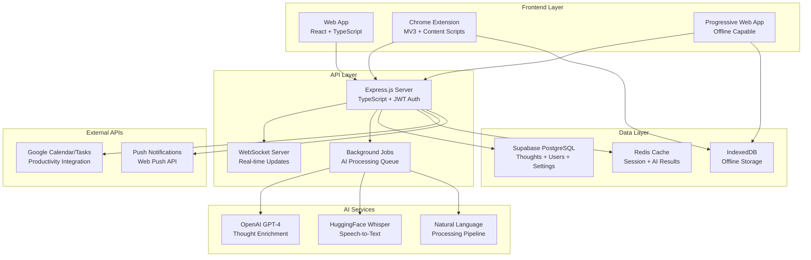
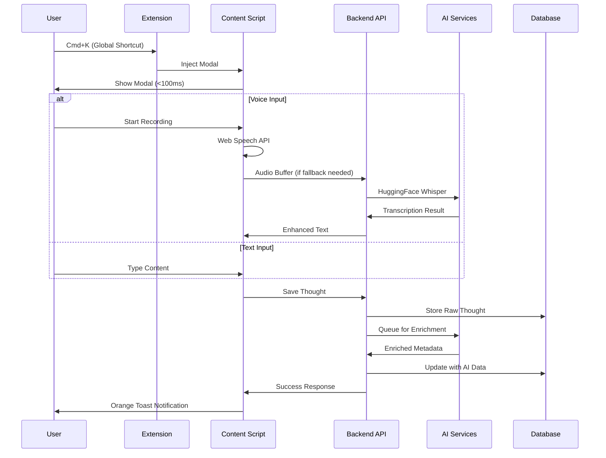
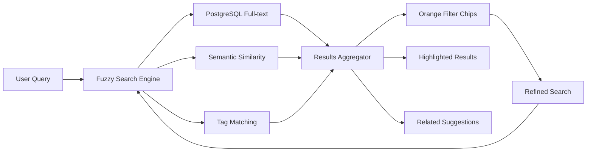

# 🏗 Technical Architecture Overview

*System design for the AI-powered thought capture platform with orange-themed glassmorphism*

## 📐 High-Level Architecture



---

## 🎯 Core Design Principles

### 1. **SPEED & ZERO FRICTION** (Critical Requirements)
- **<100ms Modal Appearance**: Achieved through preloading and code splitting
- **60fps Animations**: Hardware-accelerated transforms and optimized renders
- **Instant Offline Access**: IndexedDB with background sync
- **Predictive Loading**: Pre-fetch likely next actions based on patterns

### 2. **Apple System Typography** (Corrected Design)
- **Body Text**: `-apple-system, BlinkMacSystemFont, "SF Pro Text", system-ui, sans-serif`
- **Structured Elements**: SF Mono only for timestamps, labels, code
- **NO Monospace**: Eliminated from all body text and UI elements
- **Dynamic Scaling**: Responds to system font size preferences

### 3. **Orange-Themed Glassmorphism**
- **Primary Orange**: #FF6A00 (CTAs, highlights, active states)
- **Hover Orange**: #FF8A33 (interactive feedback)
- **Subtle Orange**: #FFB080 (backgrounds, gentle accents)
- **AMOLED Black**: #000000 (energy-efficient backgrounds)
- **Glass Effects**: `backdrop-filter: blur(20px)` with orange borders

### 4. **AI-First Architecture** (OpenAI + HuggingFace)
- **OpenAI GPT-4**: Thought enrichment, categorization, command parsing
- **HuggingFace Whisper**: High-accuracy speech transcription
- **Background Processing**: Non-blocking AI enhancement
- **Confidence Scoring**: Visual indicators for AI suggestions

---

## 🧱 Frontend Architecture

### Component Hierarchy
```
src/
├── components/
│   ├── capture/
│   │   ├── CaptureModal.tsx          # Main voice/text capture
│   │   ├── VoiceVisualizer.tsx       # Orange waveform display
│   │   └── TranscriptionDisplay.tsx  # Real-time text with confidence
│   ├── dashboard/
│   │   ├── ThoughtsInbox.tsx         # Day-grouped chronological view
│   │   ├── SearchInterface.tsx       # Fuzzy semantic search
│   │   └── MindMapView.tsx           # Obsidian/Roam-style linking
│   ├── glass/
│   │   ├── GlassCard.tsx            # Reusable glassmorphism container
│   │   ├── GlassModal.tsx           # Modal with orange glass theme
│   │   └── GlassButton.tsx          # Orange-themed interactive elements
│   └── integrations/
│       ├── GoogleCalendar.tsx       # Calendar event creation
│       └── GoogleTasks.tsx          # Task management integration
├── hooks/
│   ├── useVoiceCapture.ts           # Web Speech API + Whisper fallback
│   ├── useAIEnrichment.ts           # OpenAI thought processing
│   ├── useOrangeTheme.ts            # Theme management with WCAG
│   └── useOfflineSync.ts            # IndexedDB sync management
├── contexts/
│   ├── AuthContext.tsx              # Supabase authentication
│   ├── CaptureContext.tsx           # Global capture state
│   └── ThemeContext.tsx             # Orange theme configuration
└── services/
    ├── apiClient.ts                 # HTTP client with auth
    ├── voiceService.ts              # Speech recognition pipeline
    ├── offlineStorage.ts            # IndexedDB management
    └── aiService.ts                 # OpenAI & HuggingFace integration
```

### State Management Strategy
- **Zustand**: Lightweight global state for UI interactions
- **React Query**: Server state caching and synchronization
- **Context API**: Theme configuration and authentication
- **IndexedDB**: Offline-first local storage with sync queues

### Performance Optimizations
- **Code Splitting**: Dynamic imports for non-critical components
- **Bundle Analysis**: Webpack Bundle Analyzer for size optimization
- **Tree Shaking**: Dead code elimination in production builds
- **Service Worker**: Caching strategies for instant loading

---

## 🔧 Backend Architecture

### API Structure
```
server/src/
├── routes/
│   ├── capture.ts              # Thought CRUD operations
│   ├── transcription.ts        # Audio processing endpoints
│   ├── ai-enrichment.ts        # OpenAI integration endpoints
│   ├── search.ts               # Full-text and semantic search
│   ├── integrations.ts         # Google services proxy
│   └── extension.ts            # Chrome extension specific APIs
├── services/
│   ├── aiService.ts            # OpenAI GPT-4 integration
│   ├── transcriptionService.ts # HuggingFace Whisper client
│   ├── searchService.ts        # Elasticsearch/PostgreSQL search
│   ├── queueService.ts         # Background job processing
│   └── integrationService.ts   # Third-party API connections
├── middleware/
│   ├── auth.ts                 # JWT token validation
│   ├── rateLimiting.ts         # API usage throttling
│   ├── errorHandling.ts        # Centralized error management
│   └── cors.ts                 # Cross-origin configuration
└── config/
    ├── supabase.ts             # Database client configuration
    ├── openai.ts               # OpenAI client setup
    ├── huggingface.ts          # Whisper model configuration
    └── redis.ts                # Cache and session management
```

### Database Schema (Supabase PostgreSQL)
```sql
-- Users (managed by Supabase Auth)
-- Inherits from auth.users with additional metadata

-- Core thoughts table
CREATE TABLE thoughts (
    id UUID PRIMARY KEY DEFAULT gen_random_uuid(),
    user_id UUID REFERENCES auth.users(id) NOT NULL,
    content TEXT NOT NULL,
    transcribed_text TEXT,
    audio_url TEXT,
    audio_duration INTEGER,

    -- AI Enrichment
    category JSONB,          -- {main: "work", subcategory: "meeting", confidence: 0.85}
    tags TEXT[],             -- Auto-generated tags
    summary TEXT,            -- AI-generated summary
    entities JSONB,          -- Named entities and dates
    commands JSONB,          -- Parsed actions ["create_event", "set_reminder"]

    -- Metadata
    source VARCHAR(50) DEFAULT 'web',  -- 'web', 'extension', 'mobile'
    is_processed BOOLEAN DEFAULT false,
    confidence_score DECIMAL(3,2),

    -- Linking (Obsidian/Roam style)
    linked_thoughts UUID[],   -- Bi-directional links
    backlinks UUID[],         -- Auto-generated reverse links

    created_at TIMESTAMPTZ DEFAULT NOW(),
    updated_at TIMESTAMPTZ DEFAULT NOW(),

    -- Full-text search
    search_vector tsvector GENERATED ALWAYS AS (
        to_tsvector('english', content || ' ' || COALESCE(transcribed_text, ''))
    ) STORED
);

-- AI processing queue
CREATE TABLE ai_processing_queue (
    id UUID PRIMARY KEY DEFAULT gen_random_uuid(),
    thought_id UUID REFERENCES thoughts(id) NOT NULL,
    user_id UUID REFERENCES auth.users(id) NOT NULL,
    processing_type VARCHAR(50) NOT NULL, -- 'transcription', 'enrichment', 'linking'
    status VARCHAR(20) DEFAULT 'pending', -- 'pending', 'processing', 'completed', 'failed'
    retry_count INTEGER DEFAULT 0,
    error_message TEXT,
    created_at TIMESTAMPTZ DEFAULT NOW(),
    updated_at TIMESTAMPTZ DEFAULT NOW()
);

-- User settings and preferences
CREATE TABLE user_settings (
    id UUID PRIMARY KEY DEFAULT gen_random_uuid(),
    user_id UUID REFERENCES auth.users(id) UNIQUE NOT NULL,

    -- Theme preferences
    theme_config JSONB DEFAULT '{"primary": "#FF6A00", "hover": "#FF8A33", "subtle": "#FFB080"}',

    -- AI preferences
    ai_enabled BOOLEAN DEFAULT true,
    auto_enrichment BOOLEAN DEFAULT true,
    transcription_language VARCHAR(10) DEFAULT 'en',

    -- Extension settings
    global_shortcuts BOOLEAN DEFAULT true,
    offline_mode BOOLEAN DEFAULT true,

    -- Privacy settings
    audio_storage BOOLEAN DEFAULT false,
    data_retention_days INTEGER DEFAULT 365,

    created_at TIMESTAMPTZ DEFAULT NOW(),
    updated_at TIMESTAMPTZ DEFAULT NOW()
);

-- Indexes for performance
CREATE INDEX idx_thoughts_user_created ON thoughts(user_id, created_at DESC);
CREATE INDEX idx_thoughts_search ON thoughts USING GIN(search_vector);
CREATE INDEX idx_thoughts_tags ON thoughts USING GIN(tags);
CREATE INDEX idx_queue_status ON ai_processing_queue(status, created_at);
```

### Row Level Security (RLS)
```sql
-- Enable RLS on all tables
ALTER TABLE thoughts ENABLE ROW LEVEL SECURITY;
ALTER TABLE ai_processing_queue ENABLE ROW LEVEL SECURITY;
ALTER TABLE user_settings ENABLE ROW LEVEL SECURITY;

-- Users can only access their own data
CREATE POLICY "Users can manage their own thoughts" ON thoughts
    USING (auth.uid() = user_id);

CREATE POLICY "Users can manage their own processing queue" ON ai_processing_queue
    USING (auth.uid() = user_id);

CREATE POLICY "Users can manage their own settings" ON user_settings
    USING (auth.uid() = user_id);
```

---

## 🤖 AI Integration Architecture

### OpenAI GPT-5 mini Pipeline (Corrected from Claude)
```typescript
interface ThoughtEnrichment {
    summary: string;           // Concise 2-sentence summary
    category: {
        main: string;          // Primary category
        subcategory?: string;  // Optional subcategory
        confidence: number;    // 0.0-1.0 confidence score
    };
    tags: string[];           // Extracted keywords
    entities: {
        dates: DateEntity[];   // Parsed dates and times
        people: string[];      // Mentioned individuals
        places: string[];      // Location references
        topics: string[];      // Subject matter
    };
    commands: Command[];      // Actionable items
    linked_concepts: string[]; // Concepts for auto-linking
}

// OpenAI client configuration
const openai = new OpenAI({
    apiKey: process.env.OPENAI_API_KEY,
    organization: process.env.OPENAI_ORGANIZATION,
});

async function enrichThought(content: string): Promise<ThoughtEnrichment> {
    const response = await openai.chat.completions.create({
        model: "gpt-5-mini",
        messages: [{
            role: "system",
            content: `You are an expert thought analyzer. Analyze the following thought and return structured JSON with summary, categorization, tags, entities, and actionable commands.`
        }, {
            role: "user",
            content: content
        }],
        response_format: { type: "json_object" },
        temperature: 0.3,
        max_tokens: 1000
    });

    return JSON.parse(response.choices[0].message.content);
}
```

### HuggingFace Whisper Integration
```typescript
interface TranscriptionResult {
    text: string;
    confidence: number;
    language: string;
    segments: TranscriptionSegment[];
    processing_time: number;
}

// HuggingFace Whisper client
class WhisperService {
    private client: HfInference;

    constructor() {
        this.client = new HfInference(process.env.HUGGINGFACE_API_KEY);
    }

    async transcribe(audioBuffer: Buffer): Promise<TranscriptionResult> {
        const startTime = Date.now();

        const result = await this.client.automaticSpeechRecognition({
            model: "openai/whisper-large-v3",
            data: audioBuffer,
            parameters: {
                return_timestamps: true,
                language: "en",
                task: "transcribe"
            }
        });

        return {
            text: result.text,
            confidence: this.calculateConfidence(result),
            language: result.detected_language || "en",
            segments: result.chunks || [],
            processing_time: Date.now() - startTime
        };
    }
}
```

---

## 🔌 Chrome Extension Architecture

### Manifest V3 Structure
```json
{
    "manifest_version": 3,
    "name": "CATHCR - Instant Thought Capture",
    "version": "1.0.0",
    "permissions": ["storage", "activeTab", "scripting"],
    "optional_permissions": ["microphone"],
    "background": {
        "service_worker": "background.js",
        "type": "module"
    },
    "content_scripts": [{
        "matches": ["<all_urls>"],
        "js": ["content-script.js"],
        "css": ["orange-theme.css"]
    }],
    "commands": {
        "capture-thought": {
            "suggested_key": {
                "default": "Ctrl+Shift+C",
                "mac": "Command+K"
            },
            "description": "Open thought capture modal"
        }
    }
}
```

### Service Worker (background.js)
```typescript
// Global shortcut handling
chrome.commands.onCommand.addListener((command) => {
    if (command === 'capture-thought') {
        // Inject modal into active tab
        injectCaptureModal();
    }
});

// Offline storage management
class ExtensionStorage {
    async saveThought(thought: ThoughtData): Promise<void> {
        // Save to IndexedDB
        await this.db.thoughts.add(thought);

        // Add to sync queue
        await this.queueForSync(thought);

        // Attempt immediate sync if online
        if (navigator.onLine) {
            this.syncPendingThoughts();
        }
    }

    async syncPendingThoughts(): Promise<void> {
        const pending = await this.db.syncQueue.toArray();

        for (const thought of pending) {
            try {
                await this.syncToServer(thought);
                await this.db.syncQueue.delete(thought.id);
            } catch (error) {
                // Exponential backoff retry logic
                await this.scheduleRetry(thought, error);
            }
        }
    }
}
```

### Content Script Injection
```typescript
// Modal injection with <100ms performance target
class CaptureModalInjector {
    private modal: HTMLElement | null = null;
    private isOpen = false;

    async inject(): Promise<void> {
        if (this.isOpen) return;

        // Performance optimization: Pre-build DOM structure
        this.modal = this.createOptimizedModal();

        // Use requestAnimationFrame for smooth insertion
        requestAnimationFrame(() => {
            document.body.appendChild(this.modal!);
            this.animateIn();
            this.focusInput();
        });

        this.isOpen = true;
    }

    private createOptimizedModal(): HTMLElement {
        const modal = document.createElement('div');
        modal.className = 'cathcr-capture-modal';

        // Orange-themed glassmorphism styles
        modal.innerHTML = `
            <div class="backdrop" style="
                background: rgba(0, 0, 0, 0.8);
                backdrop-filter: blur(20px);
            ">
                <div class="modal-content" style="
                    background: rgba(0, 0, 0, 0.9);
                    border: 1px solid rgba(255, 106, 0, 0.3);
                    border-radius: 16px;
                ">
                    <textarea placeholder="Capture your thought..."
                              style="font-family: -apple-system, BlinkMacSystemFont, 'SF Pro Text', system-ui, sans-serif;">
                    </textarea>
                    <button class="orange-btn">💭 Capture</button>
                </div>
            </div>
        `;

        return modal;
    }
}
```

---

## 📊 Data Flow Architecture

### Capture Flow


### Search & Discovery Flow


---

## 🔒 Security Architecture

### Authentication & Authorization
- **Supabase Auth**: JWT-based authentication with automatic token refresh
- **Row Level Security**: Database-level access control
- **API Rate Limiting**: Prevent abuse with token bucket algorithm
- **CORS Configuration**: Strict origin validation for browser security

### Data Privacy & Protection
- **No Audio Storage**: Voice data processed and discarded immediately
- **Local-First Processing**: Sensitive operations on-device when possible
- **Encryption in Transit**: All API communications over HTTPS/WSS
- **Data Retention Policies**: User-configurable retention periods

### Extension Security
- **Minimal Permissions**: Only request necessary browser permissions
- **Content Security Policy**: Prevent XSS attacks in injected content
- **Isolated Storage**: Extension data separate from website storage
- **Secure Communication**: Message passing validation and sanitization

---

## 📈 Performance & Monitoring

### Key Performance Indicators
- **Modal Appearance Time**: <100ms (critical path optimization)
- **Animation Frame Rate**: Consistent 60fps across all interactions
- **Search Response Time**: <200ms for query results
- **Transcription Accuracy**: >90% in quiet environments
- **Offline Sync Success**: 100% data integrity guarantee

### Monitoring Stack
- **Error Tracking**: Sentry for client and server error monitoring
- **Performance Monitoring**: Web Vitals and custom metrics
- **AI Usage Analytics**: Token consumption and accuracy tracking
- **User Journey Tracking**: Capture flow completion rates

### Optimization Strategies
- **Critical Path Optimization**: Inline critical CSS, preload fonts
- **Service Worker Caching**: Aggressive caching for repeat visits
- **Bundle Size Management**: Dynamic imports and tree shaking
- **Database Query Optimization**: Indexed searches and prepared statements

---

*🏗 This architecture prioritizes SPEED, ZERO FRICTION, and SNAPPINESS while maintaining all complex features like advanced search, mind mapping, and glassmorphism effects. The corrected design uses Apple system fonts and OpenAI/HuggingFace services as specified.*