# 🧠 CATHCR BRAIN - ULTRATHINK INTELLIGENCE SYSTEM

## **🎯 THE ULTIMATE THINKING PARTNER**

CATHCR BRAIN is the core intelligence system that transforms fleeting thoughts into perfectly organized, actionable insights through advanced AI processing and seamless user experience optimization.

---

## **📊 SYSTEM OVERVIEW & FLOWCHART**

### **Core Intelligence Pipeline**

```mermaid
graph TB
    subgraph "🎤 CAPTURE LAYER"
        A[User Trigger: Cmd+K/Ctrl+Shift+C] --> B[<50ms Modal Appearance]
        B --> C[Auto-Start Voice Recording]
        C --> D[Real-time Whisper Transcription]
        D --> E[Silence Detection Auto-Stop]
    end

    subgraph "🧠 AI PROCESSING BRAIN"
        E --> F[GPT-5 Mini Analysis]
        F --> G[Perfect Categorization Engine]
        G --> H[Smart Folder Assignment]
        H --> I[Auto-Tag Generation]
        I --> J[Action Item Extraction]
        J --> K[Priority Assessment]
    end

    subgraph "📁 ORGANIZATION SYSTEM"
        K --> L{Folder Decision}
        L -->|Tasks| M[📋 Tasks Folder]
        L -->|Ideas| N[💡 Ideas Folder]
        L -->|Reminders| O[⏰ Reminders Folder]
        L -->|Notes| P[📝 Notes Folder]
        L -->|Meetings| Q[👥 Meetings Folder]
        L -->|Learning| R[🎓 Learning Folder]
        L -->|Personal| S[🏠 Personal Folder]
    end

    subgraph "⚡ INSTANT RETRIEVAL"
        M --> T[Searchable Database]
        N --> T
        O --> T
        P --> T
        Q --> T
        R --> T
        S --> T
        T --> U[Lightning-Fast Search]
        U --> V[Perfect Results]
    end

    subgraph "🔄 LEARNING LOOP"
        V --> W[User Feedback]
        W --> X[Pattern Recognition]
        X --> Y[Model Improvement]
        Y --> F
    end
```


---

## **⚡ PHASE 1: LIGHTNING-FAST CAPTURE SYSTEM**

### **1A: Millisecond Modal Performance (<50ms)**

**Technical Implementation:**
```typescript
class UltrathinkCaptureModal {
  private static instance: UltrathinkCaptureModal;
  private modalElement: HTMLElement;
  private isPreloaded: boolean = false;

  constructor() {
    this.preloadModal();
  }

  private preloadModal(): void {
    // Pre-create DOM structure in memory
    this.modalElement = this.createOptimizedModal();

    // Critical CSS inlined, non-critical loaded async
    this.inlineCriticalStyles();

    // Pre-warm Web Speech API
    this.initializeSpeechRecognition();

    this.isPreloaded = true;
  }

  public show(): void {
    if (!this.isPreloaded) {
      console.error('Modal not preloaded - performance will suffer');
      this.preloadModal();
    }

    // Use requestAnimationFrame for 60fps smooth appearance
    requestAnimationFrame(() => {
      document.body.appendChild(this.modalElement);
      this.modalElement.classList.add('ultrathink-show');
      this.startVoiceCapture();
    });
  }

  private startVoiceCapture(): void {
    // Auto-start recording immediately on modal open
    this.speechRecognition.start();
    this.showWaveformAnimation();
  }
}
```

**Performance Targets:**
- Modal DOM creation: <10ms
- CSS application: <5ms
- Animation start: <10ms
- Speech API init: <15ms
- **Total: <50ms**

### **1B: Auto-Trigger Speech System**

**Smart Voice Detection:**
```typescript
interface VoiceIntelligence {
  autoStart: boolean;           // Begin recording on modal open
  silenceThreshold: number;     // 2 seconds silence = auto-stop
  confidenceMinimum: number;    // Only accept >80% confidence
  realTimeDisplay: boolean;     // Show text as spoken
  backgroundProcessing: boolean; // Parallel AI analysis
}

class SpeechCapture {
  private recognition: SpeechRecognition;
  private silenceTimer: NodeJS.Timeout;
  private isProcessing: boolean = false;

  constructor() {
    this.initializeSpeechRecognition();
    this.setupSilenceDetection();
  }

  private setupSilenceDetection(): void {
    this.recognition.onresult = (event) => {
      // Reset silence timer on new speech
      clearTimeout(this.silenceTimer);

      // Process speech in real-time
      this.processPartialResults(event.results);

      // Start silence countdown
      this.silenceTimer = setTimeout(() => {
        this.stopAndProcess();
      }, 2000);
    };
  }

  private async processPartialResults(results: SpeechRecognitionResultList): Promise<void> {
    const latestResult = results[results.length - 1];

    if (latestResult.confidence > 0.8) {
      // Show text immediately with high confidence
      this.displayTranscription(latestResult.transcript);

      // Start background AI processing
      if (!this.isProcessing) {
        this.isProcessing = true;
        this.backgroundAIAnalysis(latestResult.transcript);
      }
    }
  }
}
```

### **1C: Optimistic UI Updates**

**Instant Feedback System:**
- Text appears as user speaks (real-time)
- Category suggestions appear during speech
- Folder preview shows before completion
- Success animation triggers immediately on stop

---

## **🤖 PHASE 2: GPT-5 MINI PERFECT CATEGORIZATION**

### **2A: Advanced AI Brain Architecture**

**GPT-5 Mini Configuration:**
```typescript
interface UltrathinkAI {
  model: 'gpt-5-mini';
  temperature: 0.1;              // Highly consistent categorization
  maxTokens: 500;                // Efficient responses
  responseFormat: 'json_object';  // Structured output
  systemPrompt: UltrathinkPrompt; // Custom-trained prompts
}

class CategoryBrain {
  private openai: OpenAI;
  private userContext: UserThinkingPattern;
  private categoryConfidence: Map<string, number>;

  constructor() {
    this.openai = new OpenAI({
      apiKey: process.env.OPENAI_API_KEY,
      organization: process.env.OPENAI_ORGANIZATION,
    });
  }

  async categorizeThought(content: string): Promise<PerfectCategorization> {
    const systemPrompt = this.buildCustomPrompt();

    const response = await this.openai.chat.completions.create({
      model: 'gpt-5-mini',
      messages: [
        { role: 'system', content: systemPrompt },
        { role: 'user', content: content }
      ],
      response_format: { type: 'json_object' },
      temperature: 0.1,
      max_tokens: 500
    });

    return this.parseAndValidate(response.choices[0].message.content);
  }

  private buildCustomPrompt(): string {
    return `You are the CATHCR BRAIN - the world's most accurate thought categorization AI.

PERFECT CATEGORIZATION RULES:
1. Primary folders: Tasks, Ideas, Reminders, Notes, Meetings, Learning, Personal
2. Create smart subfolders based on content context
3. Extract actionable items automatically
4. Assign priority levels: urgent, high, medium, low
5. Generate relevant tags for instant searchability
6. Confidence must be >90% for auto-categorization

EXAMPLES:
- "Call dentist tomorrow" → Tasks/Health, priority: high, reminder: tomorrow
- "App idea: voice notes with AI" → Ideas/Technology, tags: [ai, voice, mobile]
- "Meeting notes from standup" → Meetings/Work, tags: [standup, team]
- "Learn React hooks tutorial" → Learning/Programming, tags: [react, hooks, tutorial]

USER CONTEXT: ${this.userContext.getPersonalizedContext()}

Return JSON with perfect categorization:`;
  }
}
```

### **2B: Smart Folder System**

**Intelligent Organization:**
```typescript
interface PerfectCategorization {
  primaryFolder: FolderType;
  subFolder: string;
  tags: string[];
  priority: Priority;
  actionItems: ActionItem[];
  reminders: ReminderInfo[];
  confidence: number;
  suggestedConnections: string[];
}

enum FolderType {
  TASKS = 'Tasks',           // 📋 Actionable items, todos, deadlines
  IDEAS = 'Ideas',           // 💡 Creative thoughts, inspiration, concepts
  REMINDERS = 'Reminders',   // ⏰ Time-based items, appointments, follow-ups
  NOTES = 'Notes',           // 📝 Information, observations, documentation
  MEETINGS = 'Meetings',     // 👥 Meeting notes, discussions, decisions
  LEARNING = 'Learning',     // 🎓 Education, tutorials, knowledge acquisition
  PERSONAL = 'Personal'      // 🏠 Private thoughts, family, non-work items
}

class SmartFolderSystem {
  async organizePerfectly(thought: ProcessedThought): Promise<OrganizationResult> {
    const category = await this.categoryBrain.categorizeThought(thought.content);

    if (category.confidence > 0.9) {
      // Auto-organize with high confidence
      return this.autoOrganize(thought, category);
    } else {
      // Suggest organization with user confirmation
      return this.suggestOrganization(thought, category);
    }
  }

  private autoOrganize(thought: ProcessedThought, category: PerfectCategorization): OrganizationResult {
    const folderPath = this.createFolderPath(category);
    const enrichedThought = this.enrichWithMetadata(thought, category);

    return {
      thought: enrichedThought,
      folderPath,
      autoOrganized: true,
      confidence: category.confidence,
      tags: category.tags,
      actionItems: category.actionItems
    };
  }
}
```

### **2C: Learning and Adaptation**

**Personal Intelligence:**
```typescript
class UserThinkingPattern {
  private vocabularyMap: Map<string, number>;
  private categoryPreferences: Map<string, FolderType>;
  private timePatterns: Map<string, string>;
  private contextClues: Map<string, string>;

  constructor(userId: string) {
    this.loadUserPatterns(userId);
  }

  learnFromFeedback(originalThought: string, userCorrection: PerfectCategorization): void {
    // Update vocabulary preferences
    this.updateVocabularyWeights(originalThought, userCorrection.primaryFolder);

    // Learn time-based patterns
    this.updateTimePatterns(originalThought, userCorrection);

    // Adjust confidence thresholds
    this.adjustConfidenceModel(originalThought, userCorrection);

    // Save learned patterns
    this.persistLearning();
  }

  getPersonalizedContext(): string {
    return `
USER VOCABULARY PREFERENCES: ${this.getTopVocabulary()}
COMMON CATEGORIES: ${this.getPreferredCategories()}
TIME PATTERNS: ${this.getTimeBasedHints()}
CONTEXT CLUES: ${this.getContextualHints()}
    `;
  }
}
```

---

## **📁 PHASE 3: PERFECT ORGANIZATION SYSTEM**

### **3A: Dynamic Folder Creation**

**Intelligent Folder Structure:**
```
📁 CATHCR THOUGHTS/
├── 📋 Tasks/
│   ├── 🔴 Urgent/
│   ├── 🟡 High Priority/
│   ├── 🟢 Medium Priority/
│   ├── 🔵 Low Priority/
│   ├── 💼 Work/
│   ├── 🏠 Personal/
│   └── 🎯 Projects/
│       ├── Project Alpha/
│       ├── Project Beta/
│       └── Project Gamma/
├── 💡 Ideas/
│   ├── 🚀 Startup Ideas/
│   ├── 🎨 Creative/
│   ├── 💻 Technology/
│   ├── 📚 Content/
│   └── 🔬 Research/
├── ⏰ Reminders/
│   ├── 📅 Today/
│   ├── 📆 This Week/
│   ├── 🗓️ This Month/
│   ├── 🎂 Birthdays/
│   └── 🏥 Health/
├── 📝 Notes/
│   ├── 📖 Learning/
│   ├── 🌐 Web Clippings/
│   ├── 📰 Articles/
│   └── 🗃️ Reference/
├── 👥 Meetings/
│   ├── 🏢 Team Standups/
│   ├── 👤 One-on-Ones/
│   ├── 🎯 Project Reviews/
│   └── 📊 Presentations/
├── 🎓 Learning/
│   ├── 💻 Programming/
│   ├── 📈 Business/
│   ├── 🎨 Design/
│   └── 🧠 AI & ML/
└── 🏠 Personal/
    ├── 👨‍👩‍👧‍👦 Family/
    ├── 🏃‍♂️ Health & Fitness/
    ├── 🎯 Goals/
    └── 💭 Random Thoughts/
```

### **3B: Auto-Tag Generation System**

**Smart Tagging Engine:**
```typescript
class AutoTagGenerator {
  private tagExtractor: TagExtractionEngine;
  private semanticAnalyzer: SemanticAnalyzer;
  private userTagHistory: Map<string, number>;

  async generatePerfectTags(content: string): Promise<string[]> {
    const extractedTags = await this.tagExtractor.extractKeywords(content);
    const semanticTags = await this.semanticAnalyzer.findRelatedConcepts(content);
    const personalTags = this.getUserPersonalizedTags(content);

    // Combine and rank tags
    const allTags = [...extractedTags, ...semanticTags, ...personalTags];
    const rankedTags = this.rankTagsByRelevance(allTags, content);

    // Return top 5 most relevant tags
    return rankedTags.slice(0, 5);
  }

  private rankTagsByRelevance(tags: string[], content: string): string[] {
    return tags
      .map(tag => ({
        tag,
        relevance: this.calculateRelevanceScore(tag, content),
        popularity: this.userTagHistory.get(tag) || 0
      }))
      .sort((a, b) => (b.relevance + b.popularity) - (a.relevance + a.popularity))
      .map(item => item.tag);
  }
}
```

### **3C: Instant Search and Retrieval**

**Lightning-Fast Search System:**
```typescript
class LightningSearch {
  private searchIndex: SearchIndex;
  private semanticSearch: SemanticSearchEngine;
  private fuzzyMatcher: FuzzyMatcher;

  async search(query: string): Promise<SearchResult[]> {
    // Parallel search across multiple engines
    const [
      fullTextResults,
      semanticResults,
      fuzzyResults,
      tagResults
    ] = await Promise.all([
      this.searchIndex.fullTextSearch(query),
      this.semanticSearch.findSimilar(query),
      this.fuzzyMatcher.findMatches(query),
      this.searchByTags(query)
    ]);

    // Merge and rank results
    const mergedResults = this.mergeSearchResults([
      fullTextResults,
      semanticResults,
      fuzzyResults,
      tagResults
    ]);

    // Apply user preference boosting
    return this.boostUserPreferences(mergedResults);
  }

  private async searchByTags(query: string): Promise<SearchResult[]> {
    const possibleTags = await this.extractPossibleTags(query);
    const taggedThoughts = await this.database.thoughts.findByTags(possibleTags);

    return taggedThoughts.map(thought => ({
      thought,
      relevance: this.calculateTagRelevance(thought.tags, possibleTags),
      source: 'tags'
    }));
  }
}
```

---

## **🚀 PHASE 4: SEAMLESS EXTENSION INTEGRATION**

### **4A: Direct Extension Distribution**

**Website Installation Flow:**
```typescript
class ExtensionInstaller {
  private detectedBrowser: BrowserType;
  private installationMethod: 'direct' | 'manual';

  constructor() {
    this.detectedBrowser = this.detectBrowser();
    this.installationMethod = this.determineInstallMethod();
  }

  showInstallationFlow(): void {
    if (this.installationMethod === 'direct') {
      this.showDirectInstall();
    } else {
      this.showManualInstall();
    }
  }

  private showDirectInstall(): void {
    const installModal = new InstallModal({
      title: '🚀 Install CATHCR Extension',
      subtitle: 'Get instant thought capture with Cmd+K',
      steps: [
        'Download extension package',
        'Open Chrome Extensions',
        'Enable Developer Mode',
        'Load unpacked extension',
        'Test with Cmd+K shortcut'
      ],
      downloadLink: '/downloads/cathcr-extension-latest.zip',
      setupAnimation: this.createShortcutAnimation()
    });

    installModal.show();
  }

  private createShortcutAnimation(): HTMLElement {
    return html`
      <div class="shortcut-demo">
        <div class="keyboard-animation">
          <div class="key cmd ${this.detectedBrowser === 'mac' ? 'active' : ''}">⌘</div>
          <div class="key ctrl ${this.detectedBrowser === 'windows' ? 'active' : ''}">Ctrl</div>
          <div class="key shift ${this.detectedBrowser === 'windows' ? 'active' : ''}">Shift</div>
          <div class="key k active">K</div>
        </div>
        <div class="demo-modal">
          <div class="modal-appear-animation">
            💭 Capture your thought...
          </div>
        </div>
      </div>
    `;
  }
}
```

### **4B: Account Linking System**

**Seamless Connection:**
```typescript
class AccountLinker {
  async linkExtensionToAccount(): Promise<LinkResult> {
    // Generate secure linking code
    const linkingCode = this.generateSecureLinkingCode();

    // Display code to user
    this.showLinkingInstructions(linkingCode);

    // Wait for extension to connect
    return this.waitForExtensionConnection(linkingCode);
  }

  private generateSecureLinkingCode(): string {
    // 6-digit alphanumeric code, expires in 5 minutes
    return crypto.randomBytes(3).toString('hex').toUpperCase();
  }

  private async waitForExtensionConnection(code: string): Promise<LinkResult> {
    return new Promise((resolve) => {
      const checkInterval = setInterval(async () => {
        const connection = await this.checkConnectionStatus(code);

        if (connection.success) {
          clearInterval(checkInterval);
          this.showSuccessAnimation();
          resolve({ success: true, userId: connection.userId });
        }
      }, 1000);

      // Timeout after 5 minutes
      setTimeout(() => {
        clearInterval(checkInterval);
        resolve({ success: false, error: 'Timeout' });
      }, 300000);
    });
  }
}
```

### **4C: Cross-Platform Synchronization**

**Real-time Sync System:**
```typescript
class CrossPlatformSync {
  private syncEngine: RealtimeSyncEngine;
  private conflictResolver: ConflictResolver;
  private offlineQueue: OfflineQueue;

  constructor() {
    this.syncEngine = new RealtimeSyncEngine();
    this.setupBidirectionalSync();
  }

  private setupBidirectionalSync(): void {
    // Web app → Extension sync
    this.syncEngine.onWebAppChange((change) => {
      this.propagateToExtension(change);
    });

    // Extension → Web app sync
    this.syncEngine.onExtensionChange((change) => {
      this.propagateToWebApp(change);
    });

    // Handle offline scenarios
    this.setupOfflineHandling();
  }

  private async propagateToExtension(change: SyncChange): Promise<void> {
    try {
      await this.sendToExtension(change);
    } catch (error) {
      // Queue for retry if extension offline
      this.offlineQueue.add(change);
    }
  }

  private setupOfflineHandling(): void {
    window.addEventListener('online', () => {
      this.processOfflineQueue();
    });
  }
}
```

---

## **🎯 PHASE 5: ADVANCED INTELLIGENCE FEATURES**

### **5A: Predictive Suggestions**

**Context-Aware Intelligence:**
```typescript
class PredictiveIntelligence {
  private contextAnalyzer: ContextAnalyzer;
  private predictionEngine: PredictionEngine;
  private userPatternLearning: UserPatternLearning;

  async generatePredictions(currentContext: Context): Promise<Prediction[]> {
    const timeContext = this.analyzeTimeContext();
    const locationContext = await this.analyzeLocationContext();
    const activityContext = this.analyzeActivityContext();
    const historyContext = this.analyzeThoughtHistory();

    const predictions = await this.predictionEngine.predict({
      time: timeContext,
      location: locationContext,
      activity: activityContext,
      history: historyContext,
      userPatterns: this.userPatternLearning.getPatterns()
    });

    return this.rankPredictions(predictions);
  }

  private analyzeTimeContext(): TimeContext {
    const now = new Date();
    const hour = now.getHours();
    const dayOfWeek = now.getDay();

    return {
      timeOfDay: this.categorizeTimeOfDay(hour),
      dayType: this.categorizeDayType(dayOfWeek),
      isWorkingHours: this.isWorkingHours(hour, dayOfWeek),
      recentPatterns: this.getRecentTimePatterns()
    };
  }

  private analyzeActivityContext(): ActivityContext {
    const currentUrl = window.location.href;
    const activeTab = this.getCurrentTabInfo();

    return {
      currentWebsite: this.categorizeWebsite(currentUrl),
      browserActivity: this.categorizeBrowserActivity(activeTab),
      workflowContext: this.detectWorkflowContext(),
      focusLevel: this.estimateFocusLevel()
    };
  }
}
```

### **5B: Proactive Reminder System**

**Smart Reminder Engine:**
```typescript
class ProactiveReminders {
  private reminderEngine: ReminderEngine;
  private contextTriggers: ContextTriggerManager;
  private notificationManager: NotificationManager;

  setupIntelligentReminders(thought: ProcessedThought): void {
    const reminders = this.extractReminders(thought);

    reminders.forEach(reminder => {
      this.scheduleContextualReminder(reminder);
    });
  }

  private scheduleContextualReminder(reminder: ReminderInfo): void {
    // Time-based reminders
    if (reminder.timeContext) {
      this.scheduleTimeReminder(reminder);
    }

    // Location-based reminders
    if (reminder.locationContext) {
      this.scheduleLocationReminder(reminder);
    }

    // Activity-based reminders
    if (reminder.activityContext) {
      this.scheduleActivityReminder(reminder);
    }

    // Context-based reminders
    if (reminder.contextTriggers) {
      this.scheduleContextReminder(reminder);
    }
  }

  private scheduleContextReminder(reminder: ReminderInfo): void {
    this.contextTriggers.addTrigger({
      id: reminder.id,
      triggers: reminder.contextTriggers,
      action: () => {
        this.notificationManager.showContextualReminder({
          title: reminder.title,
          content: reminder.content,
          urgency: reminder.urgency,
          actions: reminder.suggestedActions
        });
      }
    });
  }
}
```

### **5C: Connection Intelligence**

**Thought Relationship Engine:**
```typescript
class ConnectionIntelligence {
  private relationshipAnalyzer: RelationshipAnalyzer;
  private semanticGraph: SemanticGraph;
  private connectionScorer: ConnectionScorer;

  async findConnections(newThought: ProcessedThought): Promise<Connection[]> {
    const semanticConnections = await this.findSemanticConnections(newThought);
    const temporalConnections = this.findTemporalConnections(newThought);
    const thematicConnections = this.findThematicConnections(newThought);
    const projectConnections = this.findProjectConnections(newThought);

    const allConnections = [
      ...semanticConnections,
      ...temporalConnections,
      ...thematicConnections,
      ...projectConnections
    ];

    return this.rankConnections(allConnections);
  }

  private async findSemanticConnections(thought: ProcessedThought): Promise<Connection[]> {
    const embedding = await this.generateEmbedding(thought.content);
    const similarThoughts = await this.semanticGraph.findSimilar(embedding, 0.8);

    return similarThoughts.map(similar => ({
      type: 'semantic',
      targetThought: similar.thought,
      strength: similar.similarity,
      reason: 'Similar concepts and meaning',
      suggestedLink: this.generateLinkSuggestion(thought, similar.thought)
    }));
  }

  private findTemporalConnections(thought: ProcessedThought): Connection[] {
    const timeWindow = 24 * 60 * 60 * 1000; // 24 hours
    const recentThoughts = this.getThoughtsInTimeWindow(thought.createdAt, timeWindow);

    return recentThoughts
      .filter(recent => this.hasTopicalOverlap(thought, recent))
      .map(recent => ({
        type: 'temporal',
        targetThought: recent,
        strength: this.calculateTemporalStrength(thought, recent),
        reason: 'Thoughts from same time period',
        suggestedLink: this.generateTemporalLink(thought, recent)
      }));
  }
}
```

---

## **🏗️ TECHNICAL ARCHITECTURE**

### **Database Schema (Enhanced)**
```sql
-- Enhanced thoughts table with AI metadata
CREATE TABLE thoughts (
    id UUID PRIMARY KEY DEFAULT gen_random_uuid(),
    user_id UUID REFERENCES auth.users(id) NOT NULL,
    content TEXT NOT NULL,
    transcribed_text TEXT,

    -- AI Processing Results
    ai_category JSONB,          -- GPT-5 Mini categorization
    ai_confidence DECIMAL(3,2), -- AI confidence score
    ai_tags TEXT[],             -- Auto-generated tags
    ai_priority VARCHAR(20),    -- urgent, high, medium, low
    ai_action_items JSONB,      -- Extracted action items
    ai_reminders JSONB,         -- Extracted reminders
    ai_entities JSONB,          -- Named entities (people, places, dates)

    -- Organization
    folder_path VARCHAR(500),   -- Full folder path
    sub_folder VARCHAR(200),    -- Auto-created subfolder
    user_tags TEXT[],           -- User-added tags
    is_favorited BOOLEAN DEFAULT false,

    -- Connections
    linked_thoughts UUID[],     -- Manual links
    ai_suggested_links UUID[],  -- AI-suggested connections
    connection_strength JSONB, -- Connection metadata

    -- Context
    capture_context JSONB,      -- Browser, location, time context
    source VARCHAR(50) DEFAULT 'web', -- web, extension, mobile

    -- Processing Status
    processing_status VARCHAR(50) DEFAULT 'pending',
    processing_error TEXT,
    processing_retries INTEGER DEFAULT 0,

    -- Timestamps
    created_at TIMESTAMPTZ DEFAULT NOW(),
    updated_at TIMESTAMPTZ DEFAULT NOW(),

    -- Search
    search_vector tsvector GENERATED ALWAYS AS (
        to_tsvector('english',
            content || ' ' ||
            COALESCE(transcribed_text, '') || ' ' ||
            COALESCE(array_to_string(ai_tags, ' '), '') || ' ' ||
            COALESCE(array_to_string(user_tags, ' '), '')
        )
    ) STORED
);

-- AI processing queue with retry logic
CREATE TABLE ai_processing_queue (
    id UUID PRIMARY KEY DEFAULT gen_random_uuid(),
    thought_id UUID REFERENCES thoughts(id) NOT NULL,
    user_id UUID REFERENCES auth.users(id) NOT NULL,
    processing_type VARCHAR(50) NOT NULL, -- categorization, tagging, linking, reminders
    priority INTEGER DEFAULT 5, -- 1 (highest) to 10 (lowest)

    -- Processing details
    input_data JSONB NOT NULL,
    output_data JSONB,
    ai_model VARCHAR(50) DEFAULT 'gpt-5-mini',

    -- Status tracking
    status VARCHAR(20) DEFAULT 'pending',
    started_at TIMESTAMPTZ,
    completed_at TIMESTAMPTZ,
    processing_duration INTEGER, -- milliseconds

    -- Error handling
    error_message TEXT,
    retry_count INTEGER DEFAULT 0,
    max_retries INTEGER DEFAULT 3,
    next_retry_at TIMESTAMPTZ,

    -- Metadata
    created_at TIMESTAMPTZ DEFAULT NOW(),
    updated_at TIMESTAMPTZ DEFAULT NOW()
);

-- User learning patterns
CREATE TABLE user_learning_patterns (
    id UUID PRIMARY KEY DEFAULT gen_random_uuid(),
    user_id UUID REFERENCES auth.users(id) NOT NULL,

    -- Vocabulary patterns
    vocabulary_weights JSONB, -- Word frequency and category associations
    category_preferences JSONB, -- User's folder preferences
    time_patterns JSONB, -- Time-based thinking patterns
    context_patterns JSONB, -- Context-based patterns

    -- Learning metrics
    categorization_accuracy DECIMAL(3,2), -- User's acceptance rate
    prediction_success_rate DECIMAL(3,2), -- Prediction accuracy
    total_thoughts INTEGER DEFAULT 0,
    total_corrections INTEGER DEFAULT 0,

    -- Model tuning
    confidence_threshold DECIMAL(3,2) DEFAULT 0.9,
    auto_organize_enabled BOOLEAN DEFAULT true,
    learning_enabled BOOLEAN DEFAULT true,

    created_at TIMESTAMPTZ DEFAULT NOW(),
    updated_at TIMESTAMPTZ DEFAULT NOW(),

    UNIQUE(user_id)
);

-- Performance indexes
CREATE INDEX idx_thoughts_ai_processing ON thoughts(processing_status, created_at);
CREATE INDEX idx_thoughts_folder_path ON thoughts(folder_path, user_id);
CREATE INDEX idx_thoughts_ai_confidence ON thoughts(ai_confidence DESC) WHERE ai_confidence IS NOT NULL;
CREATE INDEX idx_queue_priority_status ON ai_processing_queue(priority, status, created_at);
CREATE INDEX idx_queue_retry ON ai_processing_queue(next_retry_at) WHERE status = 'retry_pending';
```

### **Performance Optimization**
```typescript
class PerformanceOptimizer {
  // Target: <50ms modal appearance
  private static readonly PERFORMANCE_TARGETS = {
    modalAppearance: 50,      // milliseconds
    speechApiInit: 100,       // milliseconds
    aiProcessing: 2000,       // milliseconds
    databaseWrite: 200,       // milliseconds
    searchResults: 300        // milliseconds
  };

  async optimizeCapturePipeline(): Promise<void> {
    // Pre-warm connections
    await this.preWarmConnections();

    // Pre-load critical resources
    await this.preLoadCriticalResources();

    // Initialize speech API early
    await this.initializeSpeechAPI();

    // Cache common AI responses
    await this.warmAICache();
  }

  private async preLoadCriticalResources(): Promise<void> {
    // Pre-load modal HTML template
    await this.preloadModalTemplate();

    // Pre-compile CSS animations
    await this.precompileAnimations();

    // Pre-initialize Web Workers
    await this.initializeWebWorkers();
  }
}
```

---

## **📊 SUCCESS METRICS & VALIDATION**

### **Performance Benchmarks**
| **Metric** | **Current** | **Target** | **ULTRATHINK** |
|------------|-------------|------------|----------------|
| Modal Appearance | ~300ms | <100ms | **<50ms** |
| AI Categorization | ~3s | <2s | **<1s** |
| Search Response | ~500ms | <300ms | **<200ms** |
| Accuracy Rate | ~70% | >90% | **>95%** |
| Auto-Organization | ~30% | >80% | **>90%** |

### **User Experience Metrics**
| **Metric** | **Target** | **Measurement** |
|------------|------------|-----------------|
| Daily Captures | >20 | Average thoughts per user per day |
| User Satisfaction | >95% | Post-capture satisfaction rating |
| Time to Organize | <10s | From capture to perfect organization |
| Search Success | >98% | Find desired thought within 3 results |
| Zero-Friction Score | >90% | Captures requiring no manual organization |

### **Technical Performance**
| **Component** | **Target** | **Monitoring** |
|---------------|------------|----------------|
| Database Queries | <100ms | Query execution time |
| AI API Calls | <2s | OpenAI response time |
| Memory Usage | <50MB | Extension memory footprint |
| CPU Usage | <5% | Background processing load |
| Network Efficiency | <1KB | Average request payload |

---

## **🚀 IMPLEMENTATION ROADMAP**

### **Week 1: Lightning-Fast Capture**
- [ ] **Day 1-2**: Modal performance optimization (<50ms)
- [ ] **Day 3-4**: Auto-trigger speech system
- [ ] **Day 5-7**: Optimistic UI updates and animations

### **Week 2: Perfect AI Brain**
- [ ] **Day 1-3**: GPT-5 Mini integration and prompt engineering
- [ ] **Day 4-5**: Smart categorization engine
- [ ] **Day 6-7**: Learning and adaptation system

### **Week 3: Intelligent Organization**
- [ ] **Day 1-3**: Dynamic folder system
- [ ] **Day 4-5**: Auto-tag generation
- [ ] **Day 6-7**: Lightning-fast search

### **Week 4: Extension Integration**
- [ ] **Day 1-3**: Direct distribution system
- [ ] **Day 4-5**: Account linking and setup animations
- [ ] **Day 6-7**: Cross-platform synchronization

### **Week 5: Advanced Intelligence**
- [ ] **Day 1-3**: Predictive suggestions
- [ ] **Day 4-5**: Proactive reminders
- [ ] **Day 6-7**: Connection intelligence

---

## **🔮 NEXT PHASE: COGNITIVE INSIGHTS**

The ULTRATHINK system has achieved perfect reactive intelligence. **Phase 2: COGNITIVE INSIGHTS** evolves the system from reactive capture to proactive intelligence partner.

**See comprehensive next phase documentation: [COGNITIVE_INSIGHTS.md](./COGNITIVE_INSIGHTS.md)**

### **Phase 2 Overview**
- **🔮 Predictive Engine**: AI suggests thoughts before user thinks them
- **🔗 Connection Intelligence**: Discovers hidden relationships between thoughts
- **⏰ Proactive Reminders**: Context-aware timing based on user patterns
- **📈 Insight Analytics**: Personal intelligence reports and growth recommendations
- **🧠 Adaptive Learning**: System becomes smarter with every interaction

**Goal**: Transform CATHCR into an intelligent thinking partner that predicts, connects, and provides deep insights about user cognition patterns.

---

**🎯 THE ULTIMATE GOAL:** Transform CATHCR into the most intelligent, fastest, and most intuitive thought capture system ever created - a true extension of human consciousness that makes organizing thoughts completely effortless.