# 🧠 COGNITIVE INSIGHTS - PHASE 2 EVOLUTION

## **🎯 TRANSFORMING REACTIVE CAPTURE TO PROACTIVE INTELLIGENCE**

The COGNITIVE INSIGHTS phase evolves CATHCR from a passive thought capture tool into an intelligent thinking partner that predicts, suggests, and provides deep insights about user thinking patterns.

---

## **📊 INTELLIGENCE EVOLUTION FLOWCHART**

### **Proactive Intelligence Pipeline**

```mermaid
graph TB
    subgraph "🧠 COGNITIVE ANALYSIS ENGINE"
        A[Thought History Analysis] --> B[Pattern Recognition AI]
        B --> C[Context Understanding]
        C --> D[Predictive Modeling]
        D --> E[Suggestion Generation]
    end

    subgraph "🔮 PREDICTIVE SUGGESTIONS"
        E --> F{Context Analysis}
        F -->|Work Hours| G[📊 Suggest Work Tasks]
        F -->|Evening| H[🏠 Suggest Personal Goals]
        F -->|Meeting Prep| I[👥 Suggest Agenda Items]
        F -->|Project Context| J[🎯 Suggest Next Steps]
    end

    subgraph "🔗 CONNECTION INTELLIGENCE"
        A --> K[Cross-Thought Analysis]
        K --> L[Relationship Mapping]
        L --> M[Hidden Pattern Detection]
        M --> N[Connection Recommendations]
    end

    subgraph "⏰ PROACTIVE REMINDERS"
        D --> O[Time Pattern Analysis]
        O --> P[Context-Aware Scheduling]
        P --> Q[Smart Notification Timing]
        Q --> R[Intelligent Follow-ups]
    end

    subgraph "📈 INSIGHT ANALYTICS"
        A --> S[Thinking Pattern Analysis]
        S --> T[Productivity Insights]
        T --> U[Weekly Intelligence Reports]
        U --> V[Personal Growth Recommendations]
    end
```


---

## **🔮 PHASE 2A: PREDICTIVE SUGGESTION ENGINE**

### **Intelligent Thought Prediction**

**Core Capability:** AI analyzes user patterns and proactively suggests thoughts they're likely to capture.

```typescript
interface PredictiveSuggestion {
  id: string;
  type: 'task' | 'idea' | 'reminder' | 'note' | 'follow_up';
  content: string;
  confidence: number; // 0-100%
  triggers: ContextTrigger[];
  timing: SuggestionTiming;
  reasoning: string;
  priority: 'low' | 'medium' | 'high' | 'urgent';
}

interface ContextTrigger {
  type: 'time_pattern' | 'location' | 'calendar_event' | 'related_thought' | 'project_context';
  value: string;
  confidence: number;
}

class PredictiveEngine {
  async generateSuggestions(userId: string): Promise<PredictiveSuggestion[]> {
    const userPatterns = await this.analyzeUserPatterns(userId);
    const currentContext = await this.getCurrentContext(userId);
    const recentThoughts = await this.getRecentThoughts(userId, 7); // Last 7 days

    const suggestions = await this.aiSuggestionEngine.predict({
      patterns: userPatterns,
      context: currentContext,
      recentActivity: recentThoughts,
      prompt: `
        Based on this user's thinking patterns and current context, predict 3-5 thoughts
        they're likely to want to capture in the next 2 hours. Consider:
        - Time-based patterns (they often capture work tasks at 9am)
        - Project context (current active projects)
        - Follow-up patterns (they follow up on meetings within 24h)
        - Recurring themes (weekly planning, daily reflection)

        Provide high-confidence, actionable suggestions that feel natural and helpful.
      `
    });

    return suggestions.filter(s => s.confidence > 70); // Only high-confidence suggestions
  }
}
```

### **Smart Suggestion UI**

**Floating Intelligence Panel:**
```tsx
const PredictiveSuggestionsPanel: React.FC = () => {
  const [suggestions, setSuggestions] = useState<PredictiveSuggestion[]>([]);
  const [isVisible, setIsVisible] = useState(false);

  useEffect(() => {
    // Show suggestions at optimal times
    const checkForSuggestions = async () => {
      const newSuggestions = await predictiveEngine.generateSuggestions(user.id);
      if (newSuggestions.length > 0) {
        setSuggestions(newSuggestions);
        setIsVisible(true);
      }
    };

    // Check every 30 minutes during active hours
    const interval = setInterval(checkForSuggestions, 30 * 60 * 1000);
    checkForSuggestions(); // Initial check

    return () => clearInterval(interval);
  }, [user.id]);

  return (
    <AnimatePresence>
      {isVisible && (
        <motion.div
          initial={{ opacity: 0, x: 300 }}
          animate={{ opacity: 1, x: 0 }}
          exit={{ opacity: 0, x: 300 }}
          className="fixed right-4 top-20 z-50 w-80"
        >
          <div className="glass-panel-strong p-4 rounded-2xl border border-orange-500/20">
            <div className="flex items-center gap-2 mb-3">
              <div className="w-2 h-2 bg-orange-500 rounded-full animate-pulse" />
              <span className="text-sm font-medium text-orange-300">
                💡 Intelligent Suggestions
              </span>
            </div>

            {suggestions.map((suggestion) => (
              <SuggestionCard
                key={suggestion.id}
                suggestion={suggestion}
                onAccept={() => acceptSuggestion(suggestion)}
                onDismiss={() => dismissSuggestion(suggestion.id)}
              />
            ))}
          </div>
        </motion.div>
      )}
    </AnimatePresence>
  );
};
```

---

## **🔗 PHASE 2B: CONNECTION INTELLIGENCE**

### **Hidden Relationship Discovery**

**Core Capability:** AI finds meaningful connections between seemingly unrelated thoughts.

```typescript
interface ThoughtConnection {
  thoughtA: string;
  thoughtB: string;
  connectionType: 'semantic' | 'temporal' | 'causal' | 'thematic' | 'project_related';
  strength: number; // 0-100%
  reasoning: string;
  actionable_insights: string[];
  suggested_actions: ConnectionAction[];
}

interface ConnectionAction {
  type: 'merge_thoughts' | 'create_project' | 'schedule_follow_up' | 'tag_relationship';
  description: string;
  confidence: number;
}

class ConnectionIntelligence {
  async discoverConnections(userId: string): Promise<ThoughtConnection[]> {
    const userThoughts = await this.getUserThoughts(userId, 30); // Last 30 days
    const connections: ThoughtConnection[] = [];

    // Semantic Analysis
    const semanticConnections = await this.findSemanticConnections(userThoughts);
    connections.push(...semanticConnections);

    // Temporal Patterns
    const temporalConnections = await this.findTemporalPatterns(userThoughts);
    connections.push(...temporalConnections);

    // Project Relationships
    const projectConnections = await this.findProjectRelationships(userThoughts);
    connections.push(...projectConnections);

    // AI-Powered Deep Analysis
    const aiConnections = await this.aiConnectionEngine.analyze({
      thoughts: userThoughts,
      prompt: `
        Analyze these thoughts for hidden connections that the user might not have noticed.
        Look for:
        - Related ideas that could form a project
        - Recurring themes across different time periods
        - Cause-and-effect relationships
        - Complementary skills or interests
        - Potential synergies between different areas

        Provide actionable insights that help the user see bigger patterns in their thinking.
      `
    });

    return [...connections, ...aiConnections]
      .filter(c => c.strength > 60) // Only meaningful connections
      .sort((a, b) => b.strength - a.strength);
  }
}
```

### **Connection Visualization**

**Interactive Thought Network:**
```tsx
const ThoughtNetworkVisualization: React.FC = () => {
  const [connections, setConnections] = useState<ThoughtConnection[]>([]);
  const [selectedConnection, setSelectedConnection] = useState<ThoughtConnection | null>(null);

  return (
    <div className="glass-panel-premium p-6 rounded-3xl">
      <h3 className="text-xl font-bold text-orange-300 mb-4 flex items-center gap-2">
        🕸️ Thought Connections
        <span className="text-xs bg-orange-500/20 px-2 py-1 rounded-full">
          {connections.length} discovered
        </span>
      </h3>

      <div className="relative h-96 overflow-hidden rounded-2xl bg-black/40">
        <NetworkGraph
          connections={connections}
          onConnectionSelect={setSelectedConnection}
          className="w-full h-full"
        />
      </div>

      {selectedConnection && (
        <ConnectionInsightPanel
          connection={selectedConnection}
          onClose={() => setSelectedConnection(null)}
        />
      )}
    </div>
  );
};
```

---

## **⏰ PHASE 2C: PROACTIVE REMINDER INTELLIGENCE**

### **Context-Aware Reminder System**

**Core Capability:** AI determines the perfect time to remind users based on context, not just time.

```typescript
interface IntelligentReminder {
  id: string;
  originalThought: string;
  reminderReason: string;
  optimalTiming: ReminderTiming;
  contextTriggers: ContextTrigger[];
  priority: 'background' | 'gentle' | 'attention' | 'urgent';
  deliveryMethod: 'notification' | 'email' | 'dashboard' | 'modal';
}

interface ReminderTiming {
  suggestedTime: Date;
  timeReasoning: string;
  contextFactors: string[];
  userAvailabilityScore: number; // 0-100%
}

class ProactiveReminderEngine {
  async scheduleIntelligentReminder(thought: Thought): Promise<IntelligentReminder> {
    const userPatterns = await this.getUserPatterns(thought.userId);
    const calendarContext = await this.getCalendarContext(thought.userId);
    const productivityPatterns = await this.getProductivityPatterns(thought.userId);

    const reminderAnalysis = await this.aiTimingEngine.analyze({
      thought: thought.content,
      userPatterns,
      calendarContext,
      productivityPatterns,
      prompt: `
        Analyze this thought and determine the optimal time to remind the user about it.
        Consider:
        - User's productivity patterns (when are they most focused?)
        - Calendar context (when do they have time to act?)
        - Thought urgency and type
        - User's historical response patterns

        Suggest the perfect timing that maximizes the chance they'll act on it.
      `
    });

    return {
      id: generateId(),
      originalThought: thought.content,
      reminderReason: reminderAnalysis.reasoning,
      optimalTiming: reminderAnalysis.timing,
      contextTriggers: reminderAnalysis.triggers,
      priority: this.calculatePriority(thought, reminderAnalysis),
      deliveryMethod: this.selectDeliveryMethod(reminderAnalysis)
    };
  }

  async processReminders(): Promise<void> {
    const dueReminders = await this.getDueReminders();

    for (const reminder of dueReminders) {
      const currentContext = await this.getCurrentContext(reminder.userId);

      // Check if context is still optimal
      if (this.isContextOptimal(reminder, currentContext)) {
        await this.deliverReminder(reminder);
      } else {
        // Reschedule for better timing
        await this.rescheduleReminder(reminder, currentContext);
      }
    }
  }
}
```

---

## **📈 PHASE 2D: INSIGHT ANALYTICS DASHBOARD**

### **Personal Intelligence Reports**

**Core Capability:** AI generates personalized insights about thinking patterns and productivity.

```typescript
interface InsightReport {
  period: 'daily' | 'weekly' | 'monthly';
  userId: string;
  generatedAt: Date;
  insights: PersonalInsight[];
  recommendations: ActionableRecommendation[];
  patterns: ThinkingPattern[];
  productivity: ProductivityAnalysis;
  goals: GoalAlignment;
}

interface PersonalInsight {
  type: 'pattern' | 'productivity' | 'creativity' | 'focus' | 'growth';
  title: string;
  description: string;
  supporting_data: any[];
  confidence: number;
  actionability: 'high' | 'medium' | 'low';
}

class InsightAnalyticsEngine {
  async generateWeeklyReport(userId: string): Promise<InsightReport> {
    const weekData = await this.getWeekData(userId);

    const aiInsights = await this.aiAnalyticsEngine.analyze({
      thoughts: weekData.thoughts,
      completions: weekData.completions,
      timePatterns: weekData.timePatterns,
      prompt: `
        Analyze this user's thinking and productivity patterns for the week.
        Generate insights that help them:
        - Understand their peak creative times
        - Identify recurring themes or interests
        - See productivity patterns and bottlenecks
        - Discover hidden strengths or skills
        - Find opportunities for improvement

        Make insights specific, actionable, and encouraging.
      `
    });

    return {
      period: 'weekly',
      userId,
      generatedAt: new Date(),
      insights: aiInsights.insights,
      recommendations: aiInsights.recommendations,
      patterns: aiInsights.patterns,
      productivity: aiInsights.productivity,
      goals: await this.analyzeGoalAlignment(userId, weekData)
    };
  }
}
```

### **Insights Dashboard UI**

```tsx
const InsightsDashboard: React.FC = () => {
  const [currentReport, setCurrentReport] = useState<InsightReport | null>(null);
  const [isGenerating, setIsGenerating] = useState(false);

  return (
    <div className="space-y-6 p-6">
      <div className="glass-panel-premium p-6 rounded-3xl">
        <div className="flex items-center justify-between mb-6">
          <h2 className="text-2xl font-bold text-orange-300 flex items-center gap-3">
            🧠 Your Intelligence Report
            <span className="text-sm bg-gradient-to-r from-orange-500 to-orange-400 px-3 py-1 rounded-full text-black">
              AI-Powered
            </span>
          </h2>

          <button
            onClick={generateNewReport}
            disabled={isGenerating}
            className="glass-button-strong flex items-center gap-2"
          >
            {isGenerating ? (
              <>🔄 Analyzing...</>
            ) : (
              <>✨ Generate Report</>
            )}
          </button>
        </div>

        {currentReport && (
          <div className="grid grid-cols-1 lg:grid-cols-2 gap-6">
            <PersonalInsightsPanel insights={currentReport.insights} />
            <ProductivityAnalysisPanel analysis={currentReport.productivity} />
            <ThinkingPatternsPanel patterns={currentReport.patterns} />
            <RecommendationsPanel recommendations={currentReport.recommendations} />
          </div>
        )}
      </div>
    </div>
  );
};
```

---

## **🔧 IMPLEMENTATION TIMELINE**

### **Week 5-6: Core Intelligence Foundation**
- [ ] **Predictive AI Engine**: Build suggestion generation system
- [ ] **Connection Discovery**: Implement thought relationship analysis
- [ ] **Context Engine**: Develop context awareness system

### **Week 7-8: Proactive Features**
- [ ] **Smart Reminders**: Context-aware reminder scheduling
- [ ] **Suggestion UI**: Floating intelligence panel
- [ ] **Connection Visualization**: Interactive thought network

### **Week 9-10: Analytics & Insights**
- [ ] **Insight Engine**: Personal intelligence analysis
- [ ] **Analytics Dashboard**: Weekly/monthly reports
- [ ] **Pattern Recognition**: Deep learning from user behavior

### **Week 11-12: Intelligence Optimization**
- [ ] **Machine Learning Pipeline**: Continuous improvement system
- [ ] **Performance Optimization**: Sub-second response times
- [ ] **User Experience Polish**: Seamless intelligence integration

---

## **🎯 SUCCESS METRICS**

### **Intelligence Effectiveness**
| **Metric** | **Target** | **Measurement** |
|------------|------------|-----------------|
| Suggestion Acceptance Rate | >60% | Users accept AI suggestions |
| Connection Discovery | >5/week | Meaningful connections found |
| Proactive Reminder Success | >80% | Reminders acted upon |
| Insight Accuracy | >90% | Users find insights valuable |

### **User Engagement**
| **Metric** | **Target** | **Measurement** |
|------------|------------|-----------------|
| Weekly Report Views | >85% | Users check weekly insights |
| Feature Adoption | >70% | Active use of intelligent features |
| Time to Value | <3 days | Users see intelligence benefits |
| Retention Improvement | +25% | Increased long-term usage |

---

## **🚀 NEXT PHASE PREVIEW: COLLABORATIVE INTELLIGENCE**

After COGNITIVE INSIGHTS, the natural evolution is **COLLABORATIVE INTELLIGENCE**:
- **Team Thought Sharing**: Collaborative capture and organization
- **Collective Insights**: Team thinking pattern analysis
- **Knowledge Networks**: Shared intelligence across teams
- **Meeting Intelligence**: Real-time collaborative capture
- **Organizational Learning**: Company-wide thought patterns

The COGNITIVE INSIGHTS phase transforms CATHCR from a personal tool into an intelligent thinking partner that predicts, connects, and provides deep insights about how users think and work.

**Goal: Make every user feel like they have a personal AI thinking assistant that truly understands their mind.**