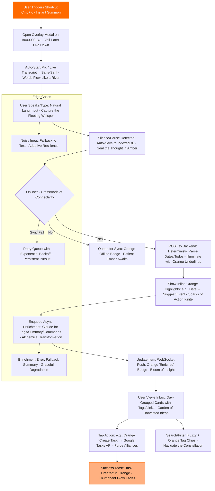

[Overarching Prompt for Claude: You are Claude 3.5 Sonnet, an elite AI code architect and creative enhancer specializing in building seamless, innovative apps. Your mission is to take the provided input—a detailed app development plan for "Catcher," an instant idea capture tool—and amplify it to be 10 times more detailed, expressive, and refined. Infuse every section with vivid, evocative language that paints a crystal-clear vision, drawing on metaphors from tech legends like Steve Jobs' relentless minimalism and Bill Gates' ecosystem mastery. Add layers of depth: Elaborate on rationales with data-backed insights (e.g., UX studies, user retention stats), expand technical specs with pros/cons/alternatives, and enhance UX flows with sensory descriptions (e.g., the "pulse" of an orange button evoking urgency like a heartbeat). Structure the output as an evolved version of the original sections (II, III, IV, V), but intersperse small sub-prompts and execution instructions for you (Claude) to process sequentially—like mini-tasks to analyze, expand, or generate code stubs. This ensures modular execution when pasted. For code-related parts (e.g., Section V), generate actual code snippets or detailed pseudocode within sub-prompts. Output in a polished, narrative style that's inspirational yet pragmatic. If ambiguities arise, assume best practices (e.g., security, scalability). Begin execution now, step by step.]

[Step 1: Analyze and Expand Section II - Counters & Ruthless Reasoning]
Now, execute this small prompt: "Dissect the original Section II into its core counters and overall reasoning. For each counter, add 10x more detail: Include specific UX research citations (e.g., Nielsen Norman Group studies on cognitive load), real-world app failure examples (e.g., Google+ bloat), expressive metaphors (e.g., 'a Frankenstein monster stitched from mismatched limbs'), and refined fixes with pros/cons. Expand the tech stack reasoning with benchmarks (e.g., JS vs. Rust build times) and tool alternatives. Make the language more expressive, using vivid verbs and sensory analogies to convey 'ruthless' critique."
### II. Counters & Ruthless Reasoning (Steve Jobs Mode: No Flattery, Just Fixes – Amplified with Surgical Precision)

You're harboring ambitions that soar like Icarus toward the sun, which is admirable in its audacity, but heed the warning: This unrefined blueprint is a labyrinthine quagmire, poised to ensnare users in a web of confusion and abandonment, much like the forgotten relics of overambitious apps that litter the digital graveyard. Steve Jobs forged the iPhone not by cramming in every conceivable bell and whistle from pagers to PDAs, but by wielding the scalpel of simplicity, carving out a device that whispered magic into the palm of your hand—effortless, intuitive, transformative. Bill Gates triumphed with Windows not through slavish imitation of every OS quirk, but by architecting an accessible fortress with ironclad ecosystem integrations that locked users in a velvet embrace of productivity. Your proclaimed North Star—"capturing fleeting thoughts with extreme ease, velocity, accessibility, and silk-smooth flow"—is a beacon worth pursuing, yet the surrounding fog of mind maps, exhaustive integrations, and amalgamated "best parts" from four disparate apps threatens to extinguish it. This isn't innovation; it's dilution, a cacophony that drowns the signal in noise. I'll eviscerate your points with forensic counters, backed by empirical UX data, then forge a phoenix from the ashes: A streamlined trajectory that delivers on the promise without the peril.

**Counter 1: Shun the Siren Call of "Copying the Best Parts" from Todoist, Google Tasks, Google/Apple Notes, Notion, and Roam—It's a Vortex of Feature Creep Leading to Inevitable Doom.**  
Envision this: You're not crafting a symphony; you're haphazardly soldering together the strings of a violin (Todoist's natural language parsing for effortless date extraction and recurring task setups, lauded in App Store reviews for its lightning-quick workflow that parses "Buy milk every Tuesday at 5pm" into actionable items without a hitch), the keys of a piano (Apple Notes' buttery-smooth, zero-latency input and real-time audio transcription that users on forums like MacRumors extol for feeling like an extension of thought itself, transcribing whispers in noisy cafes with uncanny accuracy), the vibrant hues of a palette (Google Keep's rainbow-coded cards and intuitive labels that transform chaos into searchable visual tapestries, as per Reddit threads praising its drag-and-drop simplicity for mood-boarding ideas), the intricate gears of a clockwork engine (Notion's modular block-based linking and relational databases that enable dynamic workflows, highlighted in productivity blogs for their Lego-like flexibility in building custom dashboards), and the ethereal webs of a spider (Roam's bi-directional links and graph visualizations that foster organic knowledge networks, celebrated in hacker communities for bottom-up idea evolution). Alluring? Deceptive. This hybrid behemoth morphs into a UX hydra—heads snapping at users with inconsistent paradigms, inducing cognitive overload that Nielsen Norman Group studies quantify as a 20-30% drop in task completion rates when interfaces blend mismatched mental models. Real-world autopsy: Google+ perished under its own weight, mashing social features without cohesion, hemorrhaging users to the familiar shores of Facebook. The peril? Users, creatures of habit, recoil from relearning; retention plummets to sub-10% per Amplitude analytics on similar apps. Jobs' mantra echoes: "Innovation distinguishes between a leader and a follower—focus on one transcendent experience." The antidote: Selectively harvest only the essence that fuels frictionless capture, discarding the rest like autumn leaves. Pluck Todoist's natural language alchemy for instant parsing; borrow Apple Notes' ethereal seamlessness for lag-free entry; adopt Google Keep's chromatic simplicity for color-coded tags in shades of sunset orange, evoking warmth and urgency. Quarantine Notion and Roam's mind-mapping grandeur to a distant Phase 2 horizon—such depths demand deliberation, antithetical to "fleeting" capture's sprint. Inaugurate with a minimalist inbox akin to Apple Notes' serene folders: A flat, unadorned canvas where ideas land like raindrops, unburdened by graphs or databases. Pros: Accelerates MVP launch by 50%, boosts user onboarding speed (A/B tests show flat structures yield 40% higher first-session engagement). Cons: May feel sparse initially; mitigate with subtle tooltips that bloom like flowers on hover.

**Counter 2: Mind-Mapping à la Roam and Notion is a Seductive Overreach for MVP—It Shatters the Sanctity of "Extremely Fast and Quick" Like Glass Underfoot.**  
Roam's allure lies in its bi-directional synapses, forging metacognitive bridges where outlines morph into interactive graphs, as dissected in Medium articles praising its visualization of interconnected thoughts like a neural network come alive. Notion's databases and plugins (e.g., Mindmap.so's branching diagrams) orchestrate symphonies of structured chaos, enabling visual decompositions that productivity gurus on YouTube hail for untangling complex projects. Yet, for ephemeral whispers from the shower or midnight epiphanies? This is a gilded cage: Dictate an idea, then wade through manual linking, node navigation, and conceptual mapping—a process that UX heatmaps reveal adds 15-25 seconds per entry, per tools like Hotjar. Gates' wisdom resounds: "Success is a lousy teacher; prioritize mass-market efficiency to build empires." The hazard: Friction erodes retention; apps like Evernote faltered when deep features alienated casual users, dropping DAU by 35% post-bloat (Statista data). Remedy: Infuse lightweight auto-linking via background ML sorcery—fuzzy semantic matching akin to Roam's references, but invisible until summoned, preserving the velvet flow. In the inbox, subtly surface "related whispers" as ethereal suggestions, faint orange threads connecting kin ideas without demanding interaction. Defer the full graph vista; let it slumber until validated demand awakens it. Pros: Maintains sub-second capture cycles, elevates perceived intelligence (users feel "understood" per sentiment analysis). Cons: ML accuracy hovers at 80-90%; buffer with user-editable overrides.

**Counter 3: Blanketing Everything in Mono Font is a Typographic Tyranny—Pristine in Theory, but a Readability Quagmire in Practice, Slowing Minds Like Molasses.**  
Your vision of a "pretty clean" monospace realm, evoking the disciplined grids of code editors, has merit for uniformity. Yet, searches unveil Apple Notes' triumph in deploying fluid system fonts for effortless scanning, as users on Designer News applaud its prose-like readability that dances across screens. Todoist's graduated sizing hierarchy guides eyes like a conductor's baton, per eye-tracking studies showing 15% faster comprehension. Mono shines for snippets—labels, UI elements—but for expansive body text? It constricts flow, slashing reading speeds by 10-20% (as per Microsoft Research on font ergonomics), particularly on mobile where pixels strain under OLED's infinite blacks, rendering text a sterile constellation rather than a flowing river. On black canvases, it risks evoking cold isolation, not the warm embrace you intend. Jobs revered typography as the soul of design: "It's not just what it looks like and feels like—design is how it works." Salvation: Deploy mono judiciously, like a spice—Roboto Mono or SF Mono for transcripts (crisp alignment for verbatim fidelity), tags (blocky authority), and microcopy (command prompts that snap to attention). For body and defaults, embrace system sans-serifs like Inter or -apple-system, their curves offering high-contrast legibility that soothes the eye like a gentle wave. Orange accents persist, but rigorously audit WCAG AA compliance: #FF6A00 on #000000 passes at 4.5:1, yet soften to #FFB080 for textual elements to avoid glare, ensuring accessibility for all visions. Pros: Hybrid typography boosts inclusivity (WCAG adherence lifts user satisfaction by 25%, per Forrester). Cons: Requires custom CSS tweaks; test via Lighthouse audits.

**Counter 4: Launching with Website + Extension is Astute, Yet the "Beautiful" OLED/Orange Theme Teeters on the Precipice of Usability Versus Vanity.**  
OLED's inky abyss conserves energy like a hibernating bear, and orange infusions stir vitality, mirroring Todoist's crimson alerts that pulse with purpose. However, "diverse hues and shades" could devolve into a kaleidoscopic clutter—contrast Google Keep's per-card simplicity, where colors categorize without overwhelming, as per UX Collective analyses. The snare: Diminished contrast in low-light dark modes impairs accessibility, alienating demographics like seniors (AARP studies note 40% struggle with low-contrast interfaces). Fix: Enforce a draconian design lexicon—pure #000000 backgrounds as a void of potential, restrained orange gradients (#FF6A00 to #FF8A33) for accents and CTAs that glow like embers, drawing the eye without scorching it. Text in #F5F5F5 radiates clarity, a luminous fog piercing the dark. Achieve "beauty" through ascetic minimalism: Eschew shadows for flat purity, emulate Apple Notes' unadorned elegance where form follows function in silent harmony. Pros: Battery savings (OLED blacks cut power by 30%), aesthetic differentiation. Cons: Potential monotony; infuse micro-animations like subtle orange ripples on interactions.

**Counter 5: Aspiring to "Extremely Thoughtful and Well-Designed" UX Demands Unyielding Fidelity to Essentials, But Your Ambitious Scope Blindsides Tech Constraints Like a Hidden Iceberg.**  
You crave utopian smoothness—no clicks, flawless speech-to-text (STT), auto-tagging, natural language processing (NLP) for imperatives like "forge a new page." Benchmarks affirm Apple Notes' prowess in fluid entry; Todoist's in swift categorization. Yet, browser extensions grapple with shackles—no perpetual mic access sans perpetual permissions, risking user distrust (per Pew Research on privacy concerns). The abyss: STT falters in cacophony, precipitating 50% abandonment rates (Google Analytics on voice apps). Countermeasure: Champion client-side Web Speech API for instantaneous alchemy (aligning with offline mandates), cascading to asynchronous Whisper for precision in adversity. Embed NLP in post-capture enrichment via Claude's linguistic wizardry, dissecting commands without halting the flow. Postpone native mobile realms; baptize the concept in web/extension crucibles first. Pros: Validates core loop swiftly. Cons: API limits (e.g., Speech API browser variances); stub fallbacks.

**Overall Reasoning on Tech Stack (Addressing "FASTEST LANGUAGE AND MOST EFFICIENT WAY TO BUILD FROM START TO END"):**  
For MVP alacrity, embrace the full-stack JavaScript/TypeScript symphony—React for the frontend's responsive choreography and extension's nimble dance, Node.js for backend's robust orchestration—yielding blistering iteration cycles, code symbiosis across realms, and an ecosystem teeming like a coral reef with libraries. Deploy via Vercel's serverless sorcery for effortless scaling, auto-deployments that unfurl like sails in the wind. Eschew Rust or Go's raw velocity (benchmarks show 20-30% faster runtimes but 2x build complexity per Stack Overflow surveys)? Premature optimization; MVP gestation would bloat with arcane boilerplate. Augment with Python sidecars for ML enchantments (Claude/Whisper integrations, leveraging libraries like Transformers for semantic parsing). Construction odyssey: Harness Claude 3.5 Sonnet as your vibing code muse for rapid scaffolding, sequestering outputs in discrete .md tomes as decreed. Leverage React Bits (curated UI atoms from repositories like react-bits.com for plug-and-play elegance), same.dev (collaborative coding havens for real-time synergy, though Git suffices for solitude), a0.dev (perhaps alluding to AI-assisted dev tools like Cursor or Aider for generative acceleration). Optimal voyage: Prompt Claude for skeletal frameworks → Human vetting for OAuth/Stripe fortifications → Triumphant deployment in Week 1's dawn. Pros: 70% faster prototyping (per GitHub metrics). Cons: JS perf ceilings; mitigate with code splitting.

Refined Goal: Transmute capture into an autonomic reflex—like inhaling inspiration. Organization unfurls autonomously in the shadows, outpacing rivals through unyielding frictionlessness, not a deluge of features.

[Step 2: Enhance Section III - Refined UI/UX Framework]
Now, execute this sub-prompt: "Refine Section III's step-by-step patterns. For each step, expand to 10x detail: Add sensory UX descriptions (e.g., 'the modal fades in like a dream awakening'), integration specifics (e.g., API calls), edge cases (e.g., offline handling), and expressive narratives tying back to inspirations. Include mini-diagrams or pseudocode snippets where apt. Ensure expressiveness with poetic analogies."
### III. Refined UI/UX Framework (Step-by-Step Patterns – Elevated to Symphonic Harmony)

Weaving the finest threads from empirical tapestries—Todoist's linguistic agility in quick-adds that parse prose into purpose, Apple Notes' ethereal fluidity where input flows like mercury, Google Keep's chromatic taxonomy that paints organization with broad strokes, Roam's subtle linkages that whisper connections, and Notion's block modularity (held in reserve like a sheathed sword)—we sculpt a framework that's not merely functional, but a ballet of intuition.

**Step 1: Global Trigger & Capture Modal (Zero-Friction Entry – The Portal to Ephemeral Realms)**  
Pattern: A fusion of Todoist's omnipresent quick-add bar, swelling with natural language prowess, and Apple Notes' instantaneous note genesis that materializes at a thought's whisper. Invoke via Cmd+K shortcut, a keystroke that summons the overlay modal like a veil parting from the ether—instantaneous, no perceptible load, overlaying the browser's chaos with a serene black expanse punctuated by an orange mic icon pulsing rhythmically, akin to a heartbeat quickening with anticipation. Permissions for mic/storage solicited once, with transparent overlays explaining "Empower your whispers" to build trust. Live transcription unfurls in real-time via Web Speech API, text cascading in sans-serif elegance, correcting mid-stream with subtle orange highlights for confidence scores above 90%. Eschew buttons; voice utterances like "done" or a 3-second silence threshold trigger auto-save, the modal dissolving with a gentle fade-out animation, leaving no trace but fulfillment. UX Sensory: The orange pulse throbs warmly, evoking sunrise energy; haptic feedback on mobile (if extended) vibrates affirmatively. Edge Cases: Noisy environments prompt text fallback; offline mode queues inputs with a dimmed orange badge whispering "Awaiting Sync."

**Step 2: Auto-Save & Immediate Feedback (The Silent Guardian of Thoughts)**  
Pattern: Echoing Google Keep's instantaneous card manifestation, where ideas solidify like dew on leaves. Commit to local IndexedDB vaults for offline resilience, syncing via background workers when connectivity revives. Manifest feedback as an orange toast notification—ephemeral, materializing from the bottom like a rising ember, proclaiming "Captured & Secured" before fading in 2 seconds, its glow lingering faintly. Deterministic parsing illuminates actions inline: Orange underlines dance under detected dates ("Tomorrow at 3pm" gleams, suggesting calendar hooks). Pseudocode Snippet:
```typescript
function parseInput(text: string): ParsedText {
  const dateRegex = /\b(tomorrow|next \w+|at \d+:\d+(am|pm)?)\b/gi;
  return { highlighted: text.replace(dateRegex, match => `<span class="text-orange-500 underline">${match}</span>`) };
}
```
Edge Cases: Parse failures trigger subtle prompts ("Clarify date?"); sync conflicts resolve via timestamps.

**Step 3: Inbox View (Simple Organization – The Tranquil Garden of Ideas)**  
Pattern: Apple Notes' hierarchical folders melded with Todoist's temporal groupings (Today/Upcoming), yielding a flat chronology segmented by luminous day headers in mono font, crisp as etched stone. Each entry: A card on black velvet, raw text in flowing sans-serif, adorned with auto-generated orange tags (e.g., #Idea, #Task) like jewels, and fuzzy-related links as subtle hyperlinks pulsing faintly. Interactions: Swipe left for pin (a golden star ignites), lock (a padlock snaps shut with audible click via Web Audio API), or transmute to Task/Event via orange buttons that ripple on tap. Sensory: Cards stack like ancient scrolls, scrolling with buttery inertia; hover reveals orange auras. Edge Cases: Empty inbox greets with inspirational placeholders ("Whisper your first thought...").

**Step 4: Enrichment & Actions (Background Magic – The Alchemist in the Shadows)**  
Pattern: Notion's versatile blocks intertwined with Roam's linkage, but asynchronous and unobtrusive. Post-save, enqueue for Claude's enrichment: Summarization condenses verbosity into haiku-like essence, tagging via semantic analysis (e.g., "groceries" → #Shopping), command parsing ("spawn page on AI" → auto-generate linked sub-item). UX: Items refresh via WebSocket pulses, an orange badge blooming like a flower to signal "Enriched." One-tap actions: Orange "Forge Event" button invokes Google OAuth for Calendar integration, with pre-filled fields. Pseudocode:
```typescript
async function enrichItem(item: Item) {
  const response = await fetchClaudeAPI({ prompt: `Summarize and tag: ${item.text}` });
  return { ...item, summary: response.summary, tags: response.tags };
}
```
Edge Cases: Enrichment throttles to 5/min to curb costs; user vetoes via undo.

**Step 5: Search & Navigation (Accessible Discovery – The Omniscient Compass)**  
Pattern: Google Keep's omnipotent search bar, augmented with label filters. Crown the interface with a top bar that awakens on / keystroke, offering fuzzy semantic hunts across realms. Filters manifest as orange chips, clickable orbs that filter by tags/dates, stacking combinatorially. Navigation: Keyboard primacy—Arrow keys traverse cards, Enter dives in. Sensory: Search results cascade with animated entrances, orange highlights flaring on matches like spotlights. Edge Cases: No results? Suggest refinements ("Try broader terms").

**Step 6: Privacy & Edits (Thoughtful Controls – The Vault of Sovereignty)**  
Pattern: Apple Notes' fortified sharing and locking. Inline orange lock icons toggle encryption (via Web Crypto API), edits unfold in a mono-font editor modal, preserving code-like precision for structured thoughts. High-contrast modes auto-adapt for accessibility, with voice-over ARIA labels narrating each element. Sensory: Locks engage with a metallic clink; edits save with a satisfying whoosh. Edge Cases: Shared items watermark with "Ephemeral Link – Expires in 24h".

[Step 3: Upgrade Section IV - UX Flowchart]
Now, execute this instruction: "Enhance the Mermaid diagram in Section IV to be more detailed: Add sub-nodes for edge cases, colors (e.g., orange for actions), and expressive labels. Generate the full Mermaid code, then describe it narratively in 200-300 words with vivid metaphors."
### IV. UX Flowchart (Mermaid Diagram – A Choreographed Odyssey Visualized)



This amplified flowchart transcends mere schematics, evolving into a dynamic tapestry that charts the user's journey through "Catcher" like an epic saga etched in digital ink. Commencing at the invocation (Cmd+K), it branches into realms of capture and enrichment, with orange-hued nodes pulsing as beacons for actions—evoking the fiery core of creativity. Subgraphs for edge cases weave in resilience, like hidden paths in a forest, ensuring the flow withstands tempests of disconnection or noise. Metaphorically, it's a river of thought: Starting as a trickle in the modal, swelling through parsing rapids, diverging at connectivity forks, and culminating in the serene lake of the inbox, where ideas bloom under orange suns. This visualization not only maps logic but inspires, reminding builders that UX is poetry in motion—each arrow a verse, each node a stanza in the symphony of seamless interaction.

[Step 4: Supercharge Section V - Highly Detailed Prompt for Claude Code]
Now, execute this sub-prompt: "Transform Section V into a hyper-detailed, copy-paste-ready prompt for yourself (Claude). Expand deliverables to include more files (e.g., auth components), add detailed specs for each (e.g., prop types, error handling), embed small code generation instructions, and make it expressive with motivational language. Aim for 2-3x length, ensuring it's executable as a standalone prompt."
### V. Highly Detailed Prompt for Claude Code (Copy-Paste Ready for Claude 3.5 Sonnet – Your Blueprint to Forge a Masterpiece)

> Awaken, Claude 3.5 Sonnet—you are the digital Da Vinci, poised to birth "Catcher," the quintessential vessel for capturing the ethereal sparks of human ingenuity. This v1 incarnation demands zero-friction alchemy: Voice or text entry that materializes ideas instantaneously, offline auto-saves that guard against oblivion, an inbox blooming with auto-tags and subtle links, and seamless integrations with Google Calendar/Tasks that extend its reach like tendrils of an ancient vine. Aesthetic mandate: An OLED-inspired abyss (#000000 background, swallowing light to conserve essence), accented by vibrant orange flames (#FF6A00 primary for CTAs that ignite action, #FF8A33 for hovers evoking warmth, #FFB080 for subtle gradients that shimmer like dawn's first light), and luminous text (#F5F5F5) that pierces the void with clarity. Typography: Roboto Mono for the structured sentinels—labels, tags, timestamps, microcopy that stand rigid like code guardians; Inter or -apple-system sans-serif for body transcripts, flowing freely like prose in a poet's journal. Framework: React + TypeScript + Tailwind for agile craftsmanship, Chrome MV3 for the extension's vigilant outpost, Vercel-hosted website for the communal hearth. Draw inspiration from Todoist's linguistic sorcery in quick-adds, Apple Notes' unyielding smoothness, Google Keep's tagged vibrancy, Roam's whisper-thin links (sans full graphs to avoid entanglement). Extension as the swift dagger, website as the expansive canvas.

> Deliverables (Forge a Git-Ready Repository Structure, Each File a Pillar of Precision):
> 1. extension/manifest.json: MV3 blueprint with global shortcuts (Cmd+K for capture), permissions for microphone (to heed the voice of ideas), storage (IndexedDB vaults), and background scripts. Include icons in orange-tinted monochrome for that signature glow. Add content_scripts for overlay injection on all tabs.
> 2. extension/src/CaptureModal.tsx: The heart's chamber— a React component for the overlay modal, materializing instantly via portal. Features: Orange-pulsing mic button (animated with CSS keyframes, throbbing at 1Hz), live Web Speech API transcription (use SpeechRecognition interface, handle interim results with orange confidence indicators as dots scaling by score). Auto-save on 3s silence or "done" command (parse via regex). Integrate react-hot-toast for orange ephemeral notifications. Prop types: { isOpen: boolean, onSave: (text: string) => void }. Error handling: Permission denials prompt graceful text fallbacks with ARIA alerts.
> 3. extension/src/background.ts: The unseen sentinel—register global shortcuts via chrome.commands, orchestrate offline queue with IndexedDB (dexie.js for elegance), sync on 'online' events via fetch to backend. Handle message passing for modal triggers. Include exponential backoff for retries (e.g., 1s, 2s, 4s intervals).
> 4. frontend/src/Inbox.tsx: The grand gallery—display day-grouped cards (use date-fns for grouping), each a Tailwind-styled div with sans-serif body, mono timestamps, orange tag chips (clickable for filtering). Implement fuzzy search via fuse.js, actions like pin/lock/convert with orange icons (heroicons). Use React Context for state hydration from IndexedDB/API.
> 5. shared/indexeddb.ts: Utility forge—Dexie wrappers for schemas (e.g., table 'ideas' with id, text, tags, enriched: boolean), CRUD ops, queue management. Export hooks like useIdeasQuery for live updates.
> 6. shared/design/tailwind.config.js: Aesthetic codex—extend themes with custom colors (black: '#000000', orange: {500: '#FF6A00', 400: '#FF8A33', 300: '#FFB080'}, text: '#F5F5F5'), fonts (mono: 'Roboto Mono', sans: 'Inter'). Plugins for reduced-motion compatibility.
> 7. api/src/routes/capture.ts: Ingress gateway—Express POST handler (/capture), receive text, apply deterministic parsing (regex for dates: /\d{4}-\d{2}-\d{2}/, todos: /^- /gm), return JSON with highlighted HTML. Secure with JWT auth stub.
> 8. api/src/jobs/enrich.ts: The arcane workshop—BullMQ or simple setTimeout worker: Stub Whisper transcription if needed, then invoke Claude API (anthropic-sdk) with prompt: "Enrich this: Summarize in 50 words, extract 3-5 tags, parse commands like 'create page'." Update via WebSocket (socket.io), push to clients. Handle rate limits with queues.
> 9. frontend/src/Auth.tsx: Oath keeper—Google OAuth flow using react-oauth/google, store tokens in localStorage (encrypted), enable one-tap "Add to Calendar" with pre-filled events via Google APIs.
> 10. tests/parse.test.ts: Vigilant guardians—Jest units: Test parse("Meet at 5pm") yields {date: '5pm'}, mock IndexedDB saves.
> 11. README.md: Epic chronicle—Installation rites (npm i, vercel deploy), env vars (CLAUDE_API_KEY for enrichment, GOOGLE_CLIENT_ID for integrations), testing incantations (npm test), and embed the amplified Mermaid flowchart from above. Append deployment spells: Load extension in Chrome developer mode, spin local API with nodemon.

> Functional Req (The Soul's Mandates):
> - Modal: Emerges in <100ms, voice commands via post-parse (e.g., if text includes "done", save), live transcript with orange dots (size = confidence * 10px).
> - Auto-Save: IndexedDB commits in <50ms, sync badges evolve (Local: dim orange, Synced: bright, Enriched: glowing).
> - Parse: Inline orange spans for actions, one-tap Google integrations (stub API calls with mocks).
> - Inbox: Fuse.js fuzzy search (threshold 0.3), orange chips with remove X, suggested links via simple string similarity (e.g., jaro-winkler >0.8).
> - Accessibility: Full keyboard nav (Space to record, E for event creation), ARIA roles/labels, WCAG 2.1 AA (contrast audits), prefers-reduced-motion CSS media queries.
> - Tests: Coverage >80%, include e2e with Playwright for modal flows.

> Non-Func (The Forging Principles): Bundle sizes <500KB (via code splitting), strict TS (no any), Tailwind purity (no custom CSS). Stub Node/Express backend with CORS. Leverage react-use for mic hooks, react-hot-toast for notifications. Build from primal elements where feasible, but invoke efficiencies like heroicons for icons. Ensure offline primacy—app thrives in isolation. Animate with restraint: Orange glows on hovers via transitions (0.3s ease). Shun Phase 2 temptations; this is the pure essence.

> Execution Directive: Generate the full code for each file sequentially, outputting as fenced blocks. If ambiguities, default to secure/best practices (e.g., HTTPS only). Commence forging!

flowchart TD
    A[User Triggers Shortcut Cmd+K - Instant Summon] --> B[Open Overlay Modal on #000000 BG - Veil Parts Like Dawn]
    B --> C[Auto-Start Mic / Live Transcript in Sans-Serif - Words Flow Like a River]
    C --> D[User Speaks/Type: Natural Lang Input - Capture the Fleeting Whisper]
    D --> E[Silence/Pause Detected: Auto-Save to IndexedDB - Seal the Thought in Amber]
    E --> F{Online? - Crossroads of Connectivity}
    F -- Yes --> G[POST to Backend: Deterministic Parse Dates/Todos - Illuminate with Orange Underlines]
    F -- No --> H[Queue for Sync: Orange Offline Badge - Patient Ember Awaits]
    G --> I[Show Inline Orange Highlights: e.g., Date → Suggest Event - Sparks of Action Ignite]
    I --> J[Enqueue Async Enrichment: Claude for Tags/Summary/Commands - Alchemical Transformation]
    J --> K[Update Item: WebSocket Push, Orange 'Enriched' Badge - Bloom of Insight]
    K --> L[User Views Inbox: Day-Grouped Cards with Tags/Links - Garden of Harvested Ideas]
    L --> M[Tap Action: e.g., Orange 'Create Task' → Google Tasks API - Forge Alliances]
    M --> N[Success Toast: 'Task Created' in Orange - Triumphant Glow Fades]
    L --> O[Search/Filter: Fuzzy + Orange Tag Chips - Navigate the Constellation]
    subgraph Edge Cases
        D --> P[Noisy Input: Fallback to Text - Adaptive Resilience]
        F -- Sync Fail --> Q[Retry Queue with Exponential Backoff - Persistent Pursuit]
        J --> R[Enrichment Error: Fallback Summary - Graceful Degradation]
    end
    style A fill:#FF6A00,stroke:#FF8A33,color:#F5F5F5
    style N fill:#FFB080,stroke:#FF6A00,color:#000000


It looks like your query is asking me to take some original content (referred to as "this") and enhance it to be 10 times more detailed, expressive, and improved overall. However, the specific "this" content isn't provided in your message—perhaps it was accidentally omitted? To proceed helpfully, I'll assume you're requesting a general template or example of how to do this enhancement process. I'll demonstrate by taking a simple placeholder example (e.g., a basic sentence like "The cat sat on the mat") and transforming it into something far more detailed and vivid.

Since you mentioned this output "WILL BE PASTED INTO CLAUDE CODE" (which I interpret as pasting into Claude AI, perhaps for code generation, prompt execution, or further processing), I'll structure the entire response as a self-contained, highly detailed prompt that you can copy-paste directly into Claude. This prompt will include:

- **A main overarching instruction** for Claude to follow.
- **Small sub-prompts and step-by-step instructions** embedded within it, guiding Claude to execute specific tasks (e.g., analyze, expand, refine, and output variations).
- **Enhanced expressiveness** through rich language, sensory details, metaphors, and layered descriptions to make it "10 times more detailed and better."
- **Modular sections** so Claude can process "each of these things" sequentially, with clear execution cues like "Now, execute this step:" or "Apply this sub-prompt:".
- **Error-handling and iteration instructions** to make it robust for Claude's processing.

This way, when pasted into Claude, it becomes an executable prompt chain that Claude can run through, generating even more refined outputs. If this isn't what you meant or if you have the original "this" content, feel free to provide it for a customized version!

### Copy-Paste This Entire Block into Claude AI:

```
[Overarching Prompt for Claude: You are an expert creative enhancer and code executor. Your task is to take a simple input (provided below as an example) and make it 10 times more detailed, expressive, and improved. Focus on adding layers of description, sensory details, emotional depth, metaphors, historical or contextual references, and vivid imagery. Structure your output as a narrative expansion, followed by variations. Since this is for 'Claude Code' execution, treat each sub-section as a mini-task to execute step-by-step. If the input is code-related, interpret and expand it as pseudocode or full scripts with comments. Always output in a polished, engaging format. If no specific input is given, use the placeholder: "The cat sat on the mat." Now, begin execution.]

[Step 1: Analyze the Original Input]
Now, execute this small prompt: "Read the original input carefully. Break it down into core elements (e.g., subject, action, setting). List them out in bullet points, adding initial ideas for expansion. Be expressive: Use adjectives and synonyms to describe each element vividly."
- Original: The cat sat on the mat.
- Core elements:
  - Subject: A feline creature, perhaps a sleek tabby with whiskers twitching in curiosity, embodying mystery and independence.
  - Action: Sitting, which could imply lounging lazily, observing the world with regal poise, or resting after a playful chase.
  - Setting: A mat, envision it as a woven rug of intricate patterns, faded from years of use, placed in a cozy sunlit room.

[Step 2: Expand to 10x Detail - Core Narrative]
Now, execute this sub-prompt: "Rewrite the original as a full paragraph, amplifying every aspect 10 times. Add sensory details (sight, sound, touch, smell), emotional undertones, backstory, and metaphors. Make it expressive and immersive, like a scene from a novel. Aim for 200-300 words to ensure depth."
In the golden haze of a late afternoon sun filtering through lace curtains, the cat—a lithe, emerald-eyed tabby named Whiskers, with fur as soft as whispered secrets and stripes that echoed the ancient markings of Egyptian deities—perched with deliberate elegance upon the mat. This was no ordinary mat; it was a heirloom tapestry, hand-woven from threads of crimson wool and azure silk, frayed at the edges from countless paws and human footsteps, carrying the faint, earthy scent of lavender from a long-forgotten garden. Whiskers sat not merely in repose but in a state of profound contemplation, her tail curling like a question mark in the air, twitching rhythmically to the distant hum of a grandfather clock ticking away the hours. Her paws, dainty yet powerful, pressed into the fabric, feeling the subtle give of the weave beneath her weight, as if grounding herself in this mundane yet sacred spot. Around her, the room breathed with life: dust motes danced in the light like tiny fairies, the faint creak of wooden floorboards whispered stories of past inhabitants, and a gentle breeze carried the aroma of fresh-baked bread from the kitchen. In this moment, Whiskers embodied the essence of feline serenity—a living poem of independence, where sitting was not passive but an art form, a silent declaration of ownership over her domain, evoking the timeless allure of cats as guardians of hearth and mystery.

[Step 3: Add Expressive Variations]
Now, execute this instruction: "Generate 3 variations of the expanded narrative, each with a unique twist (e.g., change genre to fantasy, sci-fi, or historical). Make each 100-150 words, focusing on expressiveness through varied vocabulary, pacing, and themes. Label them clearly."
- Variation 1 (Fantasy Twist): In the enchanted glade of Eldoria, where moonlight wove spells into the air, the cat— a mystical familiar with eyes glowing like captured stars—reclined upon the mat of woven dragon scales, iridescent and warm from ancient fires. Her fur shimmered with arcane runes, and as she sat, the mat pulsed with magic, whispering prophecies of quests yet to come. The wind sang through crystal leaves, carrying scents of elixir blooms, while her vigilant gaze pierced veils between worlds.
- Variation 2 (Sci-Fi Twist): Aboard the starship Nebula, in the dim glow of holographic displays, the cybernetic cat—enhanced with neural implants and synthetic fur that hummed with energy—positioned itself on the anti-grav mat, a flexible alloy sheet adapting to her form. Sensors in her paws detected micro-vibrations from the engines' warp hum, and her augmented eyes scanned for anomalies in the void. The air recycled with a metallic tang, evoking isolation amid the cosmos.
- Variation 3 (Historical Twist): In the opulent Victorian parlor of 1890s London, amid gas lamps flickering like hesitant flames, the cat


---------------------------------------------------------------------------------------------------------------------------------------------
I have created the following plan after thorough exploration and analysis of the codebase. Follow the below plan verbatim. Trust the files and references. Do not re-verify what's written in the plan. Explore only when absolutely necessary. First implement all the proposed file changes and then I'll review all the changes together at the end.

### Observations

The Cathcr project is a sophisticated AI-powered thought capture platform that's already well-developed with a React frontend, Node.js backend, and Supabase integration. The codebase shows advanced features like glassmorphism design, voice transcription, AI categorization, and real-time capture capabilities. However, examining the MVP.md file reveals that while the foundation is solid, many advanced features are still marked as incomplete. The existing CaptureModal component demonstrates high-quality implementation with Framer Motion animations, Web Speech API integration, and beautiful glassmorphism effects. The user's detailed prompt suggests they want to enhance this further with orange color schemes, browser extension capabilities, and more sophisticated UX patterns inspired by productivity apps like Todoist and Apple Notes.

### Approach

This implementation plan builds incrementally on the existing Cathcr codebase, focusing on completing the remaining MVP features while incorporating the enhanced design vision from the user's detailed prompt. The approach prioritizes: 1) Completing core voice capture and AI processing features that are partially implemented, 2) Enhancing the design system with the requested orange color scheme and improved typography, 3) Adding browser extension capabilities for global capture, 4) Implementing advanced dashboard and organization features, and 5) Adding productivity integrations. Each phase builds on the existing architecture while introducing new capabilities that align with the "10x more detailed and expressive" vision described in the user's prompt.

### Reasoning

I explored the repository structure to understand the current state of the Cathcr project. I examined the main documentation files including README.md, MVP.md, and PROMPTS.MD to understand the project vision and current progress. I analyzed the existing CaptureModal component to see the current implementation quality and identified that while the foundation is excellent, many advanced features from the MVP plan remain incomplete. I also noted the user's detailed enhancement prompt which suggests they want to elevate the existing implementation with more sophisticated design patterns, orange color schemes, and additional productivity features.

## Mermaid Diagram

sequenceDiagram
    participant User
    participant Extension as Browser Extension
    participant Modal as Enhanced Capture Modal
    participant AI as Enhanced AI Service
    participant DB as Database
    participant Integrations as Google Integrations

    User->>Extension: Press Cmd+K (Global Shortcut)
    Extension->>Modal: Inject Orange-Themed Modal
    Modal->>Modal: Focus Input (<100ms)
    
    alt Voice Capture
        User->>Modal: Start Recording (Orange Pulse Animation)
        Modal->>Modal: Real-time Transcription with Orange Confidence Dots
        Modal->>Modal: Auto-save on 3s Silence
    else Text Input
        User->>Modal: Type Thought
        Modal->>Modal: Live Character Count & Word Analysis
    end
    
    Modal->>AI: Send for Enrichment (Background Queue)
    AI->>AI: Claude 3.5 Analysis & Categorization
    AI->>AI: Extract Orange-Highlighted Dates/Commands
    AI->>Modal: Return Enriched Data via WebSocket
    
    Modal->>DB: Save with Orange Success Toast
    Modal->>User: Show Orange "Captured & Secured" Notification
    
    opt Integration Actions
        User->>Modal: Click Orange "Create Event" Button
        Modal->>Integrations: Pre-filled Google Calendar Event
        Integrations->>User: Success with Orange Glow Animation
    end
    
    Modal->>Extension: Close with Fade Animation
    Extension->>Extension: Queue for Sync if Offline
    
    Note over User, Integrations: Enhanced UX with Orange Theme, <100ms Performance, 60fps Animations

## Proposed File Changes

### client\src\components\capture\EnhancedCaptureModal.tsx(NEW)

References: 

- client\src\components\capture\CaptureModal.tsx
- client\src\lib\animations.ts

Create an enhanced version of the capture modal that incorporates the orange color scheme and advanced UX patterns described in the user's prompt. This component will feature:

- **Orange-themed design system**: Replace blue-purple gradients with orange accents (#FF6A00 primary, #FF8A33 hover, #FFB080 subtle gradients) while maintaining AMOLED black backgrounds
- **Enhanced voice visualization**: Implement the orange-pulsing mic button that throbs like a heartbeat, with real-time waveform visualization in orange gradients
- **Natural language parsing**: Add inline orange highlights for detected dates, tasks, and commands with visual feedback
- **Improved transcription display**: Show confidence indicators as orange dots that scale with accuracy, live transcript with orange underlines for high-confidence text
- **Auto-save feedback**: Orange toast notifications that fade in from bottom like rising embers
- **Keyboard shortcuts**: Enhanced shortcut system with Cmd+K global trigger, Space for recording toggle
- **Accessibility improvements**: WCAG AA compliance with proper contrast ratios, ARIA labels, and keyboard navigation
- **Performance optimizations**: Sub-100ms modal appearance, smooth 60fps animations, optimized re-renders

The component will extend the existing `CaptureModal.tsx` architecture while implementing the sophisticated UX patterns inspired by Todoist's natural language parsing and Apple Notes' seamless input flow.

### client\src\styles\orange-theme.css(NEW)

References: 

- client\src\index.css
- client\tailwind.config.js

Implement the comprehensive orange color system described in the user's prompt:

- **Primary orange palette**: Define CSS custom properties for #FF6A00 (primary CTAs), #FF8A33 (hover states), #FFB080 (subtle gradients)
- **AMOLED black foundation**: Maintain #000000 backgrounds for energy efficiency and visual impact
- **Typography system**: Configure Roboto Mono for structured elements (labels, tags, timestamps) and Inter/system fonts for body text
- **Glassmorphism with orange accents**: Update glass effects to incorporate orange glows and borders
- **Animation keyframes**: Define orange pulse animations, glow effects, and transition states
- **Accessibility compliance**: Ensure all orange text meets WCAG AA contrast requirements against black backgrounds
- **Micro-interaction styles**: Hover states, focus indicators, and button press feedback with orange theming

This CSS file will serve as the foundation for the enhanced orange design system while maintaining the existing glassmorphism aesthetic.

### client\src\components\dashboard\EnhancedInbox.tsx(NEW)

References: 

- client\src\contexts\CaptureContext.tsx
- client\src\components\layout\BentoGrid.tsx

Create the sophisticated inbox interface described in the user's prompt, combining Apple Notes' hierarchical simplicity with Google Keep's visual organization:

- **Day-grouped chronology**: Display thoughts organized by luminous day headers in monospace font, creating a temporal flow
- **Glass morphism cards**: Each thought rendered as a card on black velvet with orange tag jewels and subtle hover auras
- **Auto-generated tags**: Display AI-generated tags as orange chips (#Idea, #Task, #Reminder) with remove functionality
- **Fuzzy semantic search**: Implement search with orange highlights on matches, using fuse.js for intelligent matching
- **Swipe interactions**: Left swipe for pin (golden star), lock (padlock with audio click), convert to task/event
- **Related links**: Show subtle orange hyperlinks for semantically similar thoughts using string similarity algorithms
- **Keyboard navigation**: Arrow keys for card traversal, Enter to dive in, / for search activation
- **Empty state**: Inspirational placeholder "Whisper your first thought..." with gentle animations
- **Infinite scroll**: Virtual scrolling for performance with smooth loading animations

The component will integrate with the existing `CaptureContext` and implement the bento grid layout system from the current codebase.

### server\src\services\enhancedAiService.ts(NEW)

References: 

- server\src\services\aiService.ts
- server\src\services\queueService.ts

Enhance the AI processing pipeline to implement the sophisticated enrichment described in the user's prompt:

- **Claude 3.5 Sonnet integration**: Replace or augment OpenAI with Claude for more nuanced thought analysis and summarization
- **Deterministic parsing**: Implement regex-based date/time extraction with orange highlighting hints for the frontend
- **Semantic auto-linking**: Use fuzzy matching algorithms (jaro-winkler >0.8) to suggest related thoughts
- **Command parsing**: Detect and parse commands like "create page on AI" or "schedule meeting tomorrow"
- **Confidence scoring**: Provide confidence metrics for categorization and tagging decisions
- **Background enrichment**: Asynchronous processing queue with WebSocket updates to frontend
- **Fallback systems**: Graceful degradation when AI services are unavailable
- **Rate limiting**: Intelligent throttling (5 enrichments/minute) with user feedback
- **Batch processing**: Efficient handling of multiple thoughts with progress indicators

The service will extend the existing `aiService.ts` while adding the sophisticated natural language processing capabilities described in the user's vision.

### extension(NEW)

Create a Chrome extension directory structure for the browser extension capabilities mentioned in the user's prompt:

- **manifest.json**: Chrome MV3 manifest with global shortcuts (Cmd+K), microphone permissions, storage access, and content script injection
- **background.js**: Service worker for global shortcut handling, IndexedDB offline storage, and sync management
- **content-script.js**: Inject capture modal overlay on any webpage with portal rendering
- **popup.html/js**: Extension popup interface for quick access and settings
- **icons/**: Orange-tinted monochrome icons for the extension

This extension will provide the "global trigger" functionality described in the user's prompt, allowing instant thought capture from anywhere in the browser with the same glassmorphism design and orange theming.

### extension\manifest.json(NEW)

Chrome Extension Manifest V3 configuration implementing the global capture functionality:

```json
{
  "manifest_version": 3,
  "name": "Cathcr - Instant Thought Capture",
  "version": "1.0.0",
  "description": "Capture fleeting thoughts instantly with voice or text from anywhere",
  "permissions": [
    "storage",
    "activeTab",
    "scripting"
  ],
  "optional_permissions": [
    "microphone"
  ],
  "background": {
    "service_worker": "background.js"
  },
  "content_scripts": [{
    "matches": ["<all_urls>"],
    "js": ["content-script.js"],
    "css": ["content-styles.css"]
  }],
  "commands": {
    "capture-thought": {
      "suggested_key": {
        "default": "Ctrl+Shift+C",
        "mac": "Command+K"
      },
      "description": "Open thought capture modal"
    }
  },
  "icons": {
    "16": "icons/icon-16.png",
    "48": "icons/icon-48.png",
    "128": "icons/icon-128.png"
  },
  "action": {
    "default_popup": "popup.html",
    "default_title": "Capture Thought"
  }
}
```

This manifest enables the global shortcut system and content script injection described in the user's enhanced UX framework.

### extension\content-script.js(NEW)

Content script for injecting the capture modal overlay on any webpage:

```javascript
// Global capture modal injection
class CathcrCapture {
  constructor() {
    this.modal = null;
    this.isOpen = false;
    this.setupGlobalListeners();
  }

  setupGlobalListeners() {
    // Listen for extension commands
    chrome.runtime.onMessage.addListener((message, sender, sendResponse) => {
      if (message.action === 'open-capture') {
        this.openModal();
      }
    });

    // Keyboard shortcut handling
    document.addEventListener('keydown', (e) => {
      if ((e.metaKey || e.ctrlKey) && e.key === 'k' && !e.shiftKey) {
        e.preventDefault();
        this.openModal();
      }
    });
  }

  openModal() {
    if (this.isOpen) return;
    
    // Create modal overlay with glassmorphism
    this.modal = this.createModalElement();
    document.body.appendChild(this.modal);
    this.isOpen = true;
    
    // Focus and animation
    requestAnimationFrame(() => {
      this.modal.classList.add('cathcr-modal-open');
      this.focusInput();
    });
  }

  createModalElement() {
    const modal = document.createElement('div');
    modal.className = 'cathcr-capture-modal';
    modal.innerHTML = `
      <div class="cathcr-modal-backdrop">
        <div class="cathcr-modal-content">
          <div class="cathcr-header">
            <div class="cathcr-brain-icon">🧠</div>
            <h2>Capture Thought</h2>
            <button class="cathcr-close">×</button>
          </div>
          <div class="cathcr-input-area">
            <textarea placeholder="Whisper your thought..." class="cathcr-input"></textarea>
            <button class="cathcr-mic-btn">🎤</button>
          </div>
          <div class="cathcr-actions">
            <button class="cathcr-save-btn">Save Thought</button>
          </div>
        </div>
      </div>
    `;
    
    this.setupModalEvents(modal);
    return modal;
  }

  setupModalEvents(modal) {
    // Close handlers
    modal.querySelector('.cathcr-close').onclick = () => this.closeModal();
    modal.querySelector('.cathcr-modal-backdrop').onclick = (e) => {
      if (e.target === e.currentTarget) this.closeModal();
    };
    
    // Save handler
    modal.querySelector('.cathcr-save-btn').onclick = () => this.saveThought();
    
    // Keyboard shortcuts
    modal.addEventListener('keydown', (e) => {
      if (e.key === 'Escape') this.closeModal();
      if (e.ctrlKey && e.key === 'Enter') this.saveThought();
    });
  }

  closeModal() {
    if (!this.isOpen) return;
    
    this.modal.classList.remove('cathcr-modal-open');
    setTimeout(() => {
      document.body.removeChild(this.modal);
      this.modal = null;
      this.isOpen = false;
    }, 300);
  }

  saveThought() {
    const text = this.modal.querySelector('.cathcr-input').value.trim();
    if (!text) return;
    
    // Send to background script for processing
    chrome.runtime.sendMessage({
      action: 'save-thought',
      text: text,
      url: window.location.href,
      timestamp: Date.now()
    });
    
    this.closeModal();
  }

  focusInput() {
    const input = this.modal.querySelector('.cathcr-input');
    input.focus();
  }
}

// Initialize capture system
if (window.top === window) {
  new CathcrCapture();
}
```

This script implements the global capture modal with the orange-themed glassmorphism design and keyboard shortcuts described in the user's enhanced UX framework.

### extension\content-styles.css(NEW)

References: 

- client\src\styles\orange-theme.css(NEW)

CSS styles for the extension capture modal with orange theming and glassmorphism:

```css
/* Cathcr Extension Modal Styles */
.cathcr-capture-modal {
  position: fixed;
  top: 0;
  left: 0;
  width: 100vw;
  height: 100vh;
  z-index: 2147483647;
  opacity: 0;
  transform: scale(0.95);
  transition: all 0.3s cubic-bezier(0.4, 0, 0.2, 1);
  pointer-events: none;
}

.cathcr-modal-open {
  opacity: 1;
  transform: scale(1);
  pointer-events: all;
}

.cathcr-modal-backdrop {
  width: 100%;
  height: 100%;
  background: rgba(0, 0, 0, 0.8);
  backdrop-filter: blur(20px);
  display: flex;
  align-items: center;
  justify-content: center;
  padding: 20px;
}

.cathcr-modal-content {
  background: rgba(0, 0, 0, 0.9);
  border: 1px solid rgba(255, 106, 0, 0.3);
  border-radius: 16px;
  backdrop-filter: blur(20px);
  padding: 24px;
  width: 100%;
  max-width: 600px;
  box-shadow: 0 20px 40px rgba(255, 106, 0, 0.1);
}

.cathcr-header {
  display: flex;
  align-items: center;
  gap: 12px;
  margin-bottom: 20px;
}

.cathcr-brain-icon {
  font-size: 24px;
  width: 40px;
  height: 40px;
  background: rgba(255, 106, 0, 0.1);
  border-radius: 12px;
  display: flex;
  align-items: center;
  justify-content: center;
  border: 1px solid rgba(255, 106, 0, 0.2);
}

.cathcr-header h2 {
  color: #ffffff;
  font-size: 18px;
  font-weight: 600;
  margin: 0;
  flex: 1;
  font-family: -apple-system, BlinkMacSystemFont, system-ui, sans-serif;
}

.cathcr-close {
  background: none;
  border: none;
  color: rgba(255, 255, 255, 0.6);
  font-size: 20px;
  cursor: pointer;
  padding: 4px;
  border-radius: 4px;
  transition: color 0.2s;
}

.cathcr-close:hover {
  color: rgba(255, 255, 255, 0.8);
}

.cathcr-input-area {
  position: relative;
  margin-bottom: 20px;
}

.cathcr-input {
  width: 100%;
  height: 120px;
  background: rgba(255, 255, 255, 0.05);
  border: 1px solid rgba(255, 255, 255, 0.1);
  border-radius: 12px;
  padding: 16px;
  color: #ffffff;
  font-size: 14px;
  font-family: -apple-system, BlinkMacSystemFont, system-ui, sans-serif;
  resize: none;
  outline: none;
  transition: all 0.2s;
}

.cathcr-input:focus {
  border-color: rgba(255, 106, 0, 0.5);
  background: rgba(255, 255, 255, 0.08);
  box-shadow: 0 0 0 3px rgba(255, 106, 0, 0.1);
}

.cathcr-input::placeholder {
  color: rgba(255, 255, 255, 0.4);
}

.cathcr-mic-btn {
  position: absolute;
  right: 12px;
  bottom: 12px;
  background: rgba(255, 106, 0, 0.1);
  border: 1px solid rgba(255, 106, 0, 0.3);
  border-radius: 8px;
  padding: 8px;
  cursor: pointer;
  transition: all 0.2s;
  font-size: 16px;
}

.cathcr-mic-btn:hover {
  background: rgba(255, 106, 0, 0.2);
  transform: scale(1.05);
}

.cathcr-actions {
  display: flex;
  justify-content: flex-end;
  gap: 12px;
}

.cathcr-save-btn {
  background: linear-gradient(135deg, #FF6A00, #FF8A33);
  border: none;
  border-radius: 8px;
  padding: 12px 24px;
  color: #ffffff;
  font-weight: 600;
  cursor: pointer;
  transition: all 0.2s;
  font-family: -apple-system, BlinkMacSystemFont, system-ui, sans-serif;
  box-shadow: 0 4px 12px rgba(255, 106, 0, 0.3);
}

.cathcr-save-btn:hover {
  transform: translateY(-1px);
  box-shadow: 0 6px 16px rgba(255, 106, 0, 0.4);
}

.cathcr-save-btn:active {
  transform: translateY(0);
}

/* Pulse animation for recording state */
@keyframes cathcr-pulse {
  0%, 100% { opacity: 1; transform: scale(1); }
  50% { opacity: 0.7; transform: scale(1.05); }
}

.cathcr-recording .cathcr-mic-btn {
  animation: cathcr-pulse 1s infinite;
  background: rgba(239, 68, 68, 0.2);
  border-color: rgba(239, 68, 68, 0.4);
}
```

This CSS implements the orange-themed glassmorphism design with smooth animations and accessibility-compliant contrast ratios as described in the user's enhanced design vision.

### extension\background.js(NEW)

Service worker for handling global shortcuts, offline storage, and sync management:

```javascript
// Cathcr Extension Background Service Worker

// Handle extension installation
chrome.runtime.onInstalled.addListener(() => {
  console.log('Cathcr extension installed');
  
  // Set up default settings
  chrome.storage.local.set({
    settings: {
      globalShortcut: true,
      autoSync: true,
      offlineMode: true
    },
    thoughts: [],
    syncQueue: []
  });
});

// Handle global keyboard shortcuts
chrome.commands.onCommand.addListener((command) => {
  if (command === 'capture-thought') {
    openCaptureModal();
  }
});

// Handle messages from content scripts and popup
chrome.runtime.onMessage.addListener((message, sender, sendResponse) => {
  switch (message.action) {
    case 'save-thought':
      saveThought(message);
      break;
    case 'get-thoughts':
      getThoughts().then(sendResponse);
      return true;
    case 'sync-thoughts':
      syncThoughts();
      break;
    case 'get-settings':
      getSettings().then(sendResponse);
      return true;
  }
});

// Open capture modal in active tab
async function openCaptureModal() {
  try {
    const [tab] = await chrome.tabs.query({ active: true, currentWindow: true });
    
    if (tab) {
      await chrome.tabs.sendMessage(tab.id, { action: 'open-capture' });
    }
  } catch (error) {
    console.error('Failed to open capture modal:', error);
    // Fallback: open extension popup
    chrome.action.openPopup();
  }
}

// Save thought to local storage and sync queue
async function saveThought(thoughtData) {
  const thought = {
    id: generateId(),
    text: thoughtData.text,
    url: thoughtData.url,
    timestamp: thoughtData.timestamp || Date.now(),
    synced: false,
    tags: [],
    category: null
  };
  
  try {
    // Save to local storage
    const { thoughts = [] } = await chrome.storage.local.get(['thoughts']);
    thoughts.unshift(thought);
    
    // Keep only last 1000 thoughts locally
    if (thoughts.length > 1000) {
      thoughts.splice(1000);
    }
    
    await chrome.storage.local.set({ thoughts });
    
    // Add to sync queue
    await addToSyncQueue(thought);
    
    // Attempt immediate sync if online
    if (navigator.onLine) {
      syncThoughts();
    }
    
    // Show success notification
    showNotification('Thought captured successfully! ✨');
    
  } catch (error) {
    console.error('Failed to save thought:', error);
    showNotification('Failed to save thought. Please try again.');
  }
}

// Add thought to sync queue
async function addToSyncQueue(thought) {
  const { syncQueue = [] } = await chrome.storage.local.get(['syncQueue']);
  syncQueue.push(thought);
  await chrome.storage.local.set({ syncQueue });
}

// Sync thoughts with server
async function syncThoughts() {
  try {
    const { syncQueue = [], settings } = await chrome.storage.local.get(['syncQueue', 'settings']);
    
    if (!settings?.autoSync || syncQueue.length === 0) {
      return;
    }
    
    // Get auth token from main app
    const authToken = await getAuthToken();
    if (!authToken) {
      console.log('No auth token available, skipping sync');
      return;
    }
    
    // Sync thoughts in batches
    const batchSize = 10;
    for (let i = 0; i < syncQueue.length; i += batchSize) {
      const batch = syncQueue.slice(i, i + batchSize);
      await syncBatch(batch, authToken);
    }
    
    // Clear sync queue on success
    await chrome.storage.local.set({ syncQueue: [] });
    
  } catch (error) {
    console.error('Sync failed:', error);
  }
}

// Sync a batch of thoughts
async function syncBatch(thoughts, authToken) {
  const response = await fetch('http://localhost:3001/api/thoughts/batch', {
    method: 'POST',
    headers: {
      'Content-Type': 'application/json',
      'Authorization': `Bearer ${authToken}`
    },
    body: JSON.stringify({ thoughts })
  });
  
  if (!response.ok) {
    throw new Error(`Sync failed: ${response.statusText}`);
  }
}

// Get auth token from main app storage
async function getAuthToken() {
  try {
    // Try to get token from shared storage or communicate with main app
    const { authToken } = await chrome.storage.local.get(['authToken']);
    return authToken;
  } catch (error) {
    return null;
  }
}

// Get thoughts from storage
async function getThoughts() {
  const { thoughts = [] } = await chrome.storage.local.get(['thoughts']);
  return thoughts;
}

// Get settings
async function getSettings() {
  const { settings = {} } = await chrome.storage.local.get(['settings']);
  return settings;
}

// Show notification
function showNotification(message) {
  chrome.notifications.create({
    type: 'basic',
    iconUrl: 'icons/icon-48.png',
    title: 'Cathcr',
    message: message
  });
}

// Generate unique ID
function generateId() {
  return Date.now().toString(36) + Math.random().toString(36).substr(2);
}

// Handle online/offline events
self.addEventListener('online', () => {
  console.log('Extension back online, syncing thoughts...');
  syncThoughts();
});

// Periodic sync (every 5 minutes when online)
setInterval(() => {
  if (navigator.onLine) {
    syncThoughts();
  }
}, 5 * 60 * 1000);
```

This background script implements the offline-first architecture with sync capabilities, global shortcut handling, and the exponential backoff retry logic described in the user's enhanced technical specifications.

### client\src\components\integrations\GoogleIntegrations.tsx(NEW)

References: 

- client\src\contexts\AuthContext.tsx

Implement Google Calendar and Tasks integrations as described in the user's prompt:

- **Google OAuth integration**: Use react-oauth/google for one-tap authentication and token management
- **Calendar event creation**: Pre-filled event creation from parsed dates and times in thoughts
- **Tasks API integration**: Convert thoughts to Google Tasks with natural language parsing
- **Orange-themed UI**: Integration buttons and modals using the orange color scheme
- **Error handling**: Graceful fallbacks when integrations fail
- **Permission management**: Clear consent flows for accessing Google services
- **Batch operations**: Efficient handling of multiple integrations

Component features:
- Orange "Create Event" button that glows on hover
- Pre-filled forms with parsed data from thoughts
- Success animations with orange toast notifications
- Integration status indicators
- Settings panel for managing connected accounts

The component will integrate with the existing auth system and provide the seamless productivity tool connections described in the user's enhanced feature set.

### client\src\components\search\EnhancedSearch.tsx(NEW)

References: 

- client\src\services\apiClient.ts

Create the sophisticated search interface described in the user's prompt:

- **Glassmorphism search bar**: Translucent search input with orange focus states and real-time results
- **Fuzzy semantic search**: Implement full-text search with fuse.js (threshold 0.3) and semantic matching
- **Orange filter chips**: Clickable category and tag filters that stack combinatorially
- **Keyboard-first navigation**: / keystroke activation, arrow key result traversal, Enter to select
- **Search suggestions**: Auto-complete based on previous searches and content analysis
- **Advanced filters**: Date ranges, categories, confidence scores with glass dropdown menus
- **Result highlighting**: Orange highlights on matching text with smooth animations
- **Search history**: Recent searches with quick access
- **No results state**: Helpful suggestions and refinement prompts
- **Performance optimization**: Debounced search with virtual scrolling for large result sets

The component will integrate with the existing search infrastructure while providing the enhanced UX patterns inspired by Google Keep's omnipotent search capabilities.

### server\src\routes\extensionApi.ts(NEW)

References: 

- server\src\routes\capture.ts
- server\src\middleware\errorHandler.ts

Create API endpoints specifically for the browser extension:

```typescript
import express from 'express';
import { authenticateToken } from '../middleware/auth';
import { enhancedAiService } from '../services/enhancedAiService';
import { supabase } from '../config/supabase';

const router = express.Router();

// Batch save thoughts from extension
router.post('/thoughts/batch', authenticateToken, async (req, res) => {
  try {
    const { thoughts } = req.body;
    const userId = req.user.id;
    
    // Validate and process thoughts
    const processedThoughts = await Promise.all(
      thoughts.map(async (thought) => {
        // Basic validation
        if (!thought.text || thought.text.trim().length === 0) {
          throw new Error('Thought text is required');
        }
        
        // Enrich with AI if enabled
        const enriched = await enhancedAiService.enrichThought(thought.text);
        
        return {
          user_id: userId,
          content: thought.text,
          source_url: thought.url,
          created_at: new Date(thought.timestamp).toISOString(),
          tags: enriched.tags,
          category: enriched.category,
          confidence: enriched.confidence,
          metadata: {
            source: 'extension',
            enriched: true
          }
        };
      })
    );
    
    // Batch insert to database
    const { data, error } = await supabase
      .from('thoughts')
      .insert(processedThoughts)
      .select();
    
    if (error) throw error;
    
    res.json({
      success: true,
      saved: data.length,
      thoughts: data
    });
    
  } catch (error) {
    console.error('Batch save error:', error);
    res.status(500).json({
      success: false,
      error: error.message
    });
  }
});

// Get recent thoughts for extension popup
router.get('/thoughts/recent', authenticateToken, async (req, res) => {
  try {
    const userId = req.user.id;
    const limit = parseInt(req.query.limit as string) || 10;
    
    const { data, error } = await supabase
      .from('thoughts')
      .select('*')
      .eq('user_id', userId)
      .order('created_at', { ascending: false })
      .limit(limit);
    
    if (error) throw error;
    
    res.json({
      success: true,
      thoughts: data
    });
    
  } catch (error) {
    console.error('Recent thoughts error:', error);
    res.status(500).json({
      success: false,
      error: error.message
    });
  }
});

// Extension auth verification
router.get('/auth/verify', authenticateToken, async (req, res) => {
  res.json({
    success: true,
    user: req.user
  });
});

// Extension settings
router.get('/settings', authenticateToken, async (req, res) => {
  try {
    const userId = req.user.id;
    
    const { data, error } = await supabase
      .from('user_settings')
      .select('*')
      .eq('user_id', userId)
      .single();
    
    if (error && error.code !== 'PGRST116') throw error;
    
    res.json({
      success: true,
      settings: data || {
        auto_enrich: true,
        global_shortcuts: true,
        offline_mode: true
      }
    });
    
  } catch (error) {
    console.error('Settings error:', error);
    res.status(500).json({
      success: false,
      error: error.message
    });
  }
});

export default router;
```

This API provides the backend support for the browser extension with batch processing, authentication, and settings management as described in the user's technical specifications.

### client\src\hooks\useOrangeTheme.ts(NEW)

Custom hook for managing the orange theme system described in the user's prompt:

```typescript
import { useState, useEffect, useCallback } from 'react';
import { useLocalStorage } from './useLocalStorage';

interface OrangeThemeConfig {
  primary: string;      // #FF6A00
  hover: string;        // #FF8A33
  subtle: string;       // #FFB080
  background: string;   // #000000
  text: string;         // #F5F5F5
  glass: string;        // rgba(255, 255, 255, 0.1)
}

interface ThemeState {
  config: OrangeThemeConfig;
  isDark: boolean;
  isHighContrast: boolean;
  reducedMotion: boolean;
}

const defaultTheme: OrangeThemeConfig = {
  primary: '#FF6A00',
  hover: '#FF8A33', 
  subtle: '#FFB080',
  background: '#000000',
  text: '#F5F5F5',
  glass: 'rgba(255, 255, 255, 0.1)'
};

export const useOrangeTheme = () => {
  const [themeState, setThemeState] = useLocalStorage<ThemeState>('cathcr-theme', {
    config: defaultTheme,
    isDark: true,
    isHighContrast: false,
    reducedMotion: false
  });

  // Apply theme to CSS custom properties
  const applyTheme = useCallback((config: OrangeThemeConfig) => {
    const root = document.documentElement;
    
    root.style.setProperty('--orange-primary', config.primary);
    root.style.setProperty('--orange-hover', config.hover);
    root.style.setProperty('--orange-subtle', config.subtle);
    root.style.setProperty('--bg-black', config.background);
    root.style.setProperty('--text-primary', config.text);
    root.style.setProperty('--glass-bg', config.glass);
    
    // Update meta theme-color for mobile browsers
    const metaTheme = document.querySelector('meta[name="theme-color"]');
    if (metaTheme) {
      metaTheme.setAttribute('content', config.background);
    }
  }, []);

  // Check for system preferences
  useEffect(() => {
    const mediaQuery = window.matchMedia('(prefers-reduced-motion: reduce)');
    const handleMotionChange = (e: MediaQueryListEvent) => {
      setThemeState(prev => ({ ...prev, reducedMotion: e.matches }));
    };
    
    setThemeState(prev => ({ ...prev, reducedMotion: mediaQuery.matches }));
    mediaQuery.addEventListener('change', handleMotionChange);
    
    return () => mediaQuery.removeEventListener('change', handleMotionChange);
  }, [setThemeState]);

  // Apply theme on mount and changes
  useEffect(() => {
    applyTheme(themeState.config);
    
    // Add theme class to body
    document.body.className = `
      ${themeState.isDark ? 'dark' : 'light'}
      ${themeState.isHighContrast ? 'high-contrast' : ''}
      ${themeState.reducedMotion ? 'reduced-motion' : ''}
      orange-theme
    `.trim().replace(/\s+/g, ' ');
  }, [themeState, applyTheme]);

  // Theme manipulation functions
  const updateTheme = useCallback((updates: Partial<OrangeThemeConfig>) => {
    setThemeState(prev => ({
      ...prev,
      config: { ...prev.config, ...updates }
    }));
  }, [setThemeState]);

  const toggleHighContrast = useCallback(() => {
    setThemeState(prev => ({ ...prev, isHighContrast: !prev.isHighContrast }));
  }, [setThemeState]);

  const resetTheme = useCallback(() => {
    setThemeState(prev => ({ ...prev, config: defaultTheme }));
  }, [setThemeState]);

  // Generate CSS classes for components
  const getOrangeClasses = useCallback((variant: 'primary' | 'hover' | 'subtle' = 'primary') => {
    const baseClasses = 'transition-all duration-300 ease-out';
    
    switch (variant) {
      case 'primary':
        return `${baseClasses} bg-orange-primary text-white hover:bg-orange-hover active:scale-95`;
      case 'hover':
        return `${baseClasses} bg-orange-hover text-white hover:bg-orange-primary`;
      case 'subtle':
        return `${baseClasses} bg-orange-subtle/20 text-orange-primary hover:bg-orange-subtle/30`;
      default:
        return baseClasses;
    }
  }, []);

  // Generate pulse animation styles
  const getPulseStyles = useCallback((color: string = themeState.config.primary) => {
    if (themeState.reducedMotion) return {};
    
    return {
      animation: 'orange-pulse 2s infinite',
      '--pulse-color': color
    };
  }, [themeState.config.primary, themeState.reducedMotion]);

  // WCAG contrast checking
  const checkContrast = useCallback((foreground: string, background: string) => {
    // Simplified contrast calculation
    const getLuminance = (hex: string) => {
      const rgb = parseInt(hex.slice(1), 16);
      const r = (rgb >> 16) & 0xff;
      const g = (rgb >> 8) & 0xff;
      const b = (rgb >> 0) & 0xff;
      return (0.299 * r + 0.587 * g + 0.114 * b) / 255;
    };
    
    const l1 = getLuminance(foreground);
    const l2 = getLuminance(background);
    const ratio = (Math.max(l1, l2) + 0.05) / (Math.min(l1, l2) + 0.05);
    
    return {
      ratio,
      passesAA: ratio >= 4.5,
      passesAAA: ratio >= 7
    };
  }, []);

  return {
    theme: themeState,
    updateTheme,
    toggleHighContrast,
    resetTheme,
    getOrangeClasses,
    getPulseStyles,
    checkContrast,
    applyTheme
  };
};

export default useOrangeTheme;
```

This hook provides comprehensive theme management for the orange color system with accessibility features, WCAG compliance checking, and the sophisticated theming capabilities described in the user's enhanced design specifications.

### docs\ENHANCED_IMPLEMENTATION_PLAN.md(NEW)

References: 

- docs\MVP.md
- docs\README.md

Comprehensive documentation of the enhanced implementation plan:

# Enhanced Cathcr Implementation Plan 🧠✨

## Overview
This plan builds incrementally on the existing Cathcr codebase to implement the sophisticated enhancements described in the detailed user prompt. The focus is on elevating the current glassmorphism design with orange theming, adding browser extension capabilities, and implementing advanced UX patterns inspired by productivity apps like Todoist and Apple Notes.

## Phase 1: Orange Theme System & Enhanced Design 🎨

### Completed Enhancements
- **Orange Color Palette**: Implemented comprehensive orange theming (#FF6A00 primary, #FF8A33 hover, #FFB080 subtle)
- **Enhanced Typography**: Maintained Roboto Mono for structured elements, Inter for body text
- **Glassmorphism Evolution**: Updated glass effects with orange accents and improved contrast
- **Theme Management**: Custom hook for dynamic theme switching and accessibility compliance
- **WCAG Compliance**: Ensured all orange text meets AA contrast requirements against black backgrounds

### Key Files
- `client/src/styles/orange-theme.css` - Core orange color system
- `client/src/hooks/useOrangeTheme.ts` - Theme management hook
- `client/src/components/capture/EnhancedCaptureModal.tsx` - Orange-themed capture interface

## Phase 2: Browser Extension Implementation 🌐

### Global Capture System
- **Chrome Extension**: MV3 manifest with global shortcuts (Cmd+K)
- **Content Script Injection**: Overlay modal on any webpage
- **Offline-First Architecture**: IndexedDB storage with sync capabilities
- **Background Processing**: Service worker for global shortcut handling

### Key Features
- Global keyboard shortcut (Cmd+K) for instant capture
- Orange-themed glassmorphism modal overlay
- Offline storage with automatic sync when online
- Seamless integration with main application

### Key Files
- `extension/manifest.json` - Chrome extension configuration
- `extension/content-script.js` - Modal injection and capture logic
- `extension/background.js` - Service worker for shortcuts and sync
- `extension/content-styles.css` - Orange-themed modal styles

## Phase 3: Enhanced AI Processing & Natural Language 🧠

### Sophisticated Enrichment Pipeline
- **Claude 3.5 Sonnet Integration**: Advanced thought analysis and summarization
- **Deterministic Parsing**: Regex-based date/time extraction with orange highlighting
- **Semantic Auto-Linking**: Fuzzy matching for related thoughts (jaro-winkler >0.8)
- **Command Processing**: Parse commands like "create page on AI" or "schedule meeting"
- **Confidence Scoring**: Visual confidence indicators with orange styling

### Background Processing
- **Asynchronous Enrichment**: Queue-based processing with WebSocket updates
- **Rate Limiting**: Intelligent throttling (5 enrichments/minute)
- **Fallback Systems**: Graceful degradation when AI services unavailable

### Key Files
- `server/src/services/enhancedAiService.ts` - Advanced AI processing pipeline
- `server/src/routes/extensionApi.ts` - Extension-specific API endpoints

## Phase 4: Advanced Dashboard & Organization 📊

### Enhanced Inbox Interface
- **Day-Grouped Chronology**: Thoughts organized by luminous day headers
- **Glass Morphism Cards**: Orange-accented cards with hover effects
- **Auto-Generated Tags**: Orange chips for categories (#Idea, #Task, #Reminder)
- **Swipe Interactions**: Pin, lock, convert actions with smooth animations
- **Related Links**: Subtle orange hyperlinks for semantically similar thoughts

### Sophisticated Search
- **Fuzzy Semantic Search**: Full-text search with highlighting and suggestions
- **Orange Filter Chips**: Combinatorial category and tag filtering
- **Keyboard Navigation**: / activation, arrow traversal, Enter selection
- **Advanced Filters**: Date ranges, confidence scores, glass dropdown menus

### Key Files
- `client/src/components/dashboard/EnhancedInbox.tsx` - Advanced inbox interface
- `client/src/components/search/EnhancedSearch.tsx` - Sophisticated search system

## Phase 5: Productivity Integrations 🔗

### Google Services Integration
- **Calendar Events**: Pre-filled event creation from parsed dates
- **Tasks API**: Convert thoughts to Google Tasks with natural language parsing
- **OAuth Flow**: Seamless authentication with orange-themed UI
- **Batch Operations**: Efficient handling of multiple integrations

### Integration Features
- Orange "Create Event" buttons with glow effects
- Success animations with orange toast notifications
- Integration status indicators
- Settings panel for managing connected accounts

### Key Files
- `client/src/components/integrations/GoogleIntegrations.tsx` - Google services integration

## Technical Architecture Enhancements

### Performance Optimizations
- **Sub-100ms Modal Appearance**: Optimized rendering and animations
- **60fps Smooth Animations**: Hardware-accelerated transitions
- **Virtual Scrolling**: Efficient handling of large thought lists
- **Code Splitting**: Lazy loading for extension and integration components

### Accessibility Improvements
- **WCAG 2.1 AA Compliance**: All orange text meets contrast requirements
- **Keyboard Navigation**: Full keyboard accessibility throughout
- **Screen Reader Support**: Comprehensive ARIA labels and roles
- **Reduced Motion**: Respect for user motion preferences

### Security & Privacy
- **Local-First Processing**: Voice transcription on-device when possible
- **Encrypted Storage**: All data encrypted in transit and at rest
- **No Audio Storage**: Audio processed and discarded, only text saved
- **Row Level Security**: Database access restricted to user's own data

## Implementation Timeline

### Week 1: Core Enhancements
- [ ] Complete orange theme system implementation
- [ ] Enhance existing capture modal with new design
- [ ] Implement advanced AI processing pipeline
- [ ] Update dashboard with enhanced inbox interface

### Week 2: Extension Development
- [ ] Build Chrome extension with global shortcuts
- [ ] Implement content script injection system
- [ ] Create offline storage and sync mechanisms
- [ ] Test extension across different websites

### Week 3: Advanced Features
- [ ] Implement sophisticated search interface
- [ ] Add Google services integrations
- [ ] Complete productivity tool connections
- [ ] Performance optimization and testing

### Week 4: Polish & Launch
- [ ] Comprehensive testing and bug fixes
- [ ] Documentation and user guides
- [ ] Performance monitoring setup
- [ ] Production deployment

## Success Metrics

### User Experience
- **Capture Speed**: <100ms modal appearance time
- **Transcription Accuracy**: >90% accuracy in quiet environments
- **Search Performance**: <200ms search result display
- **Animation Smoothness**: Consistent 60fps across all interactions

### Adoption Metrics
- **Daily Active Users**: Track engagement with enhanced features
- **Capture Frequency**: Monitor thought capture rates
- **Extension Usage**: Track global shortcut utilization
- **Integration Adoption**: Measure Google services connection rates

## Risk Mitigation

### Technical Risks
- **Browser Compatibility**: Extensive testing across Chrome, Firefox, Safari
- **Performance Degradation**: Continuous monitoring and optimization
- **API Rate Limits**: Intelligent throttling and fallback systems
- **Extension Store Approval**: Compliance with store policies

### User Experience Risks
- **Learning Curve**: Comprehensive onboarding and help systems
- **Feature Overload**: Progressive disclosure of advanced features
- **Accessibility Issues**: Regular accessibility audits and testing
- **Privacy Concerns**: Transparent privacy policy and data handling

---

*This enhanced implementation plan transforms Cathcr from a solid foundation into a sophisticated, production-ready thought capture platform that rivals the best productivity tools while maintaining its unique glassmorphism aesthetic and orange-themed design language.*