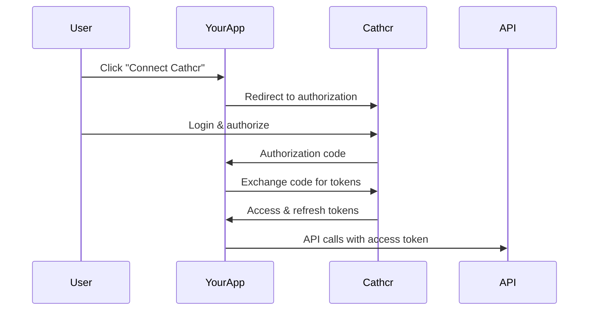

# Authentication

Secure access to the Cathcr API using multiple authentication methods. This guide covers API keys, OAuth 2.0, and JWT tokens for different integration scenarios.

## Authentication Methods Overview

| Method | Use Case | Security Level | Complexity |
|--------|----------|----------------|------------|
| API Keys | Server-to-server, scripts | High | Low |
| OAuth 2.0 | User authorization, third-party apps | Very High | Medium |
| JWT Tokens | Mobile apps, SPAs | High | Medium |
| Session Auth | Web applications | Medium | Low |

## API Key Authentication

### Overview

API keys provide simple authentication for server-to-server communication and automated scripts. They're tied to your account and inherit your permissions.

### Getting Your API Key

1. Log in to the [Cathcr Dashboard](https://dashboard.cathcr.com)
2. Navigate to **Settings** > **API Keys**
3. Click **Generate New API Key**
4. Copy and securely store your key

### Using API Keys

Include your API key in the `Authorization` header:

```bash
curl -H "Authorization: Bearer your_api_key" \
     https://api.cathcr.com/v1/thoughts
```

### Key Management

#### Creating Keys with Scopes
```http
POST /api-keys
Content-Type: application/json
Authorization: Bearer your_master_key

{
  "name": "Production Integration",
  "scopes": ["thoughts.read", "thoughts.write", "categories.read"],
  "expires_at": "2025-01-01T00:00:00Z",
  "rate_limit": 10000
}
```

#### Rotating Keys
```bash
# Generate new key
curl -X POST https://api.cathcr.com/v1/api-keys \
  -H "Authorization: Bearer your_current_key" \
  -H "Content-Type: application/json" \
  -d '{"name": "Rotated Key", "scopes": ["thoughts.read", "thoughts.write"]}'

# Deactivate old key
curl -X DELETE https://api.cathcr.com/v1/api-keys/old_key_id \
  -H "Authorization: Bearer your_current_key"
```

### Security Best Practices

1. **Store Securely**: Use environment variables or secure vaults
2. **Rotate Regularly**: Replace keys every 90 days
3. **Limit Scopes**: Only grant necessary permissions
4. **Monitor Usage**: Track API key activity
5. **Revoke Immediately**: Disable compromised keys instantly

```javascript
// Environment variable usage
const apiKey = process.env.CATHCR_API_KEY;

// Secure headers
const headers = {
  'Authorization': `Bearer ${apiKey}`,
  'User-Agent': 'MyApp/1.0',
  'Content-Type': 'application/json'
};
```

## OAuth 2.0

### OAuth Flow Types

#### Authorization Code Flow (Recommended)
Best for web applications with backend servers.



#### Implicit Flow
For single-page applications (SPAs).

#### Client Credentials Flow
For server-to-server authentication.

### Setting Up OAuth

#### 1. Register Your Application

```http
POST /oauth/apps
Content-Type: application/json
Authorization: Bearer your_api_key

{
  "name": "My Awesome App",
  "description": "Integrates thoughts with project management",
  "website": "https://myapp.com",
  "redirect_uris": [
    "https://myapp.com/auth/callback",
    "http://localhost:3000/auth/callback"
  ],
  "scopes": ["thoughts.read", "thoughts.write", "categories.read"]
}
```

**Response:**
```json
{
  "client_id": "cathcr_abc123",
  "client_secret": "secret_def456",
  "name": "My Awesome App",
  "redirect_uris": ["https://myapp.com/auth/callback"],
  "scopes": ["thoughts.read", "thoughts.write", "categories.read"]
}
```

#### 2. Authorization URL

Direct users to the authorization URL:

```javascript
const authUrl = `https://auth.cathcr.com/oauth/authorize?` +
  `response_type=code&` +
  `client_id=${clientId}&` +
  `redirect_uri=${encodeURIComponent(redirectUri)}&` +
  `scope=${encodeURIComponent('thoughts.read thoughts.write')}&` +
  `state=${state}`;

// Redirect user
window.location.href = authUrl;
```

#### 3. Handle Authorization Callback

```javascript
// Express.js example
app.get('/auth/callback', async (req, res) => {
  const { code, state } = req.query;

  // Verify state parameter
  if (state !== expectedState) {
    return res.status(400).send('Invalid state');
  }

  try {
    // Exchange code for tokens
    const tokens = await exchangeCodeForTokens(code);

    // Store tokens securely
    await storeUserTokens(userId, tokens);

    res.redirect('/dashboard');
  } catch (error) {
    res.status(500).send('Authentication failed');
  }
});
```

#### 4. Exchange Code for Tokens

```javascript
async function exchangeCodeForTokens(code) {
  const response = await fetch('https://auth.cathcr.com/oauth/token', {
    method: 'POST',
    headers: {
      'Content-Type': 'application/json',
      'Authorization': `Basic ${Buffer.from(`${clientId}:${clientSecret}`).toString('base64')}`
    },
    body: JSON.stringify({
      grant_type: 'authorization_code',
      code: code,
      redirect_uri: redirectUri
    })
  });

  return await response.json();
}
```

**Token Response:**
```json
{
  "access_token": "cathcr_access_abc123",
  "refresh_token": "cathcr_refresh_def456",
  "token_type": "Bearer",
  "expires_in": 3600,
  "scope": "thoughts.read thoughts.write"
}
```

### Token Management

#### Using Access Tokens

```javascript
const response = await fetch('https://api.cathcr.com/v1/thoughts', {
  headers: {
    'Authorization': `Bearer ${accessToken}`,
    'Content-Type': 'application/json'
  }
});
```

#### Refreshing Tokens

```javascript
async function refreshAccessToken(refreshToken) {
  const response = await fetch('https://auth.cathcr.com/oauth/token', {
    method: 'POST',
    headers: {
      'Content-Type': 'application/json',
      'Authorization': `Basic ${Buffer.from(`${clientId}:${clientSecret}`).toString('base64')}`
    },
    body: JSON.stringify({
      grant_type: 'refresh_token',
      refresh_token: refreshToken
    })
  });

  if (!response.ok) {
    throw new Error('Token refresh failed');
  }

  return await response.json();
}
```

#### Automatic Token Refresh

```javascript
class CathcrAPIClient {
  constructor(tokens) {
    this.accessToken = tokens.access_token;
    this.refreshToken = tokens.refresh_token;
    this.expiresAt = Date.now() + (tokens.expires_in * 1000);
  }

  async makeRequest(url, options = {}) {
    // Check if token needs refresh
    if (Date.now() >= this.expiresAt - 60000) { // 1 minute buffer
      await this.refreshTokens();
    }

    return fetch(url, {
      ...options,
      headers: {
        ...options.headers,
        'Authorization': `Bearer ${this.accessToken}`
      }
    });
  }

  async refreshTokens() {
    const tokens = await refreshAccessToken(this.refreshToken);
    this.accessToken = tokens.access_token;
    this.expiresAt = Date.now() + (tokens.expires_in * 1000);

    // Update stored tokens
    await updateStoredTokens(tokens);
  }
}
```

## JWT Tokens

### Overview

JWT tokens provide stateless authentication for mobile applications and single-page applications.

### Getting JWT Tokens

#### Mobile App Flow
```javascript
// Login with email/password
const response = await fetch('https://auth.cathcr.com/auth/login', {
  method: 'POST',
  headers: { 'Content-Type': 'application/json' },
  body: JSON.stringify({
    email: 'user@example.com',
    password: 'userpassword',
    client_id: 'your_mobile_app_id'
  })
});

const { jwt_token, refresh_token } = await response.json();
```

#### Token Structure
```javascript
// JWT Header
{
  "alg": "RS256",
  "typ": "JWT",
  "kid": "cathcr_key_1"
}

// JWT Payload
{
  "iss": "https://auth.cathcr.com",
  "sub": "user_123",
  "aud": "cathcr_api",
  "exp": 1640995200,
  "iat": 1640991600,
  "scope": "thoughts.read thoughts.write",
  "app_id": "your_app_id"
}
```

### JWT Validation

#### Server-Side Validation (Node.js)
```javascript
const jwt = require('jsonwebtoken');
const jwksClient = require('jwks-rsa');

const client = jwksClient({
  jwksUri: 'https://auth.cathcr.com/.well-known/jwks.json'
});

function getKey(header, callback) {
  client.getSigningKey(header.kid, (err, key) => {
    const signingKey = key.publicKey || key.rsaPublicKey;
    callback(null, signingKey);
  });
}

function validateJWT(token) {
  return new Promise((resolve, reject) => {
    jwt.verify(token, getKey, {
      audience: 'cathcr_api',
      issuer: 'https://auth.cathcr.com',
      algorithms: ['RS256']
    }, (err, decoded) => {
      if (err) reject(err);
      else resolve(decoded);
    });
  });
}

// Middleware
async function authenticateJWT(req, res, next) {
  const authHeader = req.headers.authorization;
  const token = authHeader && authHeader.split(' ')[1];

  if (!token) {
    return res.status(401).json({ error: 'Access token required' });
  }

  try {
    const decoded = await validateJWT(token);
    req.user = decoded;
    next();
  } catch (error) {
    return res.status(403).json({ error: 'Invalid token' });
  }
}
```

## Scopes and Permissions

### Available Scopes

| Scope | Description | Actions |
|-------|-------------|---------|
| `thoughts.read` | Read thoughts | GET /thoughts, GET /thoughts/{id} |
| `thoughts.write` | Create/update thoughts | POST /thoughts, PATCH /thoughts/{id} |
| `thoughts.delete` | Delete thoughts | DELETE /thoughts/{id} |
| `categories.read` | Read categories | GET /categories |
| `categories.write` | Create/update categories | POST /categories, PATCH /categories/{id} |
| `reminders.read` | Read reminders | GET /reminders |
| `reminders.write` | Create/update reminders | POST /reminders, PATCH /reminders/{id} |
| `search` | Search functionality | POST /search |
| `analytics.read` | Read analytics | GET /analytics/* |
| `webhooks.read` | Read webhooks | GET /webhooks |
| `webhooks.write` | Manage webhooks | POST /webhooks, PATCH /webhooks/{id} |
| `admin` | Full administrative access | All operations |

### Scope Examples

#### Minimal Read-Only Access
```javascript
const scopes = ['thoughts.read', 'categories.read'];
```

#### Content Management
```javascript
const scopes = [
  'thoughts.read',
  'thoughts.write',
  'categories.read',
  'categories.write',
  'search'
];
```

#### Full Application Access
```javascript
const scopes = [
  'thoughts.read',
  'thoughts.write',
  'thoughts.delete',
  'categories.read',
  'categories.write',
  'reminders.read',
  'reminders.write',
  'search',
  'webhooks.read',
  'webhooks.write'
];
```

## Session Authentication

### Web Application Flow

For traditional web applications using server-side sessions:

```javascript
// Login endpoint
app.post('/login', async (req, res) => {
  const { email, password } = req.body;

  try {
    const tokens = await authenticateUser(email, password);

    // Store tokens in session
    req.session.cathcr_tokens = tokens;

    res.redirect('/dashboard');
  } catch (error) {
    res.render('login', { error: 'Invalid credentials' });
  }
});

// API proxy middleware
app.use('/api/cathcr/*', async (req, res, next) => {
  if (!req.session.cathcr_tokens) {
    return res.status(401).json({ error: 'Not authenticated' });
  }

  try {
    // Proxy request to Cathcr API
    const response = await fetch(`https://api.cathcr.com/v1${req.path}`, {
      method: req.method,
      headers: {
        'Authorization': `Bearer ${req.session.cathcr_tokens.access_token}`,
        'Content-Type': 'application/json'
      },
      body: req.method !== 'GET' ? JSON.stringify(req.body) : undefined
    });

    const data = await response.json();
    res.json(data);
  } catch (error) {
    res.status(500).json({ error: 'API request failed' });
  }
});
```

## Error Handling

### Authentication Errors

```json
{
  "error": {
    "code": "INVALID_TOKEN",
    "message": "The provided token is invalid or expired",
    "details": {
      "token_type": "access_token",
      "expires_at": "2024-01-15T10:30:00Z"
    }
  }
}
```

### Common Error Codes

| Code | Description | Action |
|------|-------------|--------|
| `INVALID_TOKEN` | Token is invalid or malformed | Obtain new token |
| `EXPIRED_TOKEN` | Token has expired | Refresh token |
| `INSUFFICIENT_SCOPE` | Missing required permissions | Request additional scopes |
| `INVALID_CLIENT` | Invalid client credentials | Check client ID/secret |
| `RATE_LIMITED` | Too many authentication attempts | Wait and retry |

### Error Handling Examples

```javascript
// Token refresh with error handling
async function makeAuthenticatedRequest(url, options = {}) {
  try {
    const response = await fetch(url, {
      ...options,
      headers: {
        ...options.headers,
        'Authorization': `Bearer ${accessToken}`
      }
    });

    if (response.status === 401) {
      // Token expired, try to refresh
      try {
        await refreshTokens();
        return makeAuthenticatedRequest(url, options); // Retry
      } catch (refreshError) {
        // Refresh failed, redirect to login
        redirectToLogin();
        throw new Error('Authentication required');
      }
    }

    if (!response.ok) {
      throw new Error(`API request failed: ${response.status}`);
    }

    return response.json();
  } catch (error) {
    console.error('Request failed:', error);
    throw error;
  }
}
```

## Security Best Practices

### General Security

1. **Use HTTPS**: Always use HTTPS for authentication flows
2. **Validate Redirect URIs**: Ensure redirect URIs are whitelisted
3. **State Parameters**: Use state parameters to prevent CSRF attacks
4. **Secure Storage**: Store tokens securely (keychain, secure storage)
5. **Token Rotation**: Regularly rotate long-lived tokens

### Mobile Security

```javascript
// React Native secure storage
import { setInternetCredentials, getInternetCredentials } from 'react-native-keychain';

// Store tokens securely
await setInternetCredentials('cathcr_auth', 'user_id', JSON.stringify(tokens));

// Retrieve tokens
const credentials = await getInternetCredentials('cathcr_auth');
const tokens = JSON.parse(credentials.password);
```

### Web Security

```javascript
// Secure cookie settings
app.use(session({
  secret: process.env.SESSION_SECRET,
  resave: false,
  saveUninitialized: false,
  cookie: {
    secure: process.env.NODE_ENV === 'production', // HTTPS only
    httpOnly: true, // Prevent XSS
    maxAge: 24 * 60 * 60 * 1000 // 24 hours
  }
}));
```

## Testing Authentication

### Testing with cURL

```bash
# Test API key
curl -H "Authorization: Bearer your_api_key" \
     https://api.cathcr.com/v1/user

# Test OAuth token
curl -H "Authorization: Bearer oauth_access_token" \
     https://api.cathcr.com/v1/thoughts

# Test with invalid token (should return 401)
curl -H "Authorization: Bearer invalid_token" \
     https://api.cathcr.com/v1/thoughts
```

### Integration Tests

```javascript
describe('Authentication', () => {
  test('API key authentication', async () => {
    const response = await fetch('/api/thoughts', {
      headers: { 'Authorization': `Bearer ${validApiKey}` }
    });

    expect(response.status).toBe(200);
  });

  test('OAuth token authentication', async () => {
    const response = await fetch('/api/thoughts', {
      headers: { 'Authorization': `Bearer ${validOAuthToken}` }
    });

    expect(response.status).toBe(200);
  });

  test('Invalid token returns 401', async () => {
    const response = await fetch('/api/thoughts', {
      headers: { 'Authorization': 'Bearer invalid_token' }
    });

    expect(response.status).toBe(401);
  });
});
```

Choose the authentication method that best fits your application architecture and security requirements! 🔐