# Data Flow Architecture

This document describes how data flows through the Cathcr system, from user input to storage and AI processing.

## Overview

Cathcr's data flow is designed around real-time thought capture with asynchronous AI processing, ensuring immediate user feedback while maintaining high-quality automated organization.

## Primary Data Flows

### 1. Thought Capture Flow

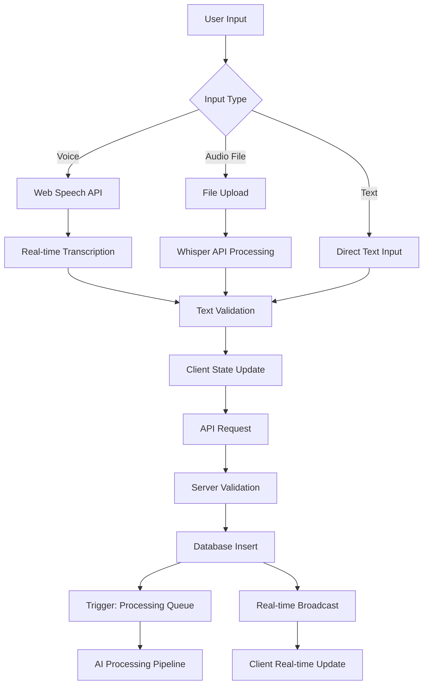

#### Flow Steps:

1. **Input Capture**:
   - Voice: Web Speech API provides real-time transcription
   - Audio File: Uploaded to server for Whisper processing
   - Text: Direct keyboard input

2. **Client Processing**:
   - Text validation and sanitization
   - Immediate UI feedback with optimistic updates
   - Local state management with Zustand

3. **Server Processing**:
   - Authentication validation
   - Input sanitization and validation
   - Database insertion with user_id

4. **Database Operations**:
   - Insert thought record
   - Trigger processing queue creation
   - Real-time subscription notification

5. **Background Processing**:
   - AI categorization queue
   - Entity extraction queue
   - Reminder parsing (if applicable)

### 2. AI Processing Pipeline

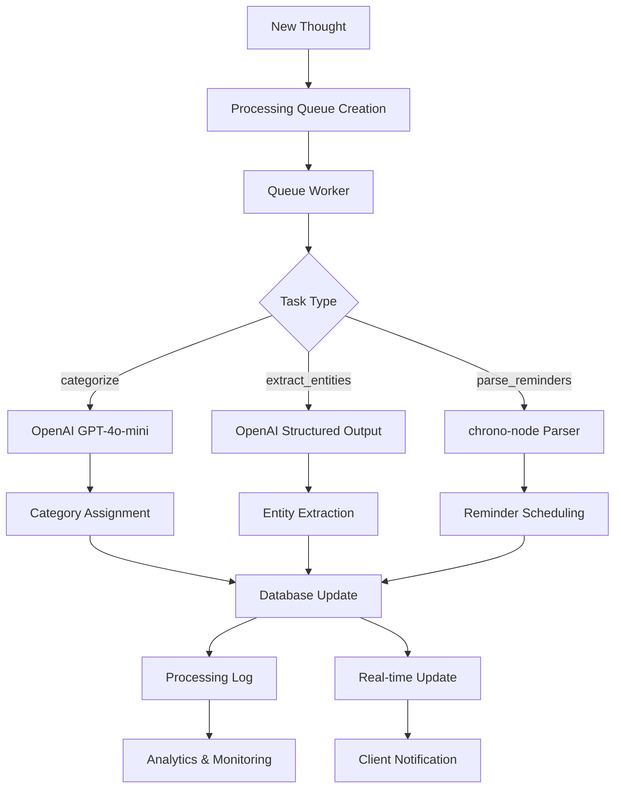

#### Processing Types:

1. **Categorization**:
   - OpenAI GPT-4o-mini analyzes content
   - Assigns category with confidence score
   - Updates thought record

2. **Entity Extraction**:
   - Identifies people, places, dates, amounts
   - Structured data extraction
   - Creates relationships and metadata

3. **Reminder Parsing**:
   - Natural language date/time parsing
   - chrono-node processes temporal expressions
   - Schedules future notifications

### 3. Real-time Update Flow

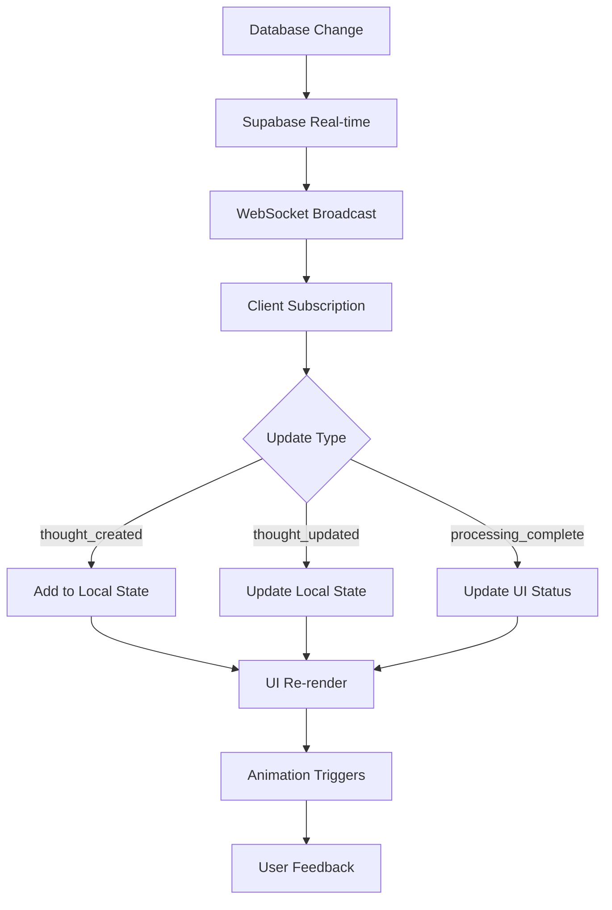

### 4. Search and Retrieval Flow

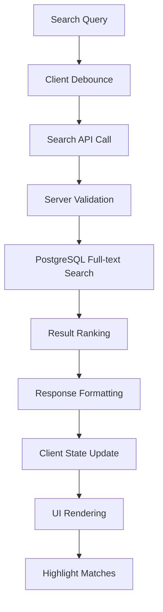

#### Search Process:

1. **Query Processing**:
   - Client-side debouncing (300ms)
   - Query sanitization and validation
   - Search history tracking

2. **Database Search**:
   - PostgreSQL full-text search with GIN indexes
   - ts_rank scoring for relevance
   - Filter by category, date, tags

3. **Result Processing**:
   - Relevance scoring and ranking
   - Highlight match preparation
   - Pagination and limits

## State Management Data Flow

### Client State Architecture

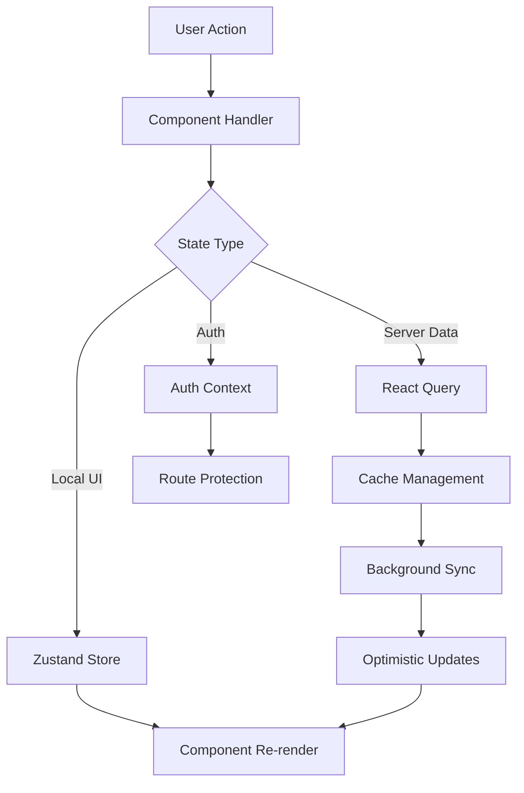

#### State Layers:

1. **UI State** (Zustand):
   - Modal visibility
   - Form state
   - Loading indicators
   - Theme preferences

2. **Server State** (React Query):
   - Thoughts data
   - Categories and tags
   - User profile
   - Processing status

3. **Auth State** (Context):
   - User session
   - Permissions
   - Route guards

### Server State Management

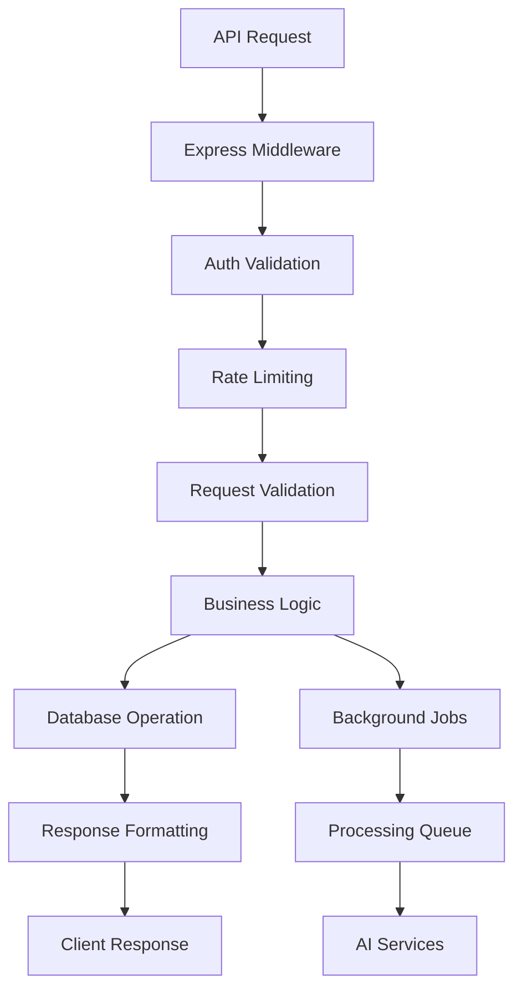

## Error Handling Data Flow

### Client Error Handling

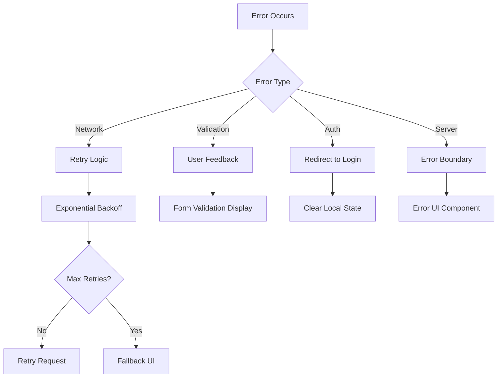

### Server Error Handling

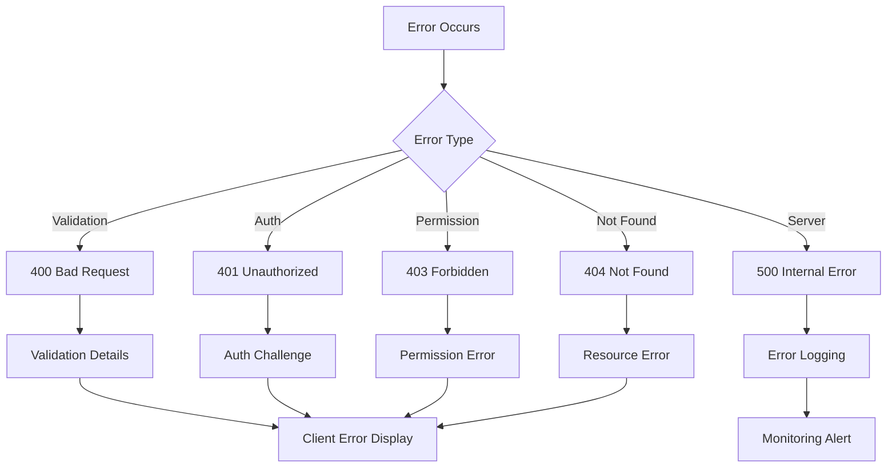

## Performance Optimization Data Flow

### Caching Strategy

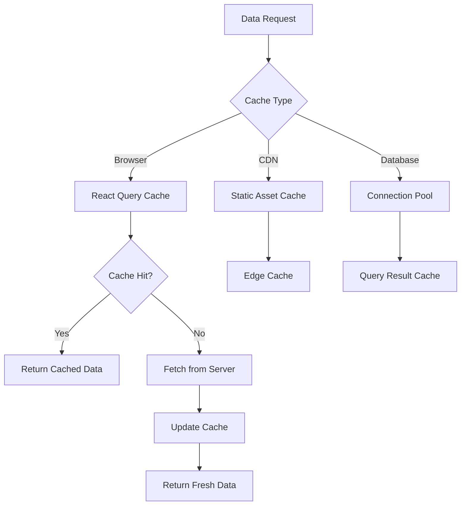

### Data Loading Optimization

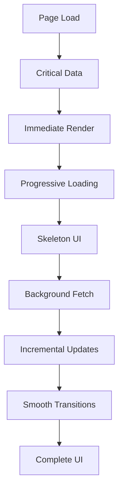

## Security Data Flow

### Authentication Flow

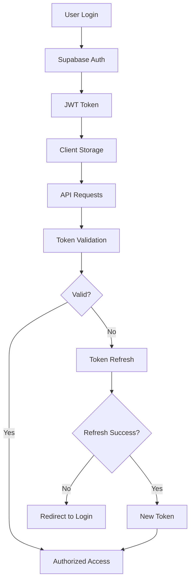

### Data Protection Flow

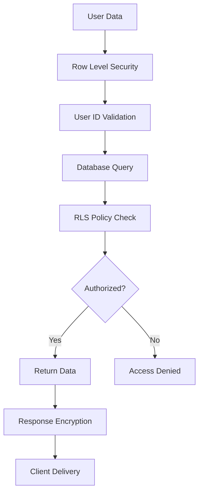

## Monitoring and Analytics Data Flow

### Application Monitoring

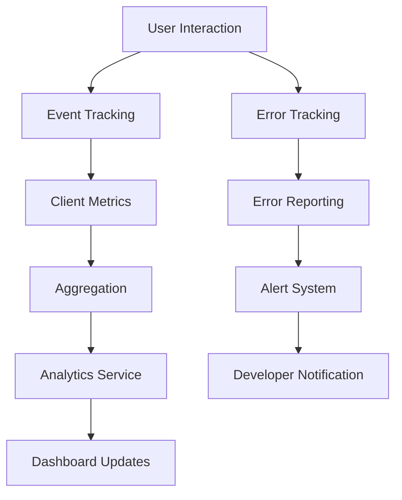

### Performance Monitoring

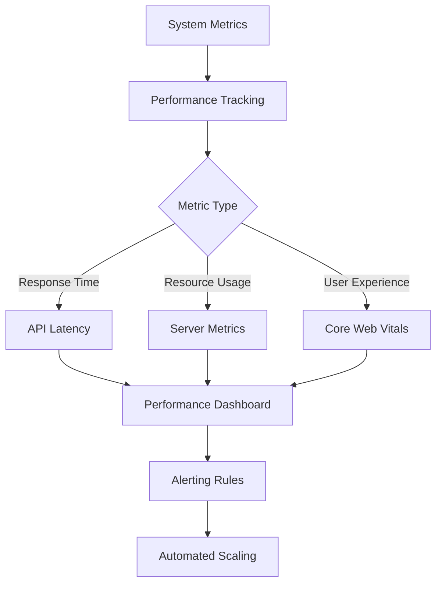

## Backup and Recovery Data Flow

### Data Backup

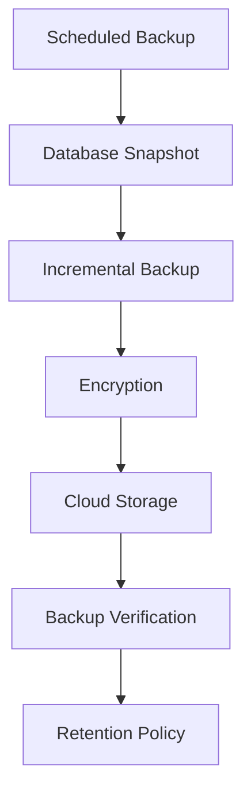

### Disaster Recovery

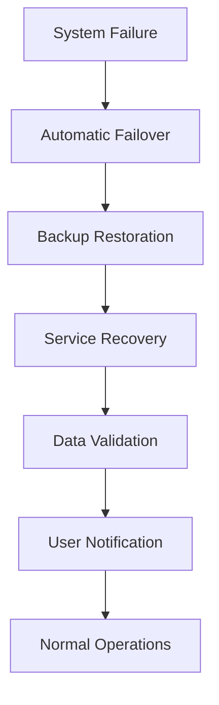

This data flow architecture ensures reliable, performant, and secure operation of the Cathcr platform while maintaining excellent user experience through real-time updates and intelligent background processing.