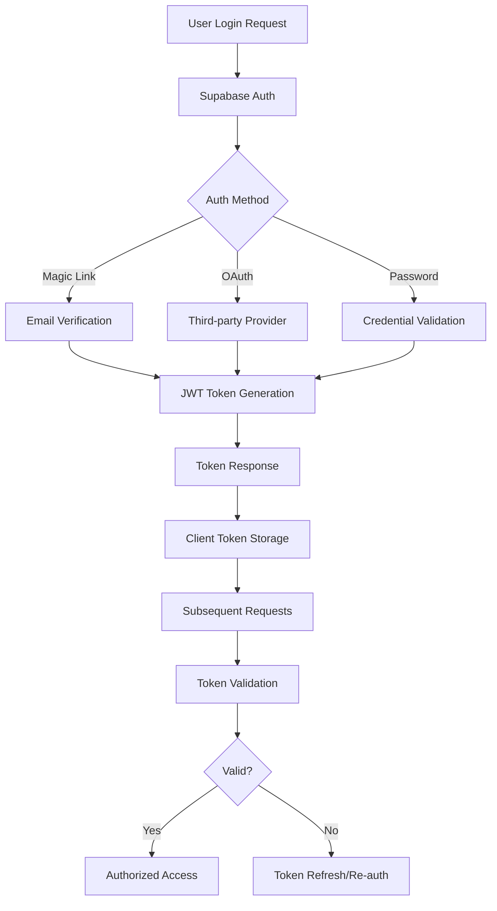
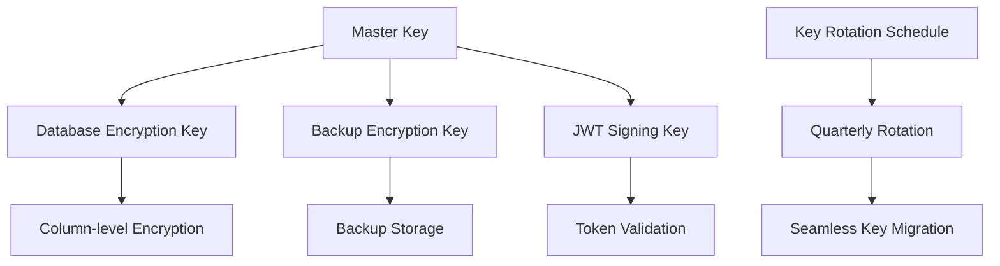
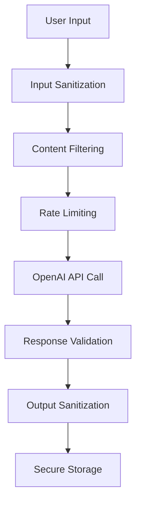
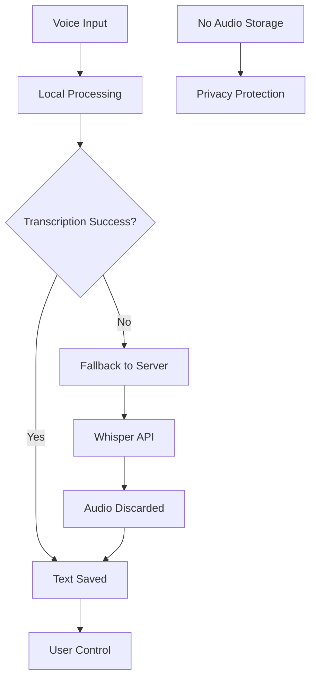
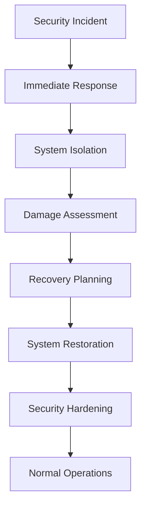

# Security Architecture

Cathcr implements a comprehensive security model with multiple layers of protection, focusing on data privacy, user authentication, and secure AI processing.

## Security Principles

### Defense in Depth
Multiple security layers protect user data at every level:
- Application-level authentication and authorization
- Database-level Row Level Security (RLS)
- Network-level encryption and protection
- Client-side security measures

### Privacy by Design
- **Minimal Data Collection**: Only necessary data is collected and stored
- **Local Processing**: Voice transcription happens client-side when possible
- **Data Encryption**: All data encrypted in transit and at rest
- **User Control**: Users control their data with export and deletion capabilities

### Zero Trust Architecture
- Every request is authenticated and authorized
- No implicit trust between system components
- Continuous verification and monitoring

## Authentication and Authorization

### Authentication Flow



### JWT Token Structure
```json
{
  "header": {
    "alg": "HS256",
    "typ": "JWT"
  },
  "payload": {
    "sub": "user-uuid",
    "email": "user@example.com",
    "role": "authenticated",
    "iat": 1640995200,
    "exp": 1640998800,
    "aud": "authenticated",
    "iss": "supabase"
  }
}
```

### Session Management
- **Token Expiration**: Short-lived access tokens (1 hour)
- **Refresh Tokens**: Long-lived refresh tokens (30 days)
- **Automatic Refresh**: Silent token refresh before expiration
- **Secure Storage**: HttpOnly cookies for refresh tokens
- **Session Invalidation**: Server-side session revocation

## Row Level Security (RLS)

### Database Security Model

All database tables implement RLS policies to ensure data isolation:

```sql
-- Example RLS policy for thoughts table
CREATE POLICY "thoughts_isolation" ON public.thoughts
  FOR ALL USING (auth.uid() = user_id);

-- Example RLS policy for categories (with system categories)
CREATE POLICY "categories_access" ON public.categories
  FOR SELECT USING (
    auth.uid() = user_id OR
    is_system = true
  );
```

### RLS Policy Categories

1. **User Data Isolation**:
   - Users can only access their own thoughts, categories, and settings
   - Strict UUID-based user identification
   - No cross-user data leakage

2. **System Data Access**:
   - System categories available to all authenticated users
   - Read-only access to system resources
   - No modification of system data by users

3. **Administrative Access**:
   - Admin roles for system maintenance
   - Audit logging for administrative actions
   - Restricted to authorized personnel only

## Data Encryption

### Encryption in Transit
- **HTTPS Everywhere**: All client-server communication over TLS 1.3
- **WebSocket Security**: WSS for real-time connections
- **API Security**: Certificate pinning for mobile apps
- **Perfect Forward Secrecy**: Ephemeral key exchange

### Encryption at Rest
- **Database Encryption**: Supabase provides AES-256 encryption
- **Backup Encryption**: All backups encrypted with separate keys
- **Key Management**: Supabase handles key rotation and management
- **File Storage**: Any uploaded files encrypted in storage

### Key Management


## Input Validation and Sanitization

### Client-Side Validation
```typescript
// Example validation schema
const thoughtValidation = z.object({
  content: z.string()
    .min(1, "Content cannot be empty")
    .max(10000, "Content too long")
    .refine(data => !containsMaliciousContent(data), "Invalid content"),
  category: z.string().optional(),
  tags: z.array(z.string()).max(10, "Too many tags")
});
```

### Server-Side Validation
```typescript
// Express middleware for input validation
const validateThought = (req: Request, res: Response, next: NextFunction) => {
  const sanitized = {
    content: sanitizeHtml(req.body.content),
    category: validator.escape(req.body.category),
    tags: req.body.tags?.map(tag => validator.escape(tag))
  };

  req.body = sanitized;
  next();
};
```

### Protection Against Common Attacks

1. **SQL Injection**:
   - Parameterized queries only
   - No dynamic SQL construction
   - Supabase built-in protections

2. **Cross-Site Scripting (XSS)**:
   - Content sanitization on input
   - React's built-in XSS protection
   - Content Security Policy headers

3. **Cross-Site Request Forgery (CSRF)**:
   - CSRF tokens for state-changing operations
   - SameSite cookie attributes
   - Origin header validation

## API Security

### Rate Limiting
```typescript
// Rate limiting configuration
const rateLimits = {
  auth: {
    windowMs: 15 * 60 * 1000, // 15 minutes
    max: 5, // 5 attempts per window
    message: "Too many authentication attempts"
  },
  api: {
    windowMs: 60 * 1000, // 1 minute
    max: 100, // 100 requests per minute
    standardHeaders: true,
    legacyHeaders: false
  },
  aiProcessing: {
    windowMs: 60 * 1000, // 1 minute
    max: 10, // 10 AI requests per minute
    keyGenerator: (req) => req.user.id
  }
};
```

### Request Validation
- **Content-Type Validation**: Strict content type checking
- **Request Size Limits**: Maximum payload size enforcement
- **Header Validation**: Required headers and value validation
- **Input Sanitization**: Comprehensive input cleaning

### CORS Configuration
```typescript
const corsOptions = {
  origin: process.env.ALLOWED_ORIGINS?.split(',') || 'http://localhost:3000',
  credentials: true,
  optionsSuccessStatus: 200,
  methods: ['GET', 'POST', 'PUT', 'DELETE', 'PATCH'],
  allowedHeaders: ['Content-Type', 'Authorization'],
  exposedHeaders: ['X-Total-Count', 'X-Rate-Limit-Remaining']
};
```

## AI Processing Security

### Secure AI Pipeline


### OpenAI API Security
- **API Key Protection**: Environment variable storage
- **Request Filtering**: Content moderation before processing
- **Response Validation**: AI output validation and sanitization
- **Usage Monitoring**: Track API usage and costs
- **Fallback Handling**: Graceful degradation on API failures

### Data Minimization
- **Selective Processing**: Only necessary data sent to AI services
- **Temporary Storage**: No persistent storage of AI API requests
- **Anonymization**: User identifiers removed from AI processing
- **Audit Logging**: All AI interactions logged for security review

## Privacy Protection

### Data Collection Principles
1. **Purpose Limitation**: Data collected only for specific purposes
2. **Data Minimization**: Collect only necessary information
3. **Storage Limitation**: Retain data only as long as needed
4. **Transparency**: Clear privacy policy and data usage

### User Privacy Controls
- **Data Export**: Users can export all their data
- **Data Deletion**: Complete account and data deletion
- **Privacy Settings**: Granular control over data usage
- **Consent Management**: Clear opt-in/opt-out mechanisms

### Audio Processing Privacy


## Monitoring and Incident Response

### Security Monitoring
```typescript
// Security event monitoring
const securityEvents = {
  authentication: {
    failedLogins: 'WARN',
    suspiciousPatterns: 'ALERT',
    bruteForceAttempts: 'CRITICAL'
  },
  dataAccess: {
    unauthorizedAttempts: 'ALERT',
    massDataExport: 'WARN',
    adminAccess: 'INFO'
  },
  apiUsage: {
    rateLimitExceeded: 'WARN',
    unusualUsagePatterns: 'ALERT',
    apiKeyCompromise: 'CRITICAL'
  }
};
```

### Incident Response Plan

1. **Detection**: Automated monitoring and alerting
2. **Assessment**: Rapid impact evaluation
3. **Containment**: Immediate threat isolation
4. **Eradication**: Root cause elimination
5. **Recovery**: Service restoration
6. **Lessons Learned**: Post-incident review and improvement

### Security Metrics
- **Authentication Success Rate**: Monitor for unusual patterns
- **Failed Access Attempts**: Track potential attacks
- **API Response Times**: Detect potential DDoS attacks
- **Error Rates**: Monitor for system compromise indicators

## Compliance and Auditing

### Audit Logging
```typescript
// Audit log structure
interface AuditLog {
  timestamp: string;
  userId: string;
  action: string;
  resource: string;
  details: object;
  ipAddress: string;
  userAgent: string;
  success: boolean;
}
```

### Compliance Considerations
- **GDPR Compliance**: European data protection regulation
- **CCPA Compliance**: California consumer privacy act
- **SOC 2 Type II**: Security, availability, and confidentiality
- **Data Localization**: Respect regional data residency requirements

### Security Audits
- **Quarterly Security Reviews**: Regular security assessment
- **Penetration Testing**: Annual third-party security testing
- **Code Security Scans**: Automated vulnerability scanning
- **Dependency Audits**: Regular security updates for dependencies

## Disaster Recovery and Business Continuity

### Backup Security
- **Encrypted Backups**: All backups encrypted with separate keys
- **Offsite Storage**: Geographically distributed backup storage
- **Access Controls**: Strict access controls for backup systems
- **Recovery Testing**: Regular backup restoration testing

### Incident Recovery


This comprehensive security architecture ensures that Cathcr maintains the highest standards of security and privacy while providing a seamless user experience.