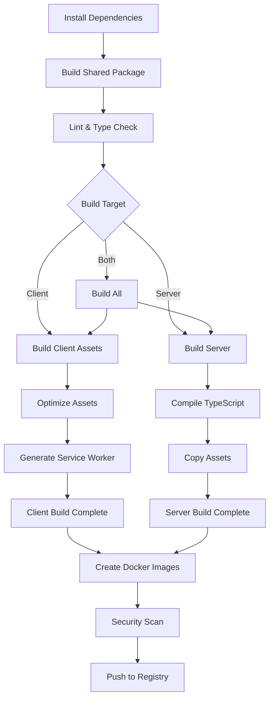

# Build Process

This document covers the complete build process for Cathcr, including optimization strategies, CI/CD pipelines, and deployment preparation.

## Overview

Cathcr uses a multi-stage build process that:
- Builds the shared package first
- Compiles TypeScript for server and client
- Optimizes client assets for production
- Creates Docker images for deployment
- Runs quality checks and tests

## Build Architecture

### Build Dependencies



### Build Scripts Overview

```json
// package.json (root)
{
  "scripts": {
    "build": "npm run build:shared && npm run build:client && npm run build:server",
    "build:shared": "npm run build --workspace=shared",
    "build:client": "npm run build --workspace=client",
    "build:server": "npm run build --workspace=server",
    "build:docker": "docker build -t cathcr:latest .",
    "build:production": "npm run clean && npm ci --production=false && npm run build",
    "prebuild": "npm run lint && npm run typecheck",
    "postbuild": "npm run test:build"
  }
}
```

## Shared Package Build

### TypeScript Configuration

```json
// shared/tsconfig.json
{
  "extends": "../tsconfig.json",
  "compilerOptions": {
    "target": "ES2020",
    "module": "ESNext",
    "moduleResolution": "node",
    "declaration": true,
    "declarationMap": true,
    "sourceMap": true,
    "outDir": "./dist",
    "rootDir": "./src",
    "composite": true,
    "incremental": true,
    "tsBuildInfoFile": "./dist/.tsbuildinfo"
  },
  "include": ["src/**/*"],
  "exclude": ["dist", "node_modules", "**/*.test.ts"]
}
```

### Build Script

```json
// shared/package.json
{
  "name": "@cathcr/shared",
  "main": "./dist/index.js",
  "types": "./dist/index.d.ts",
  "files": ["dist"],
  "scripts": {
    "build": "npm run clean && tsc",
    "build:watch": "tsc --watch",
    "clean": "rimraf dist",
    "prebuild": "npm run lint && npm run typecheck"
  }
}
```

## Client Build Process

### Vite Production Configuration

```typescript
// client/vite.config.ts
import { defineConfig } from 'vite';
import react from '@vitejs/plugin-react';
import { VitePWA } from 'vite-plugin-pwa';
import { resolve } from 'path';

export default defineConfig({
  plugins: [
    react(),
    VitePWA({
      registerType: 'autoUpdate',
      workbox: {
        globPatterns: ['**/*.{js,css,html,ico,png,svg,woff2}'],
        maximumFileSizeToCacheInBytes: 4 * 1024 * 1024, // 4MB
        runtimeCaching: [
          {
            urlPattern: /^https:\/\/api\.cathcr\.com\//,
            handler: 'NetworkFirst',
            options: {
              cacheName: 'api-cache',
              expiration: {
                maxEntries: 100,
                maxAgeSeconds: 60 * 60 * 24 // 24 hours
              }
            }
          }
        ]
      }
    })
  ],

  build: {
    target: 'es2020',
    outDir: 'dist',
    sourcemap: true,
    minify: 'esbuild',

    rollupOptions: {
      output: {
        manualChunks: {
          vendor: ['react', 'react-dom'],
          ui: ['framer-motion', '@radix-ui/react-dialog'],
          utils: ['lodash', 'date-fns', 'clsx']
        }
      }
    },

    // Performance optimizations
    chunkSizeWarningLimit: 1000,
    assetsInlineLimit: 4096
  },

  resolve: {
    alias: {
      '@': resolve(__dirname, 'src'),
      '@cathcr/shared': resolve(__dirname, '../shared/src')
    }
  },

  optimizeDeps: {
    include: ['@cathcr/shared']
  }
});
```

### Build Optimization

```typescript
// client/src/utils/buildOptimization.ts
import { lazy } from 'react';

// Code splitting for heavy components
export const ThoughtsDashboard = lazy(() =>
  import('../components/ThoughtsDashboard').then(module => ({
    default: module.ThoughtsDashboard
  }))
);

export const SettingsPanel = lazy(() =>
  import('../components/SettingsPanel').then(module => ({
    default: module.SettingsPanel
  }))
);

// Bundle analyzer for monitoring
if (process.env.ANALYZE_BUNDLE) {
  import('vite-bundle-analyzer').then(({ analyzer }) => {
    analyzer();
  });
}
```

### Asset Optimization

```json
// client/package.json
{
  "scripts": {
    "build": "npm run optimize:assets && vite build",
    "optimize:assets": "npm run optimize:images && npm run optimize:fonts",
    "optimize:images": "imagemin 'src/assets/images/**/*.{jpg,jpeg,png}' --out-dir='src/assets/images/optimized' --plugin=imagemin-mozjpeg --plugin=imagemin-pngquant",
    "optimize:fonts": "glyphhanger --subset='src/assets/fonts/*.woff2' --formats=woff2",
    "analyze": "npm run build && npx vite-bundle-analyzer"
  }
}
```

## Server Build Process

### TypeScript Configuration

```json
// server/tsconfig.json
{
  "extends": "../tsconfig.json",
  "compilerOptions": {
    "target": "ES2020",
    "module": "CommonJS",
    "moduleResolution": "node",
    "outDir": "./dist",
    "rootDir": "./src",
    "composite": true,
    "incremental": true,
    "experimentalDecorators": true,
    "emitDecoratorMetadata": true,
    "esModuleInterop": true,
    "allowSyntheticDefaultImports": true,
    "sourceMap": true,
    "declaration": false
  },
  "include": ["src/**/*"],
  "exclude": ["dist", "node_modules", "**/*.test.ts"],
  "references": [
    { "path": "../shared" }
  ]
}
```

### Build Script

```json
// server/package.json
{
  "scripts": {
    "build": "npm run clean && npm run compile && npm run copy:assets",
    "compile": "tsc",
    "copy:assets": "copyfiles -u 1 'src/**/*.{json,sql,html}' dist/",
    "clean": "rimraf dist",
    "prebuild": "npm run lint && npm run typecheck"
  }
}
```

### Production Optimizations

```typescript
// server/src/app.ts
import compression from 'compression';
import helmet from 'helmet';
import rateLimit from 'express-rate-limit';

const app = express();

if (process.env.NODE_ENV === 'production') {
  // Security middleware
  app.use(helmet({
    contentSecurityPolicy: {
      directives: {
        defaultSrc: ["'self'"],
        styleSrc: ["'self'", "'unsafe-inline'"],
        scriptSrc: ["'self'"],
        imgSrc: ["'self'", "data:", "https:"]
      }
    }
  }));

  // Compression
  app.use(compression({
    level: 6,
    threshold: 1024,
    filter: (req, res) => {
      if (req.headers['x-no-compression']) {
        return false;
      }
      return compression.filter(req, res);
    }
  }));

  // Rate limiting
  app.use(rateLimit({
    windowMs: 15 * 60 * 1000, // 15 minutes
    max: 100, // limit each IP to 100 requests per windowMs
    message: 'Too many requests from this IP',
    standardHeaders: true,
    legacyHeaders: false
  }));
}
```

## Docker Build Process

### Multi-stage Dockerfile

```dockerfile
# Dockerfile
# Stage 1: Build dependencies and compile
FROM node:18-alpine AS builder

WORKDIR /app

# Copy package files
COPY package*.json ./
COPY shared/package*.json ./shared/
COPY client/package*.json ./client/
COPY server/package*.json ./server/

# Install dependencies
RUN npm ci --only=production && npm cache clean --force

# Copy source code
COPY . .

# Build shared package first
RUN npm run build:shared

# Build client and server
RUN npm run build:client
RUN npm run build:server

# Stage 2: Production server image
FROM node:18-alpine AS server

WORKDIR /app

# Install dumb-init for proper signal handling
RUN apk add --no-cache dumb-init

# Create non-root user
RUN addgroup -g 1001 -S nodejs
RUN adduser -S nodejs -u 1001

# Copy built server application
COPY --from=builder --chown=nodejs:nodejs /app/server/dist ./server/dist
COPY --from=builder --chown=nodejs:nodejs /app/server/package*.json ./server/
COPY --from=builder --chown=nodejs:nodejs /app/shared/dist ./shared/dist
COPY --from=builder --chown=nodejs:nodejs /app/shared/package*.json ./shared/

# Install only production dependencies
RUN cd server && npm ci --only=production && npm cache clean --force

USER nodejs

EXPOSE 3001

ENTRYPOINT ["dumb-init", "--"]
CMD ["node", "server/dist/index.js"]

# Stage 3: Nginx image for client
FROM nginx:alpine AS client

# Copy built client assets
COPY --from=builder /app/client/dist /usr/share/nginx/html

# Copy nginx configuration
COPY client/nginx.conf /etc/nginx/nginx.conf

EXPOSE 80

CMD ["nginx", "-g", "daemon off;"]
```

### Nginx Configuration

```nginx
# client/nginx.conf
events {
    worker_connections 1024;
}

http {
    include       /etc/nginx/mime.types;
    default_type  application/octet-stream;

    # Compression
    gzip on;
    gzip_vary on;
    gzip_min_length 1024;
    gzip_proxied any;
    gzip_comp_level 6;
    gzip_types
        text/plain
        text/css
        text/xml
        text/javascript
        application/javascript
        application/xml+rss
        application/json;

    # Security headers
    add_header X-Frame-Options DENY;
    add_header X-Content-Type-Options nosniff;
    add_header X-XSS-Protection "1; mode=block";
    add_header Strict-Transport-Security "max-age=31536000; includeSubDomains" always;

    server {
        listen 80;
        server_name _;
        root /usr/share/nginx/html;
        index index.html;

        # Cache static assets
        location ~* \.(js|css|png|jpg|jpeg|gif|ico|svg|woff|woff2)$ {
            expires 1y;
            add_header Cache-Control "public, immutable";
        }

        # Handle client-side routing
        location / {
            try_files $uri $uri/ /index.html;
        }

        # Health check
        location /health {
            access_log off;
            return 200 "healthy\n";
            add_header Content-Type text/plain;
        }
    }
}
```

## Build Optimization Strategies

### Bundle Analysis

```typescript
// scripts/analyze-bundle.ts
import { BundleAnalyzerPlugin } from 'webpack-bundle-analyzer';
import { execSync } from 'child_process';

async function analyzeBundles() {
  console.log('🔍 Analyzing client bundle...');

  // Build with bundle analyzer
  process.env.ANALYZE_BUNDLE = 'true';
  execSync('npm run build:client', { stdio: 'inherit' });

  // Generate size report
  const sizeLimit = await import('size-limit');
  const results = await sizeLimit([
    {
      path: 'client/dist/**/*.js',
      limit: '512 KB',
      gzip: true
    }
  ]);

  console.log('📊 Bundle analysis complete');
  console.table(results);
}

analyzeBundles().catch(console.error);
```

### Performance Budget

```json
// .size-limit.json
[
  {
    "name": "Client Bundle (gzipped)",
    "path": "client/dist/assets/index-*.js",
    "limit": "512 KB",
    "gzip": true
  },
  {
    "name": "Vendor Bundle (gzipped)",
    "path": "client/dist/assets/vendor-*.js",
    "limit": "256 KB",
    "gzip": true
  },
  {
    "name": "Server Bundle",
    "path": "server/dist/**/*.js",
    "limit": "2 MB"
  }
]
```

### Tree Shaking Optimization

```typescript
// client/src/utils/treeShaking.ts
// Optimize imports for better tree shaking
import { debounce } from 'lodash/debounce'; // ✅ Good
// import { debounce } from 'lodash'; // ❌ Bad - imports entire library

import { formatDistanceToNow } from 'date-fns/formatDistanceToNow'; // ✅ Good
// import { formatDistanceToNow } from 'date-fns'; // ❌ Bad

// Use dynamic imports for large libraries
const loadChart = async () => {
  const { Chart } = await import('chart.js');
  return Chart;
};
```

## CI/CD Pipeline

### GitHub Actions Workflow

```yaml
# .github/workflows/build.yml
name: Build and Deploy

on:
  push:
    branches: [main, develop]
  pull_request:
    branches: [main]

env:
  NODE_VERSION: '18'
  REGISTRY: ghcr.io
  IMAGE_NAME: ${{ github.repository }}

jobs:
  test:
    runs-on: ubuntu-latest
    steps:
      - name: Checkout
        uses: actions/checkout@v3

      - name: Setup Node.js
        uses: actions/setup-node@v3
        with:
          node-version: ${{ env.NODE_VERSION }}
          cache: 'npm'

      - name: Install dependencies
        run: npm ci

      - name: Run tests
        run: npm run test

      - name: Run type check
        run: npm run typecheck

      - name: Run lint
        run: npm run lint

  build:
    needs: test
    runs-on: ubuntu-latest
    outputs:
      image-tag: ${{ steps.meta.outputs.tags }}
      image-digest: ${{ steps.build.outputs.digest }}
    steps:
      - name: Checkout
        uses: actions/checkout@v3

      - name: Setup Node.js
        uses: actions/setup-node@v3
        with:
          node-version: ${{ env.NODE_VERSION }}
          cache: 'npm'

      - name: Install dependencies
        run: npm ci

      - name: Build application
        run: npm run build:production

      - name: Run build tests
        run: npm run test:build

      - name: Check bundle size
        run: npx size-limit

      - name: Set up Docker Buildx
        uses: docker/setup-buildx-action@v2

      - name: Log in to Container Registry
        uses: docker/login-action@v2
        with:
          registry: ${{ env.REGISTRY }}
          username: ${{ github.actor }}
          password: ${{ secrets.GITHUB_TOKEN }}

      - name: Extract metadata
        id: meta
        uses: docker/metadata-action@v4
        with:
          images: ${{ env.REGISTRY }}/${{ env.IMAGE_NAME }}
          tags: |
            type=ref,event=branch
            type=ref,event=pr
            type=sha,prefix={{branch}}-

      - name: Build and push Docker image
        id: build
        uses: docker/build-push-action@v4
        with:
          context: .
          push: true
          tags: ${{ steps.meta.outputs.tags }}
          labels: ${{ steps.meta.outputs.labels }}
          cache-from: type=gha
          cache-to: type=gha,mode=max

  security-scan:
    needs: build
    runs-on: ubuntu-latest
    steps:
      - name: Run Trivy vulnerability scanner
        uses: aquasecurity/trivy-action@master
        with:
          image-ref: ${{ needs.build.outputs.image-tag }}
          format: 'sarif'
          output: 'trivy-results.sarif'

      - name: Upload Trivy scan results
        uses: github/codeql-action/upload-sarif@v2
        with:
          sarif_file: 'trivy-results.sarif'
```

### Build Caching Strategy

```yaml
# Advanced caching configuration
- name: Cache node modules
  uses: actions/cache@v3
  with:
    path: |
      ~/.npm
      node_modules
      */node_modules
    key: ${{ runner.os }}-node-${{ hashFiles('**/package-lock.json') }}
    restore-keys: |
      ${{ runner.os }}-node-

- name: Cache TypeScript builds
  uses: actions/cache@v3
  with:
    path: |
      shared/dist
      server/dist/.tsbuildinfo
      client/dist/.tsbuildinfo
    key: ${{ runner.os }}-ts-${{ hashFiles('**/tsconfig.json', 'shared/src/**', 'server/src/**', 'client/src/**') }}
    restore-keys: |
      ${{ runner.os }}-ts-

- name: Cache Docker layers
  uses: actions/cache@v3
  with:
    path: /tmp/.buildx-cache
    key: ${{ runner.os }}-buildx-${{ github.sha }}
    restore-keys: |
      ${{ runner.os }}-buildx-
```

## Build Monitoring

### Build Metrics Collection

```typescript
// scripts/build-metrics.ts
import { promises as fs } from 'fs';
import { execSync } from 'child_process';

interface BuildMetrics {
  timestamp: string;
  branch: string;
  commit: string;
  buildTime: number;
  bundleSize: {
    client: number;
    server: number;
    shared: number;
  };
  dependencies: {
    total: number;
    security: number;
  };
}

async function collectBuildMetrics(): Promise<BuildMetrics> {
  const startTime = Date.now();

  // Run build
  execSync('npm run build', { stdio: 'inherit' });

  const buildTime = Date.now() - startTime;

  // Collect bundle sizes
  const clientSize = await getDirSize('client/dist');
  const serverSize = await getDirSize('server/dist');
  const sharedSize = await getDirSize('shared/dist');

  // Security audit
  const auditOutput = execSync('npm audit --json', { encoding: 'utf8' });
  const audit = JSON.parse(auditOutput);

  const metrics: BuildMetrics = {
    timestamp: new Date().toISOString(),
    branch: process.env.GITHUB_REF_NAME || 'local',
    commit: process.env.GITHUB_SHA || 'unknown',
    buildTime,
    bundleSize: {
      client: clientSize,
      server: serverSize,
      shared: sharedSize
    },
    dependencies: {
      total: audit.metadata.totalDependencies,
      security: audit.metadata.vulnerabilities.total
    }
  };

  // Save metrics
  await fs.writeFile(
    'build-metrics.json',
    JSON.stringify(metrics, null, 2)
  );

  return metrics;
}

async function getDirSize(path: string): Promise<number> {
  const output = execSync(`du -sb ${path}`, { encoding: 'utf8' });
  return parseInt(output.split('\t')[0], 10);
}

collectBuildMetrics().catch(console.error);
```

This comprehensive build process ensures optimal performance, security, and maintainability while providing clear monitoring and optimization strategies for the Cathcr platform.