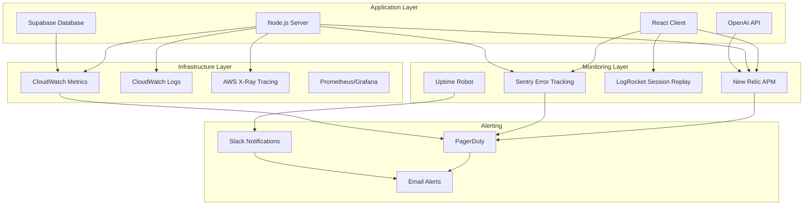

# Monitoring and Observability

This document covers comprehensive monitoring, logging, alerting, and observability strategies for the Cathcr platform in production.

## Monitoring Architecture

### Observability Stack



## Application Performance Monitoring (APM)

### New Relic Integration

#### Server-side Configuration
```typescript
// server/src/monitoring/newrelic.ts
import newrelic from 'newrelic';

// Custom instrumentation for AI processing
export const trackAIProcessing = (thoughtId: string, type: string) => {
  return newrelic.createTracer('ai-processing', (callback) => {
    newrelic.addCustomAttributes({
      'thought.id': thoughtId,
      'processing.type': type,
      'user.id': 'redacted' // Don't log PII
    });

    return callback;
  });
};

// Custom metrics for thought processing
export const recordThoughtMetrics = (category: string, confidence: number) => {
  newrelic.recordMetric('Custom/ThoughtProcessing/Count', 1);
  newrelic.recordMetric(`Custom/ThoughtProcessing/Category/${category}`, 1);
  newrelic.recordMetric('Custom/ThoughtProcessing/Confidence', confidence);
};

// Database query monitoring
export const trackDatabaseQuery = (operation: string, table: string) => {
  return newrelic.createTracer(`database-${operation}`, (callback) => {
    newrelic.addCustomAttributes({
      'db.operation': operation,
      'db.table': table
    });

    return callback;
  });
};
```

#### Client-side Configuration
```typescript
// client/src/monitoring/newrelic.ts
declare global {
  interface Window {
    newrelic: any;
  }
}

export const trackUserAction = (action: string, properties?: Record<string, any>) => {
  if (typeof window !== 'undefined' && window.newrelic) {
    window.newrelic.addPageAction(action, {
      timestamp: Date.now(),
      ...properties
    });
  }
};

export const trackThoughtCapture = (method: 'voice' | 'text', duration?: number) => {
  trackUserAction('thought_capture', {
    method,
    duration,
    session_id: getSessionId()
  });
};

export const trackAIProcessingResult = (category: string, confidence: number) => {
  trackUserAction('ai_processing_complete', {
    category,
    confidence,
    processing_time: Date.now()
  });
};

// Performance monitoring
export const trackPerformanceMetrics = () => {
  if (typeof window !== 'undefined' && window.newrelic) {
    // Core Web Vitals
    const observer = new PerformanceObserver((list) => {
      list.getEntries().forEach((entry) => {
        if (entry.entryType === 'largest-contentful-paint') {
          window.newrelic.setCustomAttribute('lcp', entry.startTime);
        }
        if (entry.entryType === 'first-input') {
          window.newrelic.setCustomAttribute('fid', entry.processingStart - entry.startTime);
        }
      });
    });

    observer.observe({ entryTypes: ['largest-contentful-paint', 'first-input'] });
  }
};
```

### Custom Metrics Dashboard

```typescript
// server/src/monitoring/metrics.ts
export class MetricsCollector {
  private static instance: MetricsCollector;
  private metrics = new Map<string, number>();

  static getInstance(): MetricsCollector {
    if (!MetricsCollector.instance) {
      MetricsCollector.instance = new MetricsCollector();
    }
    return MetricsCollector.instance;
  }

  incrementCounter(name: string, value = 1): void {
    const current = this.metrics.get(name) || 0;
    this.metrics.set(name, current + value);
  }

  recordGauge(name: string, value: number): void {
    this.metrics.set(name, value);
  }

  recordHistogram(name: string, value: number): void {
    // Implementation for histogram metrics
    const histogramKey = `${name}_histogram`;
    const buckets = this.getOrCreateBuckets(histogramKey);
    buckets.push(value);
  }

  async exportMetrics(): Promise<Record<string, number>> {
    return Object.fromEntries(this.metrics);
  }

  private getOrCreateBuckets(key: string): number[] {
    if (!this.metrics.has(key)) {
      this.metrics.set(key, [] as any);
    }
    return this.metrics.get(key) as any;
  }
}

// Usage in application
export const trackThoughtProcessing = async (thoughtId: string, startTime: number) => {
  const metrics = MetricsCollector.getInstance();
  const duration = Date.now() - startTime;

  metrics.incrementCounter('thoughts.processed');
  metrics.recordHistogram('thoughts.processing_duration', duration);
  metrics.recordGauge('thoughts.queue_size', await getQueueSize());
};
```

## Error Tracking and Logging

### Sentry Configuration

#### Server-side Setup
```typescript
// server/src/monitoring/sentry.ts
import * as Sentry from '@sentry/node';
import { ProfilingIntegration } from '@sentry/profiling-node';

Sentry.init({
  dsn: process.env.SENTRY_DSN,
  environment: process.env.NODE_ENV,
  integrations: [
    new ProfilingIntegration(),
    new Sentry.Integrations.Http({ tracing: true }),
    new Sentry.Integrations.Express({ app: express() }),
  ],
  tracesSampleRate: process.env.NODE_ENV === 'production' ? 0.1 : 1.0,
  profilesSampleRate: 0.1,
  beforeSend: (event) => {
    // Remove sensitive data
    if (event.extra) {
      delete event.extra.env;
      delete event.extra.password;
      delete event.extra.apiKey;
    }
    return event;
  },
  beforeSendTransaction: (event) => {
    // Filter out health check transactions
    if (event.transaction === 'GET /health') {
      return null;
    }
    return event;
  }
});

// Custom error context
export const addErrorContext = (context: Record<string, any>) => {
  Sentry.configureScope((scope) => {
    Object.entries(context).forEach(([key, value]) => {
      scope.setContext(key, value);
    });
  });
};

// Thought processing error tracking
export const trackThoughtProcessingError = (error: Error, context: {
  thoughtId: string;
  userId: string;
  processingType: string;
}) => {
  Sentry.withScope((scope) => {
    scope.setTag('error_type', 'thought_processing');
    scope.setContext('thought_processing', {
      thoughtId: context.thoughtId,
      userId: context.userId,
      processingType: context.processingType
    });
    Sentry.captureException(error);
  });
};

// AI API error tracking
export const trackAIAPIError = (error: Error, context: {
  service: 'openai' | 'whisper';
  endpoint: string;
  model?: string;
}) => {
  Sentry.withScope((scope) => {
    scope.setTag('error_type', 'ai_api');
    scope.setContext('ai_api', context);
    Sentry.captureException(error);
  });
};
```

#### Client-side Setup
```typescript
// client/src/monitoring/sentry.ts
import * as Sentry from '@sentry/react';
import { BrowserTracing } from '@sentry/tracing';

Sentry.init({
  dsn: import.meta.env.VITE_SENTRY_DSN,
  environment: import.meta.env.VITE_NODE_ENV,
  integrations: [
    new BrowserTracing({
      routingInstrumentation: Sentry.reactRouterV6Instrumentation(
        React.useEffect,
        useLocation,
        useNavigationType,
        createRoutesFromChildren,
        matchRoutes
      ),
    }),
  ],
  tracesSampleRate: import.meta.env.VITE_NODE_ENV === 'production' ? 0.1 : 1.0,
  beforeSend: (event) => {
    // Filter out non-critical errors
    if (event.exception?.values?.[0]?.type === 'ChunkLoadError') {
      return null;
    }
    return event;
  }
});

// React Error Boundary
export const SentryErrorBoundary = Sentry.withErrorBoundary(
  ({ children }: { children: React.ReactNode }) => children,
  {
    fallback: ({ error, resetError }) => (
      <div className="error-boundary">
        <h2>Something went wrong</h2>
        <details>
          <summary>Error details</summary>
          <pre>{error.toString()}</pre>
        </details>
        <button onClick={resetError}>Try again</button>
      </div>
    ),
    beforeCapture: (scope, error, errorInfo) => {
      scope.setTag('error_boundary', true);
      scope.setContext('error_info', errorInfo);
    }
  }
);

// Voice capture error tracking
export const trackVoiceCaptureError = (error: Error, context: {
  type: 'permission' | 'recognition' | 'processing';
  browser: string;
}) => {
  Sentry.withScope((scope) => {
    scope.setTag('error_type', 'voice_capture');
    scope.setContext('voice_capture', context);
    Sentry.captureException(error);
  });
};
```

### Structured Logging

```typescript
// server/src/utils/logger.ts
import winston from 'winston';
import { LoggingWinston } from '@google-cloud/logging-winston';

const logger = winston.createLogger({
  level: process.env.LOG_LEVEL || 'info',
  format: winston.format.combine(
    winston.format.timestamp(),
    winston.format.errors({ stack: true }),
    winston.format.json()
  ),
  defaultMeta: {
    service: 'cathcr-server',
    version: process.env.APP_VERSION || '1.0.0',
    environment: process.env.NODE_ENV
  },
  transports: [
    new winston.transports.Console({
      format: winston.format.combine(
        winston.format.colorize(),
        winston.format.simple()
      )
    })
  ]
});

// Add cloud logging in production
if (process.env.NODE_ENV === 'production') {
  logger.add(new LoggingWinston({
    projectId: process.env.GCP_PROJECT_ID,
    keyFilename: process.env.GCP_KEY_FILE
  }));
}

// Structured logging functions
export const logThoughtProcessing = (data: {
  thoughtId: string;
  userId: string;
  processingType: string;
  duration: number;
  success: boolean;
  error?: string;
}) => {
  logger.info('Thought processing completed', {
    component: 'ai_processing',
    ...data
  });
};

export const logAPIRequest = (data: {
  method: string;
  url: string;
  userId?: string;
  duration: number;
  statusCode: number;
  userAgent?: string;
}) => {
  logger.info('API request', {
    component: 'api',
    ...data
  });
};

export const logSecurityEvent = (data: {
  type: 'rate_limit' | 'auth_failure' | 'suspicious_activity';
  ip: string;
  userId?: string;
  details: Record<string, any>;
}) => {
  logger.warn('Security event', {
    component: 'security',
    ...data
  });
};

export { logger };
```

## Infrastructure Monitoring

### CloudWatch Metrics

```typescript
// server/src/monitoring/cloudwatch.ts
import { CloudWatch } from 'aws-sdk';

const cloudwatch = new CloudWatch({ region: process.env.AWS_REGION });

export class CloudWatchMetrics {
  private namespace = 'Cathcr/Application';

  async putMetric(metricName: string, value: number, unit = 'Count', dimensions?: Array<{ Name: string; Value: string }>) {
    const params = {
      Namespace: this.namespace,
      MetricData: [{
        MetricName: metricName,
        Value: value,
        Unit: unit,
        Timestamp: new Date(),
        Dimensions: dimensions
      }]
    };

    try {
      await cloudwatch.putMetricData(params).promise();
    } catch (error) {
      logger.error('Failed to put CloudWatch metric', { error, metricName });
    }
  }

  async recordThoughtProcessingMetrics(data: {
    userId: string;
    category: string;
    confidence: number;
    duration: number;
    success: boolean;
  }) {
    const dimensions = [
      { Name: 'Category', Value: data.category },
      { Name: 'Success', Value: data.success.toString() }
    ];

    await Promise.all([
      this.putMetric('ThoughtProcessed', 1, 'Count', dimensions),
      this.putMetric('ProcessingDuration', data.duration, 'Milliseconds', dimensions),
      this.putMetric('ProcessingConfidence', data.confidence, 'Percent', dimensions)
    ]);
  }

  async recordAPIMetrics(data: {
    endpoint: string;
    method: string;
    statusCode: number;
    duration: number;
  }) {
    const dimensions = [
      { Name: 'Endpoint', Value: data.endpoint },
      { Name: 'Method', Value: data.method },
      { Name: 'StatusCode', Value: data.statusCode.toString() }
    ];

    await Promise.all([
      this.putMetric('APIRequest', 1, 'Count', dimensions),
      this.putMetric('APILatency', data.duration, 'Milliseconds', dimensions)
    ]);
  }

  async recordErrorMetrics(error: Error, context: Record<string, string>) {
    const dimensions = Object.entries(context).map(([key, value]) => ({
      Name: key,
      Value: value
    }));

    await this.putMetric('ApplicationError', 1, 'Count', dimensions);
  }
}

export const cloudwatchMetrics = new CloudWatchMetrics();
```

### Health Checks

```typescript
// server/src/monitoring/health.ts
import { Request, Response } from 'express';
import { supabase } from '../config/supabase';
import OpenAI from 'openai';

interface HealthCheck {
  service: string;
  status: 'healthy' | 'unhealthy' | 'degraded';
  responseTime: number;
  error?: string;
  details?: Record<string, any>;
}

export class HealthMonitor {
  private openai = new OpenAI({ apiKey: process.env.OPENAI_API_KEY });

  async checkDatabase(): Promise<HealthCheck> {
    const start = Date.now();
    try {
      const { error } = await supabase
        .from('users')
        .select('count')
        .limit(1);

      if (error) throw error;

      return {
        service: 'database',
        status: 'healthy',
        responseTime: Date.now() - start
      };
    } catch (error) {
      return {
        service: 'database',
        status: 'unhealthy',
        responseTime: Date.now() - start,
        error: error instanceof Error ? error.message : 'Unknown error'
      };
    }
  }

  async checkOpenAI(): Promise<HealthCheck> {
    const start = Date.now();
    try {
      await this.openai.models.list();

      return {
        service: 'openai',
        status: 'healthy',
        responseTime: Date.now() - start
      };
    } catch (error) {
      return {
        service: 'openai',
        status: 'unhealthy',
        responseTime: Date.now() - start,
        error: error instanceof Error ? error.message : 'Unknown error'
      };
    }
  }

  async checkMemoryUsage(): Promise<HealthCheck> {
    const memUsage = process.memoryUsage();
    const totalMemory = memUsage.heapTotal;
    const usedMemory = memUsage.heapUsed;
    const memoryUsagePercent = (usedMemory / totalMemory) * 100;

    let status: 'healthy' | 'unhealthy' | 'degraded' = 'healthy';

    if (memoryUsagePercent > 90) {
      status = 'unhealthy';
    } else if (memoryUsagePercent > 75) {
      status = 'degraded';
    }

    return {
      service: 'memory',
      status,
      responseTime: 0,
      details: {
        usedMemory: Math.round(usedMemory / 1024 / 1024),
        totalMemory: Math.round(totalMemory / 1024 / 1024),
        usagePercent: Math.round(memoryUsagePercent)
      }
    };
  }

  async performHealthCheck(): Promise<{
    status: 'healthy' | 'unhealthy' | 'degraded';
    timestamp: string;
    checks: HealthCheck[];
    uptime: number;
  }> {
    const checks = await Promise.all([
      this.checkDatabase(),
      this.checkOpenAI(),
      this.checkMemoryUsage()
    ]);

    const overallStatus = checks.some(check => check.status === 'unhealthy')
      ? 'unhealthy'
      : checks.some(check => check.status === 'degraded')
      ? 'degraded'
      : 'healthy';

    return {
      status: overallStatus,
      timestamp: new Date().toISOString(),
      checks,
      uptime: process.uptime()
    };
  }
}

export const healthMonitor = new HealthMonitor();

// Health check endpoint
export const healthCheckHandler = async (req: Request, res: Response) => {
  try {
    const health = await healthMonitor.performHealthCheck();

    const statusCode = health.status === 'healthy' ? 200 :
                     health.status === 'degraded' ? 200 : 503;

    res.status(statusCode).json(health);
  } catch (error) {
    res.status(503).json({
      status: 'unhealthy',
      timestamp: new Date().toISOString(),
      error: error instanceof Error ? error.message : 'Health check failed',
      uptime: process.uptime()
    });
  }
};
```

## Alerting and Notifications

### Alert Configuration

```typescript
// server/src/monitoring/alerts.ts
import axios from 'axios';
import { logger } from '../utils/logger';

interface Alert {
  level: 'info' | 'warning' | 'critical';
  title: string;
  message: string;
  service: string;
  timestamp: Date;
  metadata?: Record<string, any>;
}

export class AlertManager {
  private slackWebhookUrl = process.env.SLACK_WEBHOOK_URL;
  private pagerDutyKey = process.env.PAGERDUTY_INTEGRATION_KEY;

  async sendAlert(alert: Alert): Promise<void> {
    logger.warn('Alert triggered', alert);

    // Send to Slack for all alerts
    if (this.slackWebhookUrl) {
      await this.sendSlackAlert(alert);
    }

    // Send to PagerDuty for critical alerts
    if (alert.level === 'critical' && this.pagerDutyKey) {
      await this.sendPagerDutyAlert(alert);
    }
  }

  private async sendSlackAlert(alert: Alert): Promise<void> {
    const color = {
      info: '#36a64f',
      warning: '#ff9900',
      critical: '#ff0000'
    }[alert.level];

    const payload = {
      attachments: [{
        color,
        title: alert.title,
        text: alert.message,
        fields: [
          {
            title: 'Service',
            value: alert.service,
            short: true
          },
          {
            title: 'Level',
            value: alert.level.toUpperCase(),
            short: true
          },
          {
            title: 'Timestamp',
            value: alert.timestamp.toISOString(),
            short: true
          }
        ]
      }]
    };

    try {
      await axios.post(this.slackWebhookUrl!, payload);
    } catch (error) {
      logger.error('Failed to send Slack alert', { error, alert });
    }
  }

  private async sendPagerDutyAlert(alert: Alert): Promise<void> {
    const payload = {
      routing_key: this.pagerDutyKey,
      event_action: 'trigger',
      dedup_key: `${alert.service}-${alert.title}`,
      payload: {
        summary: `${alert.service}: ${alert.title}`,
        source: alert.service,
        severity: 'critical',
        custom_details: {
          message: alert.message,
          metadata: alert.metadata
        }
      }
    };

    try {
      await axios.post('https://events.pagerduty.com/v2/enqueue', payload);
    } catch (error) {
      logger.error('Failed to send PagerDuty alert', { error, alert });
    }
  }
}

export const alertManager = new AlertManager();

// Alert functions for common scenarios
export const alertHighErrorRate = async (errorRate: number, threshold: number) => {
  await alertManager.sendAlert({
    level: 'critical',
    title: 'High Error Rate Detected',
    message: `Error rate (${errorRate}%) exceeded threshold (${threshold}%)`,
    service: 'cathcr-server',
    timestamp: new Date(),
    metadata: { errorRate, threshold }
  });
};

export const alertHighLatency = async (avgLatency: number, threshold: number) => {
  await alertManager.sendAlert({
    level: 'warning',
    title: 'High API Latency',
    message: `Average latency (${avgLatency}ms) exceeded threshold (${threshold}ms)`,
    service: 'cathcr-server',
    timestamp: new Date(),
    metadata: { avgLatency, threshold }
  });
};

export const alertAIServiceDown = async (service: string, error: string) => {
  await alertManager.sendAlert({
    level: 'critical',
    title: 'AI Service Unavailable',
    message: `${service} is not responding: ${error}`,
    service: 'ai-integration',
    timestamp: new Date(),
    metadata: { service, error }
  });
};
```

### Uptime Monitoring

```bash
#!/bin/bash
# scripts/uptime-check.sh

ENDPOINTS=(
    "https://cathcr.com"
    "https://api.cathcr.com/health"
    "https://api.cathcr.com/api/thoughts"
)

WEBHOOK_URL="${SLACK_WEBHOOK_URL}"

check_endpoint() {
    local url=$1
    local start_time=$(date +%s%N)

    response=$(curl -s -o /dev/null -w "%{http_code}:%{time_total}" --max-time 10 "$url")

    local end_time=$(date +%s%N)
    local http_code=${response%%:*}
    local response_time=${response##*:}

    if [ "$http_code" -eq 200 ]; then
        echo "✅ $url - OK (${response_time}s)"
        return 0
    else
        echo "❌ $url - Failed (HTTP $http_code)"

        # Send alert to Slack
        if [ -n "$WEBHOOK_URL" ]; then
            curl -X POST -H 'Content-type: application/json' \
                --data "{\"text\":\"🚨 Uptime Alert: $url is down (HTTP $http_code)\"}" \
                "$WEBHOOK_URL"
        fi

        return 1
    fi
}

echo "🔍 Running uptime checks..."

failed=0
for endpoint in "${ENDPOINTS[@]}"; do
    if ! check_endpoint "$endpoint"; then
        ((failed++))
    fi
done

if [ $failed -eq 0 ]; then
    echo "✅ All endpoints are healthy"
else
    echo "❌ $failed endpoint(s) failed"
    exit 1
fi
```

## Performance Monitoring Dashboards

### Grafana Dashboard Configuration

```json
{
  "dashboard": {
    "title": "Cathcr Production Monitoring",
    "panels": [
      {
        "title": "API Response Times",
        "type": "graph",
        "targets": [
          {
            "expr": "histogram_quantile(0.95, rate(http_request_duration_seconds_bucket[5m]))",
            "legendFormat": "95th percentile"
          },
          {
            "expr": "histogram_quantile(0.50, rate(http_request_duration_seconds_bucket[5m]))",
            "legendFormat": "50th percentile"
          }
        ]
      },
      {
        "title": "Error Rate",
        "type": "graph",
        "targets": [
          {
            "expr": "rate(http_requests_total{status=~\"5..\"}[5m]) / rate(http_requests_total[5m])",
            "legendFormat": "Error Rate"
          }
        ]
      },
      {
        "title": "Thought Processing Queue",
        "type": "graph",
        "targets": [
          {
            "expr": "processing_queue_size",
            "legendFormat": "Queue Size"
          },
          {
            "expr": "rate(thoughts_processed_total[5m])",
            "legendFormat": "Processing Rate"
          }
        ]
      },
      {
        "title": "AI API Usage",
        "type": "graph",
        "targets": [
          {
            "expr": "rate(openai_api_requests_total[5m])",
            "legendFormat": "OpenAI Requests/sec"
          },
          {
            "expr": "openai_api_token_usage",
            "legendFormat": "Token Usage"
          }
        ]
      }
    ]
  }
}
```

This comprehensive monitoring and observability setup ensures complete visibility into the Cathcr platform's performance, reliability, and user experience while providing proactive alerting for potential issues.