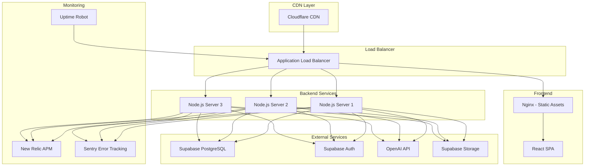

# Production Deployment

This document covers production deployment strategies, hosting options, infrastructure setup, and operational procedures for the Cathcr platform.

## Deployment Architecture

### Infrastructure Overview



## Hosting Options

### Option 1: Vercel + Railway (Recommended)

#### Frontend (Vercel)
```yaml
# vercel.json
{
  "version": 2,
  "builds": [
    {
      "src": "client/package.json",
      "use": "@vercel/static-build",
      "config": {
        "distDir": "dist"
      }
    }
  ],
  "routes": [
    {
      "src": "/api/(.*)",
      "dest": "https://cathcr-api.railway.app/api/$1"
    },
    {
      "src": "/(.*)",
      "dest": "/index.html"
    }
  ],
  "headers": [
    {
      "source": "/sw.js",
      "headers": [
        {
          "key": "Cache-Control",
          "value": "public, max-age=0, must-revalidate"
        }
      ]
    },
    {
      "source": "/(.*)",
      "headers": [
        {
          "key": "X-Content-Type-Options",
          "value": "nosniff"
        },
        {
          "key": "X-Frame-Options",
          "value": "DENY"
        },
        {
          "key": "X-XSS-Protection",
          "value": "1; mode=block"
        }
      ]
    }
  ],
  "env": {
    "VITE_API_BASE_URL": "https://cathcr-api.railway.app",
    "VITE_SUPABASE_URL": "@supabase_url",
    "VITE_SUPABASE_ANON_KEY": "@supabase_anon_key"
  }
}
```

#### Backend (Railway)
```dockerfile
# Railway deployment configuration
FROM node:18-alpine

WORKDIR /app

# Copy package files
COPY package*.json ./
COPY shared/package*.json ./shared/
COPY server/package*.json ./server/

# Install dependencies
RUN npm ci --only=production

# Copy built application
COPY shared/dist ./shared/dist
COPY server/dist ./server/dist

EXPOSE 3001

CMD ["node", "server/dist/index.js"]
```

### Option 2: AWS Infrastructure

#### CloudFormation Template
```yaml
# infrastructure/aws-infrastructure.yml
AWSTemplateFormatVersion: '2010-09-09'
Description: 'Cathcr Production Infrastructure'

Parameters:
  Environment:
    Type: String
    Default: production
    AllowedValues: [production, staging]

Resources:
  # VPC Configuration
  VPC:
    Type: AWS::EC2::VPC
    Properties:
      CidrBlock: 10.0.0.0/16
      EnableDnsHostnames: true
      EnableDnsSupport: true
      Tags:
        - Key: Name
          Value: !Sub 'cathcr-${Environment}-vpc'

  # Public Subnets
  PublicSubnet1:
    Type: AWS::EC2::Subnet
    Properties:
      VpcId: !Ref VPC
      AvailabilityZone: !Select [0, !GetAZs '']
      CidrBlock: 10.0.1.0/24
      MapPublicIpOnLaunch: true

  PublicSubnet2:
    Type: AWS::EC2::Subnet
    Properties:
      VpcId: !Ref VPC
      AvailabilityZone: !Select [1, !GetAZs '']
      CidrBlock: 10.0.2.0/24
      MapPublicIpOnLaunch: true

  # Application Load Balancer
  ApplicationLoadBalancer:
    Type: AWS::ElasticLoadBalancingV2::LoadBalancer
    Properties:
      Name: !Sub 'cathcr-${Environment}-alb'
      Scheme: internet-facing
      Type: application
      Subnets:
        - !Ref PublicSubnet1
        - !Ref PublicSubnet2
      SecurityGroups:
        - !Ref ALBSecurityGroup

  # ECS Cluster
  ECSCluster:
    Type: AWS::ECS::Cluster
    Properties:
      ClusterName: !Sub 'cathcr-${Environment}'
      CapacityProviders:
        - FARGATE
        - FARGATE_SPOT

  # ECS Task Definition
  TaskDefinition:
    Type: AWS::ECS::TaskDefinition
    Properties:
      Family: !Sub 'cathcr-${Environment}'
      NetworkMode: awsvpc
      RequiresCompatibilities:
        - FARGATE
      Cpu: '512'
      Memory: '1024'
      ExecutionRoleArn: !Ref TaskExecutionRole
      ContainerDefinitions:
        - Name: cathcr-server
          Image: !Sub '${AWS::AccountId}.dkr.ecr.${AWS::Region}.amazonaws.com/cathcr:latest'
          PortMappings:
            - ContainerPort: 3001
              Protocol: tcp
          Environment:
            - Name: NODE_ENV
              Value: !Ref Environment
          Secrets:
            - Name: SUPABASE_SERVICE_ROLE_KEY
              ValueFrom: !Sub 'arn:aws:secretsmanager:${AWS::Region}:${AWS::AccountId}:secret:cathcr/supabase/service-role-key'
            - Name: OPENAI_API_KEY
              ValueFrom: !Sub 'arn:aws:secretsmanager:${AWS::Region}:${AWS::AccountId}:secret:cathcr/openai/api-key'
          LogConfiguration:
            LogDriver: awslogs
            Options:
              awslogs-group: !Ref CloudWatchLogGroup
              awslogs-region: !Ref AWS::Region
              awslogs-stream-prefix: ecs

  # ECS Service
  ECSService:
    Type: AWS::ECS::Service
    Properties:
      ServiceName: !Sub 'cathcr-${Environment}'
      Cluster: !Ref ECSCluster
      TaskDefinition: !Ref TaskDefinition
      LaunchType: FARGATE
      DesiredCount: 3
      NetworkConfiguration:
        AwsvpcConfiguration:
          SecurityGroups:
            - !Ref ECSSecurityGroup
          Subnets:
            - !Ref PublicSubnet1
            - !Ref PublicSubnet2
          AssignPublicIp: ENABLED
      LoadBalancers:
        - ContainerName: cathcr-server
          ContainerPort: 3001
          TargetGroupArn: !Ref TargetGroup

  # CloudFront Distribution
  CloudFrontDistribution:
    Type: AWS::CloudFront::Distribution
    Properties:
      DistributionConfig:
        Origins:
          - Id: S3Origin
            DomainName: !GetAtt S3Bucket.DomainName
            S3OriginConfig:
              OriginAccessIdentity: !Sub 'origin-access-identity/cloudfront/${OriginAccessIdentity}'
          - Id: ALBOrigin
            DomainName: !GetAtt ApplicationLoadBalancer.DNSName
            CustomOriginConfig:
              HTTPPort: 80
              HTTPSPort: 443
              OriginProtocolPolicy: https-only
        DefaultCacheBehavior:
          TargetOriginId: S3Origin
          ViewerProtocolPolicy: redirect-to-https
          AllowedMethods: [GET, HEAD, OPTIONS]
          CachedMethods: [GET, HEAD]
          ForwardedValues:
            QueryString: false
            Cookies:
              Forward: none
        CacheBehaviors:
          - PathPattern: '/api/*'
            TargetOriginId: ALBOrigin
            ViewerProtocolPolicy: https-only
            AllowedMethods: [DELETE, GET, HEAD, OPTIONS, PATCH, POST, PUT]
            CachedMethods: [GET, HEAD]
            ForwardedValues:
              QueryString: true
              Headers: [Authorization, Content-Type]
        Enabled: true
        DefaultRootObject: index.html
        CustomErrorResponses:
          - ErrorCode: 404
            ResponseCode: 200
            ResponsePagePath: /index.html
        PriceClass: PriceClass_100
```

### Option 3: Kubernetes Deployment

#### Kubernetes Manifests
```yaml
# k8s/namespace.yaml
apiVersion: v1
kind: Namespace
metadata:
  name: cathcr-production
  labels:
    name: cathcr-production
    environment: production

---
# k8s/configmap.yaml
apiVersion: v1
kind: ConfigMap
metadata:
  name: cathcr-config
  namespace: cathcr-production
data:
  NODE_ENV: "production"
  PORT: "3001"
  APP_NAME: "Cathcr"

---
# k8s/secret.yaml
apiVersion: v1
kind: Secret
metadata:
  name: cathcr-secrets
  namespace: cathcr-production
type: Opaque
stringData:
  supabase-service-role-key: "your-service-role-key"
  openai-api-key: "your-openai-api-key"
  jwt-secret: "your-jwt-secret"

---
# k8s/deployment.yaml
apiVersion: apps/v1
kind: Deployment
metadata:
  name: cathcr-server
  namespace: cathcr-production
  labels:
    app: cathcr-server
    environment: production
spec:
  replicas: 3
  selector:
    matchLabels:
      app: cathcr-server
  template:
    metadata:
      labels:
        app: cathcr-server
    spec:
      containers:
      - name: cathcr-server
        image: cathcr/server:latest
        ports:
        - containerPort: 3001
        envFrom:
        - configMapRef:
            name: cathcr-config
        - secretRef:
            name: cathcr-secrets
        resources:
          requests:
            memory: "256Mi"
            cpu: "250m"
          limits:
            memory: "512Mi"
            cpu: "500m"
        livenessProbe:
          httpGet:
            path: /health
            port: 3001
          initialDelaySeconds: 30
          periodSeconds: 10
        readinessProbe:
          httpGet:
            path: /health
            port: 3001
          initialDelaySeconds: 5
          periodSeconds: 5

---
# k8s/service.yaml
apiVersion: v1
kind: Service
metadata:
  name: cathcr-server-service
  namespace: cathcr-production
spec:
  selector:
    app: cathcr-server
  ports:
  - protocol: TCP
    port: 80
    targetPort: 3001
  type: ClusterIP

---
# k8s/ingress.yaml
apiVersion: networking.k8s.io/v1
kind: Ingress
metadata:
  name: cathcr-ingress
  namespace: cathcr-production
  annotations:
    kubernetes.io/ingress.class: nginx
    cert-manager.io/cluster-issuer: letsencrypt-prod
    nginx.ingress.kubernetes.io/rate-limit: "100"
    nginx.ingress.kubernetes.io/rate-limit-window: "1m"
spec:
  tls:
  - hosts:
    - api.cathcr.com
    secretName: cathcr-tls
  rules:
  - host: api.cathcr.com
    http:
      paths:
      - path: /
        pathType: Prefix
        backend:
          service:
            name: cathcr-server-service
            port:
              number: 80

---
# k8s/hpa.yaml
apiVersion: autoscaling/v2
kind: HorizontalPodAutoscaler
metadata:
  name: cathcr-server-hpa
  namespace: cathcr-production
spec:
  scaleTargetRef:
    apiVersion: apps/v1
    kind: Deployment
    name: cathcr-server
  minReplicas: 3
  maxReplicas: 10
  metrics:
  - type: Resource
    resource:
      name: cpu
      target:
        type: Utilization
        averageUtilization: 70
  - type: Resource
    resource:
      name: memory
      target:
        type: Utilization
        averageUtilization: 80
```

## Deployment Automation

### GitHub Actions Deployment

```yaml
# .github/workflows/deploy.yml
name: Deploy to Production

on:
  push:
    branches: [main]
  workflow_dispatch:

jobs:
  deploy:
    runs-on: ubuntu-latest
    environment: production

    steps:
    - name: Checkout
      uses: actions/checkout@v3

    - name: Configure AWS credentials
      uses: aws-actions/configure-aws-credentials@v2
      with:
        aws-access-key-id: ${{ secrets.AWS_ACCESS_KEY_ID }}
        aws-secret-access-key: ${{ secrets.AWS_SECRET_ACCESS_KEY }}
        aws-region: us-east-1

    - name: Login to Amazon ECR
      id: login-ecr
      uses: aws-actions/amazon-ecr-login@v1

    - name: Build and push Docker image
      env:
        ECR_REGISTRY: ${{ steps.login-ecr.outputs.registry }}
        ECR_REPOSITORY: cathcr
        IMAGE_TAG: ${{ github.sha }}
      run: |
        docker build -t $ECR_REGISTRY/$ECR_REPOSITORY:$IMAGE_TAG .
        docker push $ECR_REGISTRY/$ECR_REPOSITORY:$IMAGE_TAG
        docker tag $ECR_REGISTRY/$ECR_REPOSITORY:$IMAGE_TAG $ECR_REGISTRY/$ECR_REPOSITORY:latest
        docker push $ECR_REGISTRY/$ECR_REPOSITORY:latest

    - name: Deploy to ECS
      env:
        ECR_REGISTRY: ${{ steps.login-ecr.outputs.registry }}
        ECR_REPOSITORY: cathcr
        IMAGE_TAG: ${{ github.sha }}
      run: |
        aws ecs update-service \
          --cluster cathcr-production \
          --service cathcr-production \
          --task-definition cathcr-production \
          --force-new-deployment

    - name: Wait for deployment
      run: |
        aws ecs wait services-stable \
          --cluster cathcr-production \
          --services cathcr-production

    - name: Notify deployment success
      uses: 8398a7/action-slack@v3
      with:
        status: success
        text: 'Production deployment completed successfully! 🚀'
      env:
        SLACK_WEBHOOK_URL: ${{ secrets.SLACK_WEBHOOK_URL }}
```

### Blue-Green Deployment Script

```bash
#!/bin/bash
# scripts/blue-green-deploy.sh

set -e

CLUSTER_NAME="cathcr-production"
SERVICE_NAME="cathcr-production"
NEW_IMAGE="$1"

if [ -z "$NEW_IMAGE" ]; then
    echo "Usage: $0 <new-image-uri>"
    exit 1
fi

echo "🚀 Starting blue-green deployment..."
echo "New image: $NEW_IMAGE"

# Get current task definition
CURRENT_TASK_DEF=$(aws ecs describe-services \
    --cluster $CLUSTER_NAME \
    --services $SERVICE_NAME \
    --query 'services[0].taskDefinition' \
    --output text)

echo "Current task definition: $CURRENT_TASK_DEF"

# Create new task definition with new image
NEW_TASK_DEF=$(aws ecs describe-task-definition \
    --task-definition $CURRENT_TASK_DEF \
    --query 'taskDefinition' \
    --output json | \
    jq --arg IMAGE "$NEW_IMAGE" '.containerDefinitions[0].image = $IMAGE' | \
    jq 'del(.taskDefinitionArn, .revision, .status, .requiresAttributes, .placementConstraints, .compatibilities, .registeredAt, .registeredBy)')

# Register new task definition
NEW_TASK_DEF_ARN=$(echo $NEW_TASK_DEF | \
    aws ecs register-task-definition \
    --cli-input-json file:///dev/stdin \
    --query 'taskDefinition.taskDefinitionArn' \
    --output text)

echo "New task definition registered: $NEW_TASK_DEF_ARN"

# Update service with new task definition
aws ecs update-service \
    --cluster $CLUSTER_NAME \
    --service $SERVICE_NAME \
    --task-definition $NEW_TASK_DEF_ARN

echo "⏳ Waiting for deployment to complete..."

# Wait for deployment to stabilize
aws ecs wait services-stable \
    --cluster $CLUSTER_NAME \
    --services $SERVICE_NAME

echo "✅ Blue-green deployment completed successfully!"

# Health check
echo "🔍 Performing health check..."
HEALTH_CHECK_URL="https://api.cathcr.com/health"
for i in {1..5}; do
    if curl -f $HEALTH_CHECK_URL > /dev/null 2>&1; then
        echo "✅ Health check passed"
        break
    else
        echo "❌ Health check failed, attempt $i/5"
        if [ $i -eq 5 ]; then
            echo "🚨 Health check failed after 5 attempts, rolling back..."
            aws ecs update-service \
                --cluster $CLUSTER_NAME \
                --service $SERVICE_NAME \
                --task-definition $CURRENT_TASK_DEF
            exit 1
        fi
        sleep 10
    fi
done

echo "🎉 Deployment successful!"
```

## Database Migrations

### Migration Strategy

```typescript
// server/src/migrations/runner.ts
import { supabase } from '../config/supabase';

interface Migration {
  version: string;
  name: string;
  up: string;
  down: string;
}

export class MigrationRunner {
  private migrations: Migration[] = [
    {
      version: '001',
      name: 'initial_schema',
      up: `
        CREATE TABLE IF NOT EXISTS migrations (
          version VARCHAR(10) PRIMARY KEY,
          name VARCHAR(255) NOT NULL,
          applied_at TIMESTAMP WITH TIME ZONE DEFAULT NOW()
        );
      `,
      down: 'DROP TABLE IF EXISTS migrations;'
    }
    // Add more migrations here
  ];

  async runMigrations(): Promise<void> {
    console.log('🔄 Running database migrations...');

    for (const migration of this.migrations) {
      const isApplied = await this.isMigrationApplied(migration.version);

      if (!isApplied) {
        await this.applyMigration(migration);
      }
    }

    console.log('✅ All migrations completed');
  }

  private async isMigrationApplied(version: string): Promise<boolean> {
    const { data } = await supabase
      .from('migrations')
      .select('version')
      .eq('version', version)
      .single();

    return !!data;
  }

  private async applyMigration(migration: Migration): Promise<void> {
    try {
      console.log(`Applying migration ${migration.version}: ${migration.name}`);

      // Execute migration
      const { error } = await supabase.rpc('exec_sql', {
        sql: migration.up
      });

      if (error) throw error;

      // Record migration
      await supabase.from('migrations').insert({
        version: migration.version,
        name: migration.name
      });

      console.log(`✅ Migration ${migration.version} applied successfully`);
    } catch (error) {
      console.error(`❌ Migration ${migration.version} failed:`, error);
      throw error;
    }
  }
}
```

### Pre-deployment Migration Check

```bash
#!/bin/bash
# scripts/check-migrations.sh

echo "🔍 Checking for pending migrations..."

# Get current database version
CURRENT_VERSION=$(psql $DATABASE_URL -t -c "SELECT version FROM migrations ORDER BY version DESC LIMIT 1;" | xargs)

# Get latest migration version from code
LATEST_VERSION=$(ls server/migrations/*.sql | tail -1 | grep -o '[0-9]\{3\}')

if [ "$CURRENT_VERSION" != "$LATEST_VERSION" ]; then
    echo "⚠️  Pending migrations detected!"
    echo "Current version: $CURRENT_VERSION"
    echo "Latest version: $LATEST_VERSION"

    read -p "Do you want to run migrations? (y/N) " -n 1 -r
    echo
    if [[ $REPLY =~ ^[Yy]$ ]]; then
        npm run migrate
    else
        echo "❌ Deployment cancelled due to pending migrations"
        exit 1
    fi
else
    echo "✅ Database is up to date"
fi
```

## Rollback Procedures

### Automated Rollback

```bash
#!/bin/bash
# scripts/rollback.sh

CLUSTER_NAME="cathcr-production"
SERVICE_NAME="cathcr-production"

echo "🔄 Rolling back to previous deployment..."

# Get current and previous task definitions
TASK_DEFS=$(aws ecs list-task-definitions \
    --family-prefix cathcr-production \
    --status ACTIVE \
    --sort DESC \
    --query 'taskDefinitionArns[0:2]' \
    --output text)

CURRENT_TASK_DEF=$(echo $TASK_DEFS | cut -d' ' -f1)
PREVIOUS_TASK_DEF=$(echo $TASK_DEFS | cut -d' ' -f2)

if [ -z "$PREVIOUS_TASK_DEF" ]; then
    echo "❌ No previous task definition found"
    exit 1
fi

echo "Current: $CURRENT_TASK_DEF"
echo "Rolling back to: $PREVIOUS_TASK_DEF"

# Update service to previous task definition
aws ecs update-service \
    --cluster $CLUSTER_NAME \
    --service $SERVICE_NAME \
    --task-definition $PREVIOUS_TASK_DEF

echo "⏳ Waiting for rollback to complete..."

# Wait for rollback to stabilize
aws ecs wait services-stable \
    --cluster $CLUSTER_NAME \
    --services $SERVICE_NAME

echo "✅ Rollback completed successfully!"

# Health check
echo "🔍 Performing health check after rollback..."
if curl -f https://api.cathcr.com/health > /dev/null 2>&1; then
    echo "✅ Health check passed after rollback"
else
    echo "❌ Health check failed after rollback"
    exit 1
fi
```

## Security Hardening

### Production Security Checklist

```bash
#!/bin/bash
# scripts/security-check.sh

echo "🔒 Running production security checks..."

# Check for secrets in environment
echo "Checking for hardcoded secrets..."
if grep -r "sk-" server/dist/ 2>/dev/null; then
    echo "❌ Found potential API keys in built files"
    exit 1
fi

# Check SSL certificate
echo "Checking SSL certificate..."
SSL_EXPIRY=$(echo | openssl s_client -servername cathcr.com -connect cathcr.com:443 2>/dev/null | openssl x509 -noout -enddate | cut -d= -f2)
SSL_EXPIRY_EPOCH=$(date -d "$SSL_EXPIRY" +%s)
CURRENT_EPOCH=$(date +%s)
DAYS_UNTIL_EXPIRY=$(( ($SSL_EXPIRY_EPOCH - $CURRENT_EPOCH) / 86400 ))

if [ $DAYS_UNTIL_EXPIRY -lt 30 ]; then
    echo "⚠️  SSL certificate expires in $DAYS_UNTIL_EXPIRY days"
fi

# Check security headers
echo "Checking security headers..."
HEADERS=$(curl -I https://cathcr.com 2>/dev/null)

if ! echo "$HEADERS" | grep -i "strict-transport-security" > /dev/null; then
    echo "❌ Missing HSTS header"
fi

if ! echo "$HEADERS" | grep -i "x-content-type-options" > /dev/null; then
    echo "❌ Missing X-Content-Type-Options header"
fi

if ! echo "$HEADERS" | grep -i "x-frame-options" > /dev/null; then
    echo "❌ Missing X-Frame-Options header"
fi

echo "✅ Security check completed"
```

### Secrets Rotation

```typescript
// scripts/rotate-secrets.ts
import { SecretsManager } from 'aws-sdk';
import { supabase } from '../server/src/config/supabase';

const secretsManager = new SecretsManager({ region: 'us-east-1' });

async function rotateJWTSecret(): Promise<void> {
  console.log('🔄 Rotating JWT secret...');

  // Generate new secret
  const newSecret = require('crypto').randomBytes(64).toString('hex');

  // Update in AWS Secrets Manager
  await secretsManager.updateSecret({
    SecretId: 'cathcr/jwt-secret',
    SecretString: newSecret
  }).promise();

  console.log('✅ JWT secret rotated successfully');
}

async function rotateSupabaseKeys(): Promise<void> {
  console.log('🔄 Checking Supabase key rotation...');

  // This would typically involve calling Supabase's admin API
  // to generate new keys and update them in your secrets manager

  console.log('✅ Supabase keys checked');
}

async function rotateSecrets(): Promise<void> {
  try {
    await rotateJWTSecret();
    await rotateSupabaseKeys();

    console.log('🎉 All secrets rotated successfully');
    console.log('⚠️  Remember to restart services to pick up new secrets');
  } catch (error) {
    console.error('❌ Secret rotation failed:', error);
    process.exit(1);
  }
}

rotateSecrets();
```

This comprehensive production deployment guide ensures secure, scalable, and maintainable deployments with proper monitoring, rollback capabilities, and security hardening for the Cathcr platform.