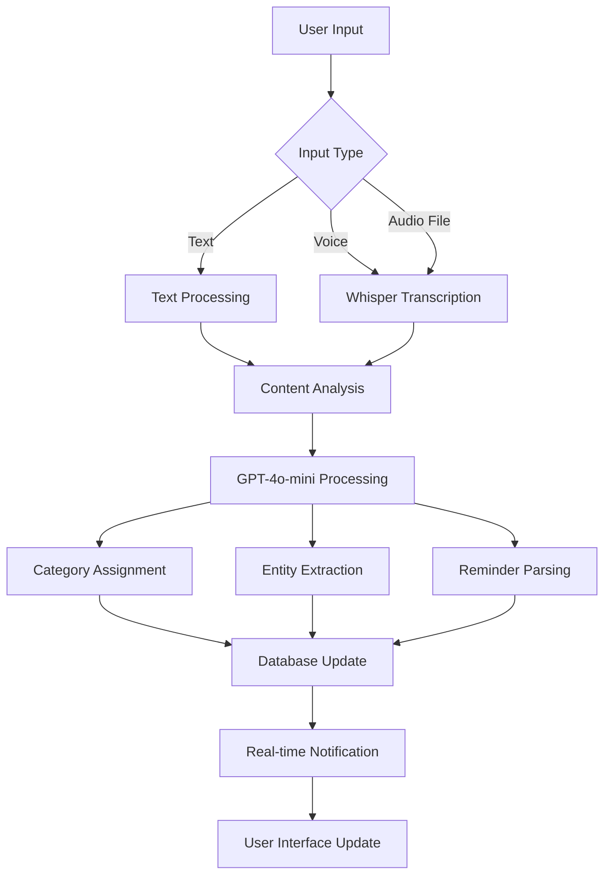

# AI Integration

Cathcr leverages OpenAI's advanced AI models to provide intelligent thought categorization, transcription, and entity extraction, creating a seamless user experience for organizing and understanding captured thoughts.

## Overview

The AI integration consists of multiple processing pipelines that work together to enhance the user's thought capture experience:

- **GPT-4o-mini**: Thought categorization and analysis
- **Whisper**: Audio transcription for voice notes
- **Structured Output**: Entity extraction and data parsing
- **Natural Language Processing**: Reminder and date parsing

## Architecture

### AI Processing Pipeline



### Service Architecture

```typescript
// AI Service Structure
class AIService {
  private openai: OpenAI;
  private retryPolicy: RetryPolicy;
  private cache: CacheService;

  // Core AI processing methods
  async categorizeThought(content: string): Promise<CategoryResult>;
  async transcribeAudio(audioBuffer: Buffer): Promise<TranscriptionResult>;
  async extractEntities(content: string): Promise<EntityResult>;
  async parseReminders(content: string): Promise<ReminderResult>;
}
```

## Thought Categorization

### Categories and Classification

Cathcr uses a predefined set of categories with AI-powered classification:

```typescript
export const THOUGHT_CATEGORIES = {
  IDEAS: 'ideas',           // Creative thoughts and concepts
  REMINDERS: 'reminders',   // Tasks and scheduled items
  PROJECTS: 'projects',     // Work and personal projects
  NOTES: 'notes',          // General information and observations
  GOALS: 'goals',          // Aspirations and objectives
  QUESTIONS: 'questions',   // Inquiries and topics to explore
  INSIGHTS: 'insights',     // Realizations and learning
  DECISIONS: 'decisions'    // Choices and evaluations
} as const;
```

### Implementation

#### Categorization Service
```typescript
// server/src/services/aiService.ts
export class AIService {
  async categorizeThought(content: string): Promise<CategoryResult> {
    try {
      const prompt = this.buildCategorizationPrompt(content);

      const response = await this.openai.chat.completions.create({
        model: 'gpt-5-mini',
        messages: [
          {
            role: 'system',
            content: CATEGORIZATION_SYSTEM_PROMPT
          },
          {
            role: 'user',
            content: prompt
          }
        ],
        temperature: 0.3,
        response_format: { type: 'json_object' }
      });

      const result = JSON.parse(response.choices[0].message.content);

      return {
        category: result.category,
        confidence: result.confidence,
        reasoning: result.reasoning,
        tags: result.suggested_tags || []
      };
    } catch (error) {
      return this.handleCategorizationError(error);
    }
  }

  private buildCategorizationPrompt(content: string): string {
    return `
    Analyze this thought and categorize it:

    "${content}"

    Return a JSON response with:
    - category: one of [${Object.values(THOUGHT_CATEGORIES).join(', ')}]
    - confidence: float between 0-1
    - reasoning: brief explanation
    - suggested_tags: array of relevant tags
    `;
  }
}
```

#### System Prompt
```typescript
const CATEGORIZATION_SYSTEM_PROMPT = `
You are an AI assistant specialized in categorizing human thoughts and ideas.

Categories:
- ideas: Creative thoughts, concepts, innovations, brainstorming
- reminders: Tasks, to-dos, scheduled items, appointments
- projects: Work initiatives, personal projects, ongoing endeavors
- notes: General information, observations, facts, references
- goals: Aspirations, objectives, targets, ambitions
- questions: Inquiries, topics to explore, research items
- insights: Realizations, learnings, discoveries, reflections
- decisions: Choices, evaluations, comparisons, conclusions

Guidelines:
1. Choose the most appropriate category based on the primary intent
2. Consider the actionable nature of the content
3. Provide confidence scores based on clarity of intent
4. Include relevant tags that might help with organization
5. If multiple categories apply, choose the most prominent one

Always respond with valid JSON matching the requested format.
`;
```

### Error Handling and Fallbacks

```typescript
private handleCategorizationError(error: unknown): CategoryResult {
  console.error('AI categorization failed:', error);

  // Fallback categorization based on keywords
  const fallbackCategory = this.getKeywordBasedCategory(content);

  return {
    category: fallbackCategory,
    confidence: 0.4, // Low confidence for fallback
    reasoning: 'Fallback categorization due to AI service error',
    tags: [],
    error: true
  };
}

private getKeywordBasedCategory(content: string): string {
  const keywords = {
    reminders: ['remind', 'remember', 'todo', 'task', 'appointment', 'meeting'],
    ideas: ['idea', 'concept', 'brainstorm', 'innovation', 'creative'],
    projects: ['project', 'work', 'initiative', 'plan', 'develop'],
    goals: ['goal', 'objective', 'target', 'aim', 'achieve'],
    questions: ['?', 'how', 'what', 'why', 'when', 'where', 'question'],
    insights: ['realize', 'understand', 'learn', 'discover', 'insight']
  };

  for (const [category, words] of Object.entries(keywords)) {
    if (words.some(word => content.toLowerCase().includes(word))) {
      return category;
    }
  }

  return THOUGHT_CATEGORIES.NOTES; // Default fallback
}
```

## Audio Transcription

### Whisper Integration

#### Service Implementation
```typescript
async transcribeAudio(audioBuffer: Buffer, language?: string): Promise<TranscriptionResult> {
  try {
    const formData = new FormData();
    formData.append('file', new Blob([audioBuffer]), 'audio.webm');
    formData.append('model', 'whisper-1');

    if (language) {
      formData.append('language', language);
    }

    const response = await this.openai.audio.transcriptions.create({
      file: formData.get('file') as File,
      model: 'whisper-1',
      language: language,
      response_format: 'verbose_json'
    });

    return {
      text: response.text,
      confidence: this.calculateConfidence(response),
      language: response.language,
      duration: response.duration,
      segments: response.segments
    };
  } catch (error) {
    throw new TranscriptionError('Failed to transcribe audio', error);
  }
}

private calculateConfidence(response: any): number {
  // Calculate average confidence from segments
  if (response.segments && response.segments.length > 0) {
    const totalConfidence = response.segments.reduce(
      (sum: number, segment: any) => sum + (segment.avg_logprob || 0),
      0
    );
    return Math.max(0, Math.min(1, (totalConfidence / response.segments.length + 1) / 2));
  }
  return 0.8; // Default confidence
}
```

#### Audio Processing Workflow
```typescript
// server/src/routes/transcription.ts
router.post('/transcription',
  authenticate,
  upload.single('audio'),
  async (req: AuthenticatedRequest, res: Response) => {
    try {
      if (!req.file) {
        return res.status(400).json({ error: 'No audio file provided' });
      }

      const audioBuffer = req.file.buffer;
      const language = req.body.language || 'en';

      // Process audio with Whisper
      const transcription = await aiService.transcribeAudio(audioBuffer, language);

      // Create thought if transcription successful
      if (transcription.confidence > 0.5) {
        const thought = await thoughtService.create({
          content: transcription.text,
          userId: req.user.id,
          source: 'voice',
          transcription_confidence: transcription.confidence
        });

        res.json({
          transcription,
          thought,
          message: 'Audio transcribed and thought created successfully'
        });
      } else {
        res.json({
          transcription,
          message: 'Transcription completed with low confidence'
        });
      }
    } catch (error) {
      next(error);
    }
  }
);
```

## Entity Extraction

### Structured Data Extraction

```typescript
interface ExtractedEntities {
  people: string[];
  places: string[];
  dates: Date[];
  amounts: { value: number; currency?: string }[];
  organizations: string[];
  topics: string[];
}

async extractEntities(content: string): Promise<EntityResult> {
  const prompt = `
  Extract structured information from this text:
  "${content}"

  Return JSON with:
  - people: array of person names
  - places: array of locations
  - dates: array of dates (ISO format)
  - amounts: array of {value, currency} objects
  - organizations: array of company/org names
  - topics: array of key topics/subjects
  `;

  try {
    const response = await this.openai.chat.completions.create({
      model: 'gpt-5-mini',
      messages: [
        {
          role: 'system',
          content: 'You are an expert at extracting structured data from text. Always return valid JSON.'
        },
        {
          role: 'user',
          content: prompt
        }
      ],
      response_format: { type: 'json_object' }
    });

    const entities = JSON.parse(response.choices[0].message.content);

    return {
      entities,
      confidence: 0.85,
      processed_at: new Date().toISOString()
    };
  } catch (error) {
    console.error('Entity extraction failed:', error);
    return {
      entities: { people: [], places: [], dates: [], amounts: [], organizations: [], topics: [] },
      confidence: 0,
      error: true
    };
  }
}
```

## Reminder Parsing

### Natural Language Date Processing

```typescript
import * as chrono from 'chrono-node';

async parseReminders(content: string): Promise<ReminderResult> {
  try {
    // Use chrono-node for initial date parsing
    const chronoResults = chrono.parse(content);

    if (chronoResults.length === 0) {
      return { hasReminder: false };
    }

    // Enhance with AI understanding
    const prompt = `
    Analyze this text for reminder/scheduling intent:
    "${content}"

    Detected dates: ${chronoResults.map(r => r.text).join(', ')}

    Return JSON with:
    - is_reminder: boolean
    - reminder_date: ISO date string
    - reminder_type: "specific" | "recurring" | "deadline"
    - description: cleaned reminder text
    - urgency: "low" | "medium" | "high"
    `;

    const response = await this.openai.chat.completions.create({
      model: 'gpt-5-mini',
      messages: [
        {
          role: 'system',
          content: 'You specialize in understanding temporal intent and scheduling from natural language.'
        },
        {
          role: 'user',
          content: prompt
        }
      ],
      response_format: { type: 'json_object' }
    });

    const aiResult = JSON.parse(response.choices[0].message.content);

    if (aiResult.is_reminder) {
      return {
        hasReminder: true,
        reminderDate: new Date(aiResult.reminder_date),
        type: aiResult.reminder_type,
        description: aiResult.description,
        urgency: aiResult.urgency,
        originalText: content,
        confidence: 0.9
      };
    }

    return { hasReminder: false };
  } catch (error) {
    console.error('Reminder parsing failed:', error);
    return { hasReminder: false, error: true };
  }
}
```

## Processing Queue

### Background Processing System

```typescript
// server/src/services/processingQueue.ts
export class ProcessingQueueService {
  async queueThoughtProcessing(thoughtId: string, userId: string): Promise<void> {
    const tasks = [
      { type: 'categorize', priority: 1 },
      { type: 'extract_entities', priority: 2 },
      { type: 'parse_reminders', priority: 1 }
    ];

    for (const task of tasks) {
      await this.addToQueue({
        thought_id: thoughtId,
        user_id: userId,
        task_type: task.type,
        priority: task.priority,
        scheduled_at: new Date(),
        max_attempts: 3
      });
    }
  }

  async processQueue(): Promise<void> {
    const pendingTasks = await this.getPendingTasks();

    for (const task of pendingTasks) {
      try {
        await this.processTask(task);
      } catch (error) {
        await this.handleTaskError(task, error);
      }
    }
  }

  private async processTask(task: ProcessingTask): Promise<void> {
    const thought = await this.getThought(task.thought_id);

    switch (task.task_type) {
      case 'categorize':
        const categoryResult = await this.aiService.categorizeThought(thought.content);
        await this.updateThoughtCategory(task.thought_id, categoryResult);
        break;

      case 'extract_entities':
        const entities = await this.aiService.extractEntities(thought.content);
        await this.saveEntities(task.thought_id, entities);
        break;

      case 'parse_reminders':
        const reminder = await this.aiService.parseReminders(thought.content);
        if (reminder.hasReminder) {
          await this.createReminder(task.thought_id, reminder);
        }
        break;
    }

    await this.markTaskCompleted(task.id);
  }
}
```

## Performance Optimization

### Caching Strategy

```typescript
export class AICacheService {
  private cache = new Map<string, CachedResult>();
  private readonly TTL = 24 * 60 * 60 * 1000; // 24 hours

  async getCachedResult(content: string, type: string): Promise<any | null> {
    const key = this.generateCacheKey(content, type);
    const cached = this.cache.get(key);

    if (cached && (Date.now() - cached.timestamp) < this.TTL) {
      return cached.result;
    }

    return null;
  }

  async setCachedResult(content: string, type: string, result: any): Promise<void> {
    const key = this.generateCacheKey(content, type);
    this.cache.set(key, {
      result,
      timestamp: Date.now()
    });
  }

  private generateCacheKey(content: string, type: string): string {
    const hash = crypto.createHash('sha256');
    hash.update(`${type}:${content}`);
    return hash.digest('hex');
  }
}
```

### Rate Limiting

```typescript
export class AIRateLimiter {
  private userRequests = new Map<string, number[]>();
  private readonly RATE_LIMIT = 50; // requests per hour
  private readonly WINDOW = 60 * 60 * 1000; // 1 hour

  async checkRateLimit(userId: string): Promise<boolean> {
    const now = Date.now();
    const userRequestTimes = this.userRequests.get(userId) || [];

    // Remove old requests outside the window
    const recentRequests = userRequestTimes.filter(time => now - time < this.WINDOW);

    if (recentRequests.length >= this.RATE_LIMIT) {
      return false; // Rate limit exceeded
    }

    // Add current request
    recentRequests.push(now);
    this.userRequests.set(userId, recentRequests);

    return true; // Request allowed
  }
}
```

## Monitoring and Analytics

### AI Processing Metrics

```typescript
export class AIMetricsService {
  async logProcessingMetrics(
    type: string,
    duration: number,
    success: boolean,
    tokensUsed: number,
    confidence?: number
  ): Promise<void> {
    await this.supabase.from('ai_processing_logs').insert({
      processing_type: type,
      processing_time_ms: duration,
      success,
      tokens_used: tokensUsed,
      confidence_score: confidence,
      created_at: new Date().toISOString()
    });
  }

  async getProcessingStats(): Promise<ProcessingStats> {
    const { data } = await this.supabase
      .from('ai_processing_logs')
      .select('processing_type, success, avg(processing_time_ms), avg(confidence_score), count(*)')
      .gte('created_at', new Date(Date.now() - 24 * 60 * 60 * 1000).toISOString())
      .groupBy('processing_type', 'success');

    return this.formatStats(data);
  }
}
```

## Error Handling

### Robust Error Management

```typescript
export class AIErrorHandler {
  static handleProcessingError(error: unknown, context: string): ProcessingError {
    if (error instanceof OpenAIError) {
      return new ProcessingError(`OpenAI API error in ${context}: ${error.message}`, {
        type: 'api_error',
        retryable: error.status >= 500,
        context
      });
    }

    if (error instanceof NetworkError) {
      return new ProcessingError(`Network error in ${context}`, {
        type: 'network_error',
        retryable: true,
        context
      });
    }

    return new ProcessingError(`Unknown error in ${context}`, {
      type: 'unknown_error',
      retryable: false,
      context
    });
  }
}
```

This comprehensive AI integration provides intelligent, reliable processing while maintaining excellent performance and user experience through careful optimization and error handling.