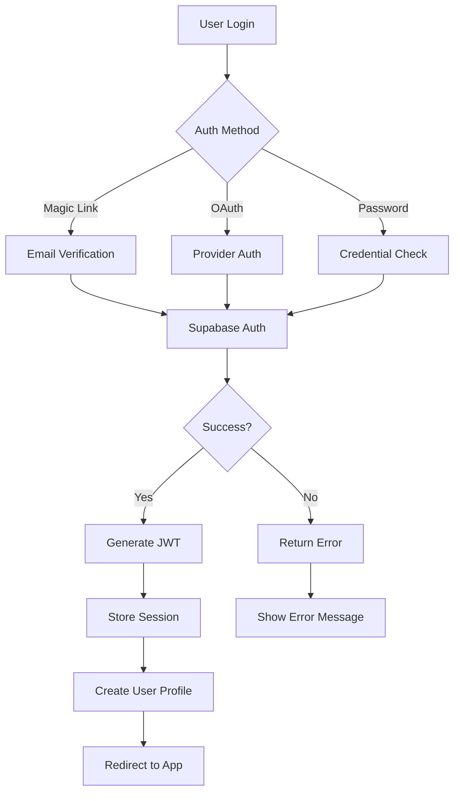

# Authentication System

Cathcr implements a comprehensive authentication system using Supabase Auth, providing secure user management, session handling, and data protection with Row Level Security (RLS).

## Overview

The authentication system provides:
- **Multiple Auth Methods**: Magic links, OAuth providers, and traditional email/password
- **Secure Session Management**: JWT-based authentication with automatic refresh
- **Row Level Security**: Database-level data isolation
- **User Profile Management**: Extended user profiles and preferences
- **Real-time State Management**: Seamless auth state across the application

## Architecture

### Authentication Flow



### Component Architecture

```typescript
// Authentication system structure
interface AuthSystem {
  providers: {
    supabase: SupabaseAuthProvider;
    oauth: OAuthProviders;
    magicLink: MagicLinkProvider;
  };
  session: SessionManager;
  protection: {
    rls: RowLevelSecurity;
    guards: RouteGuards;
  };
  ui: AuthComponents;
}
```

## Supabase Auth Configuration

### Client Setup

```typescript
// client/src/config/supabase.ts
import { createClient } from '@supabase/supabase-js';
import type { Database } from '@cathcr/shared';

const supabaseUrl = import.meta.env.VITE_SUPABASE_URL;
const supabaseAnonKey = import.meta.env.VITE_SUPABASE_ANON_KEY;

export const supabase = createClient<Database>(supabaseUrl, supabaseAnonKey, {
  auth: {
    autoRefreshToken: true,
    persistSession: true,
    detectSessionInUrl: true,
    flowType: 'pkce' // Proof Key for Code Exchange for enhanced security
  },
  realtime: {
    params: {
      eventsPerSecond: 10
    }
  }
});
```

### Server Setup

```typescript
// server/src/config/supabase.ts
import { createClient } from '@supabase/supabase-js';

const supabaseUrl = process.env.SUPABASE_URL!;
const supabaseServiceKey = process.env.SUPABASE_SERVICE_ROLE_KEY!;

// Service role client for server-side operations
export const supabaseAdmin = createClient(supabaseUrl, supabaseServiceKey, {
  auth: {
    autoRefreshToken: false,
    persistSession: false
  }
});

// Regular client for user operations
export const supabase = createClient(supabaseUrl, process.env.SUPABASE_ANON_KEY!, {
  auth: {
    autoRefreshToken: false,
    persistSession: false
  }
});
```

## Authentication Methods

### Magic Link Authentication

```typescript
// client/src/services/auth.ts
export class AuthService {
  async signInWithMagicLink(email: string): Promise<void> {
    const { error } = await supabase.auth.signInWithOtp({
      email,
      options: {
        emailRedirectTo: `${window.location.origin}/auth/callback`,
        shouldCreateUser: true
      }
    });

    if (error) {
      throw new AuthError(`Magic link failed: ${error.message}`);
    }
  }

  async handleMagicLinkCallback(): Promise<User | null> {
    const { data, error } = await supabase.auth.getSession();

    if (error) {
      throw new AuthError(`Session error: ${error.message}`);
    }

    if (data.session) {
      await this.createUserProfile(data.session.user);
      return data.session.user;
    }

    return null;
  }
}
```

### OAuth Providers

```typescript
// OAuth configuration
const oauthProviders = {
  google: {
    enabled: true,
    scopes: 'email profile'
  },
  github: {
    enabled: true,
    scopes: 'user:email'
  }
} as const;

export class OAuthService {
  async signInWithProvider(provider: 'google' | 'github'): Promise<void> {
    const { error } = await supabase.auth.signInWithOAuth({
      provider,
      options: {
        redirectTo: `${window.location.origin}/auth/callback`,
        scopes: oauthProviders[provider].scopes
      }
    });

    if (error) {
      throw new AuthError(`OAuth ${provider} failed: ${error.message}`);
    }
  }

  async handleOAuthCallback(): Promise<User | null> {
    const { data, error } = await supabase.auth.getSession();

    if (error) {
      throw new AuthError(`OAuth callback error: ${error.message}`);
    }

    if (data.session?.user) {
      await this.syncOAuthProfile(data.session.user);
      return data.session.user;
    }

    return null;
  }

  private async syncOAuthProfile(user: User): Promise<void> {
    const { user_metadata } = user;

    await supabase.from('users').upsert({
      id: user.id,
      email: user.email!,
      display_name: user_metadata.full_name || user_metadata.name,
      avatar_url: user_metadata.avatar_url || user_metadata.picture,
      provider: user.app_metadata.provider,
      updated_at: new Date().toISOString()
    });
  }
}
```

### Email/Password Authentication

```typescript
export class EmailPasswordAuth {
  async signUp(email: string, password: string, metadata?: UserMetadata): Promise<void> {
    const { error } = await supabase.auth.signUp({
      email,
      password,
      options: {
        data: metadata,
        emailRedirectTo: `${window.location.origin}/auth/verify`
      }
    });

    if (error) {
      throw new AuthError(`Sign up failed: ${error.message}`);
    }
  }

  async signIn(email: string, password: string): Promise<User> {
    const { data, error } = await supabase.auth.signInWithPassword({
      email,
      password
    });

    if (error) {
      throw new AuthError(`Sign in failed: ${error.message}`);
    }

    if (!data.user) {
      throw new AuthError('No user returned from sign in');
    }

    return data.user;
  }

  async resetPassword(email: string): Promise<void> {
    const { error } = await supabase.auth.resetPasswordForEmail(email, {
      redirectTo: `${window.location.origin}/auth/reset-password`
    });

    if (error) {
      throw new AuthError(`Password reset failed: ${error.message}`);
    }
  }

  async updatePassword(newPassword: string): Promise<void> {
    const { error } = await supabase.auth.updateUser({
      password: newPassword
    });

    if (error) {
      throw new AuthError(`Password update failed: ${error.message}`);
    }
  }
}
```

## Session Management

### Auth Context Provider

```typescript
// client/src/contexts/AuthContext.tsx
interface AuthContextType {
  user: User | null;
  profile: UserProfile | null;
  loading: boolean;
  signIn: (email: string, password: string) => Promise<void>;
  signUp: (email: string, password: string) => Promise<void>;
  signOut: () => Promise<void>;
  updateProfile: (updates: Partial<UserProfile>) => Promise<void>;
}

export const AuthContext = createContext<AuthContextType | undefined>(undefined);

export const AuthProvider: React.FC<{ children: React.ReactNode }> = ({ children }) => {
  const [user, setUser] = useState<User | null>(null);
  const [profile, setProfile] = useState<UserProfile | null>(null);
  const [loading, setLoading] = useState(true);

  useEffect(() => {
    // Get initial session
    supabase.auth.getSession().then(({ data: { session } }) => {
      setUser(session?.user ?? null);
      if (session?.user) {
        loadUserProfile(session.user.id);
      }
      setLoading(false);
    });

    // Listen for auth changes
    const { data: { subscription } } = supabase.auth.onAuthStateChange(
      async (event, session) => {
        setUser(session?.user ?? null);

        if (session?.user) {
          await loadUserProfile(session.user.id);
        } else {
          setProfile(null);
        }

        setLoading(false);
      }
    );

    return () => subscription.unsubscribe();
  }, []);

  const loadUserProfile = async (userId: string): Promise<void> => {
    try {
      const { data, error } = await supabase
        .from('users')
        .select('*')
        .eq('id', userId)
        .single();

      if (error && error.code !== 'PGRST116') { // Not found error
        throw error;
      }

      if (data) {
        setProfile(data);
      } else {
        // Create profile if it doesn't exist
        await createUserProfile(userId);
      }
    } catch (error) {
      console.error('Error loading user profile:', error);
    }
  };

  const createUserProfile = async (userId: string): Promise<void> => {
    const user = supabase.auth.getUser();

    const { data, error } = await supabase
      .from('users')
      .insert({
        id: userId,
        email: user.data.user?.email || '',
        created_at: new Date().toISOString()
      })
      .select()
      .single();

    if (error) {
      console.error('Error creating user profile:', error);
    } else {
      setProfile(data);
    }
  };

  const signIn = async (email: string, password: string): Promise<void> => {
    setLoading(true);
    try {
      const user = await authService.signIn(email, password);
      // User state will be updated by onAuthStateChange
    } finally {
      setLoading(false);
    }
  };

  const signOut = async (): Promise<void> => {
    setLoading(true);
    try {
      await supabase.auth.signOut();
      // Clear any cached data
      queryClient.clear();
    } finally {
      setLoading(false);
    }
  };

  const updateProfile = async (updates: Partial<UserProfile>): Promise<void> => {
    if (!user) throw new Error('No user logged in');

    const { data, error } = await supabase
      .from('users')
      .update({
        ...updates,
        updated_at: new Date().toISOString()
      })
      .eq('id', user.id)
      .select()
      .single();

    if (error) {
      throw new Error(`Profile update failed: ${error.message}`);
    }

    setProfile(data);
  };

  return (
    <AuthContext.Provider value={{
      user,
      profile,
      loading,
      signIn,
      signUp,
      signOut,
      updateProfile
    }}>
      {children}
    </AuthContext.Provider>
  );
};
```

### Session Persistence

```typescript
// Session management utilities
export class SessionManager {
  private static readonly SESSION_KEY = 'cathcr_session';
  private static readonly REFRESH_THRESHOLD = 5 * 60 * 1000; // 5 minutes

  static async refreshSessionIfNeeded(): Promise<void> {
    const { data: { session } } = await supabase.auth.getSession();

    if (!session) return;

    const expiresAt = new Date(session.expires_at! * 1000);
    const now = new Date();
    const timeUntilExpiry = expiresAt.getTime() - now.getTime();

    if (timeUntilExpiry < this.REFRESH_THRESHOLD) {
      await this.refreshSession();
    }
  }

  static async refreshSession(): Promise<void> {
    const { error } = await supabase.auth.refreshSession();

    if (error) {
      console.error('Session refresh failed:', error);
      // Redirect to login if refresh fails
      window.location.href = '/auth/login';
    }
  }

  static async clearSession(): Promise<void> {
    await supabase.auth.signOut();
    localStorage.removeItem(this.SESSION_KEY);
  }
}
```

## Route Protection

### Protected Route Component

```typescript
// client/src/components/ProtectedRoute.tsx
interface ProtectedRouteProps {
  children: React.ReactNode;
  redirectTo?: string;
  requireProfile?: boolean;
}

export const ProtectedRoute: React.FC<ProtectedRouteProps> = ({
  children,
  redirectTo = '/auth/login',
  requireProfile = false
}) => {
  const { user, profile, loading } = useAuth();
  const navigate = useNavigate();

  useEffect(() => {
    if (!loading) {
      if (!user) {
        navigate(redirectTo);
        return;
      }

      if (requireProfile && !profile) {
        navigate('/onboarding');
        return;
      }
    }
  }, [user, profile, loading, navigate, redirectTo, requireProfile]);

  if (loading) {
    return <LoadingScreen />;
  }

  if (!user) {
    return null;
  }

  if (requireProfile && !profile) {
    return null;
  }

  return <>{children}</>;
};
```

### Route Guards Hook

```typescript
// client/src/hooks/useRouteGuard.ts
export const useRouteGuard = () => {
  const { user, profile, loading } = useAuth();
  const navigate = useNavigate();

  const requireAuth = useCallback((redirectTo = '/auth/login') => {
    if (!loading && !user) {
      navigate(redirectTo);
      return false;
    }
    return true;
  }, [user, loading, navigate]);

  const requireProfile = useCallback((redirectTo = '/onboarding') => {
    if (!loading && user && !profile) {
      navigate(redirectTo);
      return false;
    }
    return true;
  }, [user, profile, loading, navigate]);

  const requireGuest = useCallback((redirectTo = '/dashboard') => {
    if (!loading && user) {
      navigate(redirectTo);
      return false;
    }
    return true;
  }, [user, loading, navigate]);

  return {
    requireAuth,
    requireProfile,
    requireGuest,
    isAuthenticated: !!user,
    hasProfile: !!profile,
    loading
  };
};
```

## Row Level Security (RLS)

### Database Policies

```sql
-- Enable RLS on all user tables
ALTER TABLE public.users ENABLE ROW LEVEL SECURITY;
ALTER TABLE public.thoughts ENABLE ROW LEVEL SECURITY;
ALTER TABLE public.categories ENABLE ROW LEVEL SECURITY;
ALTER TABLE public.processing_queue ENABLE ROW LEVEL SECURITY;

-- Users can only access their own data
CREATE POLICY "users_own_data" ON public.users
  FOR ALL USING (auth.uid() = id);

CREATE POLICY "thoughts_own_data" ON public.thoughts
  FOR ALL USING (auth.uid() = user_id);

CREATE POLICY "categories_own_data" ON public.categories
  FOR ALL USING (auth.uid() = user_id OR is_system = true);

CREATE POLICY "processing_queue_own_data" ON public.processing_queue
  FOR ALL USING (auth.uid() = user_id);

-- Allow users to view system categories
CREATE POLICY "system_categories_readable" ON public.categories
  FOR SELECT USING (is_system = true);

-- Users can insert their own data
CREATE POLICY "users_can_insert" ON public.thoughts
  FOR INSERT WITH CHECK (auth.uid() = user_id);

CREATE POLICY "users_can_insert_categories" ON public.categories
  FOR INSERT WITH CHECK (auth.uid() = user_id AND is_system = false);
```

### RLS Testing

```typescript
// server/src/__tests__/auth/rls.test.ts
describe('Row Level Security', () => {
  let user1: User;
  let user2: User;

  beforeEach(async () => {
    user1 = await createTestUser();
    user2 = await createTestUser();
  });

  it('prevents users from accessing other users data', async () => {
    // Create thought as user1
    const thought = await createThoughtAsUser(user1.id, 'User 1 thought');

    // Try to access as user2
    const { data } = await supabase
      .auth
      .setSession(user2.session)
      .from('thoughts')
      .select('*')
      .eq('id', thought.id);

    expect(data).toHaveLength(0); // Should not return other user's data
  });

  it('allows users to access their own data', async () => {
    const thought = await createThoughtAsUser(user1.id, 'User 1 thought');

    const { data } = await supabase
      .auth
      .setSession(user1.session)
      .from('thoughts')
      .select('*')
      .eq('id', thought.id);

    expect(data).toHaveLength(1);
    expect(data[0].content).toBe('User 1 thought');
  });
});
```

## Server-Side Authentication

### Middleware

```typescript
// server/src/middleware/auth.ts
export interface AuthenticatedRequest extends Request {
  user: User;
  profile?: UserProfile;
}

export const authenticate = async (
  req: Request,
  res: Response,
  next: NextFunction
): Promise<void> => {
  try {
    const authHeader = req.headers.authorization;

    if (!authHeader?.startsWith('Bearer ')) {
      return res.status(401).json({ error: 'Missing or invalid authorization header' });
    }

    const token = authHeader.substring(7);

    // Verify JWT token with Supabase
    const { data: { user }, error } = await supabase.auth.getUser(token);

    if (error || !user) {
      return res.status(401).json({ error: 'Invalid token' });
    }

    // Attach user to request
    (req as AuthenticatedRequest).user = user;

    // Optionally load user profile
    const { data: profile } = await supabase
      .from('users')
      .select('*')
      .eq('id', user.id)
      .single();

    if (profile) {
      (req as AuthenticatedRequest).profile = profile;
    }

    next();
  } catch (error) {
    console.error('Authentication error:', error);
    res.status(500).json({ error: 'Authentication failed' });
  }
};

// Optional authentication (doesn't fail if no token)
export const optionalAuth = async (
  req: Request,
  res: Response,
  next: NextFunction
): Promise<void> => {
  try {
    const authHeader = req.headers.authorization;

    if (authHeader?.startsWith('Bearer ')) {
      const token = authHeader.substring(7);
      const { data: { user } } = await supabase.auth.getUser(token);

      if (user) {
        (req as AuthenticatedRequest).user = user;
      }
    }

    next();
  } catch (error) {
    // Continue without authentication
    next();
  }
};
```

### Admin Routes

```typescript
// server/src/middleware/admin.ts
export const requireAdmin = async (
  req: AuthenticatedRequest,
  res: Response,
  next: NextFunction
): Promise<void> => {
  try {
    if (!req.user) {
      return res.status(401).json({ error: 'Authentication required' });
    }

    const { data: profile } = await supabaseAdmin
      .from('users')
      .select('role')
      .eq('id', req.user.id)
      .single();

    if (!profile || profile.role !== 'admin') {
      return res.status(403).json({ error: 'Admin access required' });
    }

    next();
  } catch (error) {
    console.error('Admin check error:', error);
    res.status(500).json({ error: 'Authorization check failed' });
  }
};
```

## User Profile Management

### Profile Schema

```typescript
// shared/src/types/user.ts
export interface UserProfile {
  id: string;
  email: string;
  username?: string;
  display_name?: string;
  avatar_url?: string;
  preferences: UserPreferences;
  role: 'user' | 'admin';
  created_at: string;
  updated_at: string;
}

export interface UserPreferences {
  theme: 'dark' | 'light' | 'system';
  language: string;
  timezone: string;
  notifications: {
    email: boolean;
    browser: boolean;
    reminders: boolean;
  };
  ai_processing: {
    auto_categorize: boolean;
    confidence_threshold: number;
  };
  shortcuts: {
    capture: string;
    search: string;
  };
}
```

### Profile Service

```typescript
// client/src/services/profileService.ts
export class ProfileService {
  static async updateProfile(
    userId: string,
    updates: Partial<UserProfile>
  ): Promise<UserProfile> {
    const { data, error } = await supabase
      .from('users')
      .update({
        ...updates,
        updated_at: new Date().toISOString()
      })
      .eq('id', userId)
      .select()
      .single();

    if (error) {
      throw new Error(`Profile update failed: ${error.message}`);
    }

    return data;
  }

  static async updatePreferences(
    userId: string,
    preferences: Partial<UserPreferences>
  ): Promise<UserProfile> {
    const { data: currentProfile } = await supabase
      .from('users')
      .select('preferences')
      .eq('id', userId)
      .single();

    const updatedPreferences = {
      ...currentProfile?.preferences,
      ...preferences
    };

    return this.updateProfile(userId, {
      preferences: updatedPreferences
    });
  }

  static async uploadAvatar(userId: string, file: File): Promise<string> {
    const fileExt = file.name.split('.').pop();
    const fileName = `${userId}.${fileExt}`;

    const { error: uploadError } = await supabase.storage
      .from('avatars')
      .upload(fileName, file, { upsert: true });

    if (uploadError) {
      throw new Error(`Avatar upload failed: ${uploadError.message}`);
    }

    const { data } = supabase.storage
      .from('avatars')
      .getPublicUrl(fileName);

    await this.updateProfile(userId, {
      avatar_url: data.publicUrl
    });

    return data.publicUrl;
  }
}
```

This comprehensive authentication system provides secure, scalable user management while maintaining excellent user experience and strong security practices throughout the Cathcr platform.