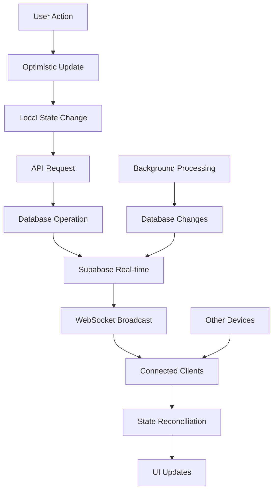

# Real-time Features

Cathcr implements comprehensive real-time functionality using Supabase's real-time capabilities to provide live updates, seamless synchronization, and collaborative features across all connected clients.

## Overview

The real-time system provides:
- **Live Thought Updates**: Instant synchronization of thought creation, updates, and deletions
- **Processing Status**: Real-time AI processing progress indicators
- **Cross-device Sync**: Seamless experience across multiple devices
- **Collaborative Features**: Future support for shared thoughts and team workspaces
- **Optimistic Updates**: Immediate UI feedback with server reconciliation

## Architecture

### Real-time Data Flow



### Real-time Architecture

```typescript
// Real-time system structure
interface RealtimeSystem {
  subscriptions: {
    thoughts: ThoughtSubscription;
    processing: ProcessingSubscription;
    user: UserSubscription;
  };
  sync: {
    optimistic: OptimisticUpdates;
    reconciliation: StateReconciliation;
    conflict: ConflictResolution;
  };
  management: {
    connection: ConnectionManager;
    retry: RetryHandler;
    offline: OfflineSync;
  };
}
```

## Supabase Real-time Setup

### Database Configuration

```sql
-- Enable real-time on relevant tables
ALTER publication supabase_realtime ADD TABLE public.thoughts;
ALTER publication supabase_realtime ADD TABLE public.processing_queue;
ALTER publication supabase_realtime ADD TABLE public.categories;
ALTER publication supabase_realtime ADD TABLE public.user_settings;

-- Create real-time policies for security
CREATE POLICY "realtime_thoughts" ON public.thoughts
  FOR SELECT USING (auth.uid() = user_id);

CREATE POLICY "realtime_processing" ON public.processing_queue
  FOR SELECT USING (auth.uid() = user_id);
```

### Client Configuration

```typescript
// client/src/config/realtime.ts
import { RealtimeChannel } from '@supabase/supabase-js';
import { supabase } from './supabase';

export class RealtimeManager {
  private channels: Map<string, RealtimeChannel> = new Map();
  private isConnected = false;
  private reconnectAttempts = 0;
  private maxReconnectAttempts = 5;

  async initialize(userId: string): Promise<void> {
    try {
      // Subscribe to user-specific channels
      await this.subscribeToThoughts(userId);
      await this.subscribeToProcessing(userId);
      await this.subscribeToUserSettings(userId);

      this.isConnected = true;
      this.reconnectAttempts = 0;
    } catch (error) {
      console.error('Failed to initialize real-time:', error);
      this.handleConnectionError();
    }
  }

  private async subscribeToThoughts(userId: string): Promise<void> {
    const channel = supabase
      .channel(`thoughts:user_id=eq.${userId}`)
      .on(
        'postgres_changes',
        {
          event: '*',
          schema: 'public',
          table: 'thoughts',
          filter: `user_id=eq.${userId}`
        },
        (payload) => this.handleThoughtChange(payload)
      )
      .subscribe((status) => {
        console.log('Thoughts subscription status:', status);
      });

    this.channels.set('thoughts', channel);
  }

  private async subscribeToProcessing(userId: string): Promise<void> {
    const channel = supabase
      .channel(`processing:user_id=eq.${userId}`)
      .on(
        'postgres_changes',
        {
          event: '*',
          schema: 'public',
          table: 'processing_queue',
          filter: `user_id=eq.${userId}`
        },
        (payload) => this.handleProcessingChange(payload)
      )
      .subscribe();

    this.channels.set('processing', channel);
  }

  private handleThoughtChange(payload: any): void {
    const { eventType, new: newRecord, old: oldRecord } = payload;

    switch (eventType) {
      case 'INSERT':
        this.emit('thought:created', newRecord);
        break;
      case 'UPDATE':
        this.emit('thought:updated', { old: oldRecord, new: newRecord });
        break;
      case 'DELETE':
        this.emit('thought:deleted', oldRecord);
        break;
    }
  }

  private handleProcessingChange(payload: any): void {
    const { eventType, new: newRecord } = payload;

    if (eventType === 'UPDATE' && newRecord.status === 'completed') {
      this.emit('processing:completed', newRecord);
    }
  }

  private emit(event: string, data: any): void {
    // Emit to event bus for React components to consume
    window.dispatchEvent(new CustomEvent(event, { detail: data }));
  }

  disconnect(): void {
    this.channels.forEach((channel) => {
      supabase.removeChannel(channel);
    });
    this.channels.clear();
    this.isConnected = false;
  }

  private handleConnectionError(): void {
    if (this.reconnectAttempts < this.maxReconnectAttempts) {
      const delay = Math.pow(2, this.reconnectAttempts) * 1000;
      setTimeout(() => {
        this.reconnectAttempts++;
        // Retry connection
      }, delay);
    }
  }
}
```

## React Integration

### Real-time Hooks

```typescript
// client/src/hooks/useRealtimeThoughts.ts
export const useRealtimeThoughts = (userId: string) => {
  const queryClient = useQueryClient();
  const [connectionStatus, setConnectionStatus] = useState<'connecting' | 'connected' | 'disconnected'>('connecting');

  useEffect(() => {
    if (!userId) return;

    const channel = supabase
      .channel(`thoughts:${userId}`)
      .on(
        'postgres_changes',
        {
          event: '*',
          schema: 'public',
          table: 'thoughts',
          filter: `user_id=eq.${userId}`
        },
        (payload) => {
          handleRealtimeUpdate(payload, queryClient);
        }
      )
      .subscribe((status) => {
        setConnectionStatus(status === 'SUBSCRIBED' ? 'connected' : 'connecting');
      });

    return () => {
      supabase.removeChannel(channel);
    };
  }, [userId, queryClient]);

  return { connectionStatus };
};

const handleRealtimeUpdate = (payload: any, queryClient: QueryClient) => {
  const { eventType, new: newRecord, old: oldRecord } = payload;

  switch (eventType) {
    case 'INSERT':
      // Add new thought to cache
      queryClient.setQueryData(['thoughts'], (old: Thought[] = []) => {
        // Avoid duplicates from optimistic updates
        if (old.some(thought => thought.id === newRecord.id)) {
          return old;
        }
        return [newRecord, ...old];
      });
      break;

    case 'UPDATE':
      // Update existing thought in cache
      queryClient.setQueryData(['thoughts'], (old: Thought[] = []) => {
        return old.map(thought =>
          thought.id === newRecord.id ? newRecord : thought
        );
      });
      break;

    case 'DELETE':
      // Remove thought from cache
      queryClient.setQueryData(['thoughts'], (old: Thought[] = []) => {
        return old.filter(thought => thought.id !== oldRecord.id);
      });
      break;
  }

  // Invalidate related queries
  queryClient.invalidateQueries({ queryKey: ['thoughts-stats'] });
  queryClient.invalidateQueries({ queryKey: ['categories'] });
};
```

### Processing Status Updates

```typescript
// client/src/hooks/useProcessingStatus.ts
export const useProcessingStatus = (thoughtId?: string) => {
  const [status, setStatus] = useState<ProcessingStatus>('pending');
  const [progress, setProgress] = useState(0);

  useEffect(() => {
    if (!thoughtId) return;

    const channel = supabase
      .channel(`processing:thought:${thoughtId}`)
      .on(
        'postgres_changes',
        {
          event: 'UPDATE',
          schema: 'public',
          table: 'processing_queue',
          filter: `thought_id=eq.${thoughtId}`
        },
        (payload) => {
          const { new: record } = payload;
          setStatus(record.status);

          // Calculate progress based on completed tasks
          if (record.status === 'completed') {
            setProgress(100);
          } else if (record.status === 'processing') {
            setProgress(50);
          }
        }
      )
      .subscribe();

    return () => {
      supabase.removeChannel(channel);
    };
  }, [thoughtId]);

  return { status, progress };
};
```

## Optimistic Updates

### Optimistic Mutations

```typescript
// client/src/hooks/useOptimisticThoughts.ts
export const useCreateThought = () => {
  const queryClient = useQueryClient();

  return useMutation({
    mutationFn: async (data: CreateThoughtRequest) => {
      return thoughtsApi.create(data);
    },

    onMutate: async (newThought) => {
      // Cancel outgoing refetches
      await queryClient.cancelQueries({ queryKey: ['thoughts'] });

      // Snapshot previous value
      const previousThoughts = queryClient.getQueryData<Thought[]>(['thoughts']);

      // Optimistically update cache
      const optimisticThought: Thought = {
        id: `temp-${Date.now()}`, // Temporary ID
        ...newThought,
        user_id: getCurrentUserId(),
        created_at: new Date().toISOString(),
        updated_at: new Date().toISOString(),
        processing_status: 'pending',
        category: 'notes', // Default until AI processes
        confidence_score: null,
        __optimistic: true // Flag for optimistic updates
      };

      queryClient.setQueryData<Thought[]>(['thoughts'], (old = []) => [
        optimisticThought,
        ...old
      ]);

      return { previousThoughts, optimisticThought };
    },

    onError: (err, newThought, context) => {
      // Rollback optimistic update on error
      if (context?.previousThoughts) {
        queryClient.setQueryData(['thoughts'], context.previousThoughts);
      }

      // Show error notification
      toast.error('Failed to create thought');
    },

    onSuccess: (data, variables, context) => {
      // Replace optimistic thought with real data
      queryClient.setQueryData<Thought[]>(['thoughts'], (old = []) => {
        return old.map(thought =>
          thought.__optimistic && thought.content === data.content
            ? data
            : thought
        );
      });

      toast.success('Thought created successfully');
    },

    onSettled: () => {
      // Always refetch to ensure consistency
      queryClient.invalidateQueries({ queryKey: ['thoughts'] });
    }
  });
};
```

### Conflict Resolution

```typescript
// client/src/utils/conflictResolution.ts
export class ConflictResolver {
  static resolveThoughtConflict(
    local: Thought,
    remote: Thought
  ): Thought {
    // Use server timestamp as source of truth
    const serverTime = new Date(remote.updated_at).getTime();
    const localTime = new Date(local.updated_at).getTime();

    if (serverTime > localTime) {
      // Server version is newer, use it
      return remote;
    }

    // Local version is newer, need to sync to server
    return local;
  }

  static async syncConflicts(
    conflicts: ThoughtConflict[]
  ): Promise<void> {
    for (const conflict of conflicts) {
      try {
        const resolved = this.resolveThoughtConflict(
          conflict.local,
          conflict.remote
        );

        if (resolved.id === conflict.local.id) {
          // Local wins, update server
          await thoughtsApi.update(resolved.id, resolved);
        }
        // If remote wins, no action needed as cache will update via real-time
      } catch (error) {
        console.error('Failed to resolve conflict:', error);
      }
    }
  }
}
```

## Offline Support

### Service Worker Integration

```typescript
// public/sw.js
const CACHE_NAME = 'cathcr-offline-v1';
const OFFLINE_ACTIONS_STORE = 'offline-actions';

self.addEventListener('fetch', (event) => {
  if (event.request.method === 'POST' && event.request.url.includes('/api/thoughts')) {
    event.respondWith(handleOfflineThoughtCreation(event.request));
  }
});

async function handleOfflineThoughtCreation(request) {
  try {
    // Try to make the request
    const response = await fetch(request);
    return response;
  } catch (error) {
    // Store action for later sync
    const body = await request.text();
    await storeOfflineAction({
      type: 'CREATE_THOUGHT',
      url: request.url,
      method: 'POST',
      body: body,
      timestamp: Date.now()
    });

    // Return success response for optimistic UI
    return new Response(JSON.stringify({
      id: `offline-${Date.now()}`,
      ...JSON.parse(body),
      __offline: true
    }), {
      status: 201,
      headers: { 'Content-Type': 'application/json' }
    });
  }
}
```

### Offline Sync Manager

```typescript
// client/src/services/offlineSync.ts
export class OfflineSyncManager {
  private syncQueue: OfflineAction[] = [];
  private isOnline = navigator.onLine;

  constructor() {
    this.setupNetworkListeners();
    this.loadQueueFromStorage();
  }

  private setupNetworkListeners(): void {
    window.addEventListener('online', () => {
      this.isOnline = true;
      this.syncPendingActions();
    });

    window.addEventListener('offline', () => {
      this.isOnline = false;
    });
  }

  async addToQueue(action: OfflineAction): Promise<void> {
    this.syncQueue.push(action);
    await this.saveQueueToStorage();

    if (this.isOnline) {
      this.syncPendingActions();
    }
  }

  private async syncPendingActions(): Promise<void> {
    const actionsToSync = [...this.syncQueue];
    this.syncQueue = [];

    for (const action of actionsToSync) {
      try {
        await this.executeAction(action);
      } catch (error) {
        console.error('Failed to sync action:', error);
        // Re-add to queue for retry
        this.syncQueue.push(action);
      }
    }

    await this.saveQueueToStorage();
  }

  private async executeAction(action: OfflineAction): Promise<void> {
    switch (action.type) {
      case 'CREATE_THOUGHT':
        await fetch(action.url, {
          method: action.method,
          headers: {
            'Content-Type': 'application/json',
            'Authorization': `Bearer ${await getAuthToken()}`
          },
          body: action.body
        });
        break;

      case 'UPDATE_THOUGHT':
        await fetch(action.url, {
          method: action.method,
          headers: {
            'Content-Type': 'application/json',
            'Authorization': `Bearer ${await getAuthToken()}`
          },
          body: action.body
        });
        break;

      case 'DELETE_THOUGHT':
        await fetch(action.url, {
          method: 'DELETE',
          headers: {
            'Authorization': `Bearer ${await getAuthToken()}`
          }
        });
        break;
    }
  }

  private async saveQueueToStorage(): Promise<void> {
    localStorage.setItem('sync-queue', JSON.stringify(this.syncQueue));
  }

  private loadQueueFromStorage(): void {
    const stored = localStorage.getItem('sync-queue');
    if (stored) {
      this.syncQueue = JSON.parse(stored);
    }
  }
}
```

## Connection Management

### Connection Status Hook

```typescript
// client/src/hooks/useConnectionStatus.ts
export const useConnectionStatus = () => {
  const [status, setStatus] = useState<ConnectionStatus>('connected');
  const [lastSeen, setLastSeen] = useState<Date>(new Date());

  useEffect(() => {
    const handleOnline = () => {
      setStatus('connected');
      setLastSeen(new Date());
    };

    const handleOffline = () => {
      setStatus('disconnected');
    };

    // Check real-time connection status
    const checkRealtimeConnection = () => {
      const channel = supabase.channel('heartbeat');

      const timeout = setTimeout(() => {
        setStatus('reconnecting');
      }, 5000);

      channel
        .on('presence', { event: 'sync' }, () => {
          clearTimeout(timeout);
          setStatus('connected');
          setLastSeen(new Date());
        })
        .subscribe();

      return () => {
        clearTimeout(timeout);
        supabase.removeChannel(channel);
      };
    };

    window.addEventListener('online', handleOnline);
    window.addEventListener('offline', handleOffline);

    const cleanup = checkRealtimeConnection();

    return () => {
      window.removeEventListener('online', handleOnline);
      window.removeEventListener('offline', handleOffline);
      cleanup();
    };
  }, []);

  return { status, lastSeen };
};
```

### Connection Status Indicator

```typescript
// client/src/components/ConnectionStatusIndicator.tsx
export const ConnectionStatusIndicator: React.FC = () => {
  const { status, lastSeen } = useConnectionStatus();

  if (status === 'connected') {
    return null; // Don't show when connected
  }

  const getStatusConfig = () => {
    switch (status) {
      case 'disconnected':
        return {
          color: 'bg-red-500',
          text: 'Offline',
          icon: WifiOff
        };
      case 'reconnecting':
        return {
          color: 'bg-yellow-500',
          text: 'Reconnecting...',
          icon: Wifi
        };
      default:
        return {
          color: 'bg-green-500',
          text: 'Connected',
          icon: Wifi
        };
    }
  };

  const config = getStatusConfig();
  const Icon = config.icon;

  return (
    <motion.div
      initial={{ opacity: 0, y: -20 }}
      animate={{ opacity: 1, y: 0 }}
      className={cn(
        'fixed top-4 right-4 z-50',
        'flex items-center space-x-2 px-3 py-2',
        'bg-black/80 backdrop-blur-sm rounded-lg',
        'border border-white/20 text-white text-sm'
      )}
    >
      <div className={cn('w-2 h-2 rounded-full', config.color)} />
      <Icon className="w-4 h-4" />
      <span>{config.text}</span>

      {status === 'disconnected' && (
        <span className="text-gray-400">
          Last seen {formatDistanceToNow(lastSeen)} ago
        </span>
      )}
    </motion.div>
  );
};
```

## Performance Optimization

### Subscription Management

```typescript
// client/src/utils/subscriptionManager.ts
export class SubscriptionManager {
  private subscriptions = new Map<string, RealtimeChannel>();
  private activeComponents = new Set<string>();

  subscribe(key: string, channel: RealtimeChannel): void {
    // Only subscribe if there are active components
    if (this.activeComponents.size > 0) {
      this.subscriptions.set(key, channel);
    }
  }

  unsubscribe(key: string): void {
    const channel = this.subscriptions.get(key);
    if (channel) {
      supabase.removeChannel(channel);
      this.subscriptions.delete(key);
    }
  }

  registerComponent(componentId: string): void {
    this.activeComponents.add(componentId);
  }

  unregisterComponent(componentId: string): void {
    this.activeComponents.delete(componentId);

    // Clean up subscriptions if no active components
    if (this.activeComponents.size === 0) {
      this.cleanup();
    }
  }

  private cleanup(): void {
    this.subscriptions.forEach((channel) => {
      supabase.removeChannel(channel);
    });
    this.subscriptions.clear();
  }
}
```

This comprehensive real-time system ensures that Cathcr provides a responsive, synchronized experience across all devices while maintaining excellent performance and reliability through intelligent connection management and offline support.