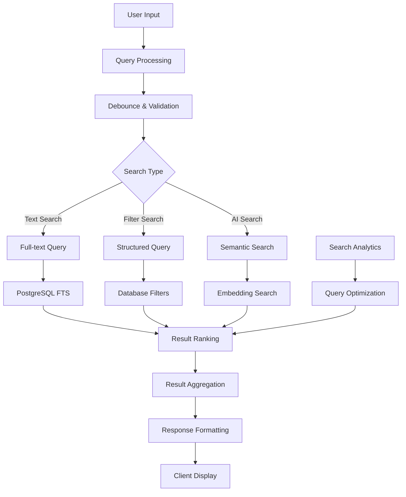

# Search System

Cathcr implements a powerful, intelligent search system combining PostgreSQL full-text search, real-time filtering, and AI-enhanced query understanding to help users quickly find and organize their thoughts.

## Overview

The search system provides:
- **Full-text Search**: PostgreSQL-powered text search with ranking
- **Real-time Filtering**: Instant results as users type
- **Advanced Filters**: Category, date, tag, and confidence-based filtering
- **Search Suggestions**: AI-powered query suggestions and autocomplete
- **Search History**: Persistent search history and saved searches
- **Intelligent Ranking**: Relevance scoring with personalization

## Architecture

### Search Flow



### Search System Components

```typescript
// Search system architecture
interface SearchSystem {
  query: {
    parser: QueryParser;
    validator: QueryValidator;
    enhancer: QueryEnhancer;
  };
  execution: {
    fulltext: FullTextSearch;
    filters: FilterSearch;
    semantic: SemanticSearch;
  };
  ranking: {
    relevance: RelevanceScoring;
    personalization: PersonalizationEngine;
    boosting: ResultBoosting;
  };
  ui: {
    input: SearchInput;
    suggestions: SearchSuggestions;
    results: SearchResults;
    filters: SearchFilters;
  };
}
```

## Full-text Search Implementation

### Database Setup

```sql
-- Create full-text search index
CREATE INDEX idx_thoughts_fts ON public.thoughts
USING GIN (to_tsvector('english', content || ' ' || COALESCE(title, '')));

-- Create search function with ranking
CREATE OR REPLACE FUNCTION search_thoughts(
  search_query TEXT,
  user_uuid UUID,
  limit_count INTEGER DEFAULT 20,
  offset_count INTEGER DEFAULT 0
) RETURNS TABLE (
  id UUID,
  content TEXT,
  title VARCHAR(255),
  category VARCHAR(50),
  tags TEXT[],
  rank REAL,
  created_at TIMESTAMP WITH TIME ZONE,
  highlight TEXT
) AS $$
BEGIN
  RETURN QUERY
  SELECT
    t.id,
    t.content,
    t.title,
    t.category,
    t.tags,
    ts_rank(
      to_tsvector('english', t.content || ' ' || COALESCE(t.title, '')),
      plainto_tsquery('english', search_query)
    ) as rank,
    t.created_at,
    ts_headline(
      'english',
      t.content,
      plainto_tsquery('english', search_query),
      'MaxWords=35, MinWords=15, ShortWord=3, HighlightAll=FALSE'
    ) as highlight
  FROM thoughts t
  WHERE t.user_id = user_uuid
    AND t.status = 'active'
    AND to_tsvector('english', t.content || ' ' || COALESCE(t.title, ''))
        @@ plainto_tsquery('english', search_query)
  ORDER BY rank DESC, t.created_at DESC
  LIMIT limit_count OFFSET offset_count;
END;
$$ LANGUAGE plpgsql SECURITY DEFINER;

-- Advanced search with filters
CREATE OR REPLACE FUNCTION advanced_search_thoughts(
  search_query TEXT,
  user_uuid UUID,
  category_filter VARCHAR(50) DEFAULT NULL,
  tag_filters TEXT[] DEFAULT NULL,
  date_from TIMESTAMP WITH TIME ZONE DEFAULT NULL,
  date_to TIMESTAMP WITH TIME ZONE DEFAULT NULL,
  confidence_min DECIMAL DEFAULT NULL,
  limit_count INTEGER DEFAULT 20,
  offset_count INTEGER DEFAULT 0
) RETURNS TABLE (
  id UUID,
  content TEXT,
  title VARCHAR(255),
  category VARCHAR(50),
  tags TEXT[],
  rank REAL,
  created_at TIMESTAMP WITH TIME ZONE,
  highlight TEXT
) AS $$
BEGIN
  RETURN QUERY
  SELECT
    t.id,
    t.content,
    t.title,
    t.category,
    t.tags,
    ts_rank(
      to_tsvector('english', t.content || ' ' || COALESCE(t.title, '')),
      plainto_tsquery('english', search_query)
    ) as rank,
    t.created_at,
    ts_headline(
      'english',
      t.content,
      plainto_tsquery('english', search_query),
      'MaxWords=35, MinWords=15, ShortWord=3, HighlightAll=FALSE'
    ) as highlight
  FROM thoughts t
  WHERE t.user_id = user_uuid
    AND t.status = 'active'
    AND (search_query IS NULL OR search_query = '' OR
         to_tsvector('english', t.content || ' ' || COALESCE(t.title, ''))
         @@ plainto_tsquery('english', search_query))
    AND (category_filter IS NULL OR t.category = category_filter)
    AND (tag_filters IS NULL OR t.tags && tag_filters)
    AND (date_from IS NULL OR t.created_at >= date_from)
    AND (date_to IS NULL OR t.created_at <= date_to)
    AND (confidence_min IS NULL OR t.confidence_score >= confidence_min)
  ORDER BY
    CASE WHEN search_query IS NOT NULL AND search_query != ''
         THEN rank ELSE 0 END DESC,
    t.created_at DESC
  LIMIT limit_count OFFSET offset_count;
END;
$$ LANGUAGE plpgsql SECURITY DEFINER;
```

### Search Service

```typescript
// server/src/services/searchService.ts
export class SearchService {
  constructor(private supabase: SupabaseClient) {}

  async searchThoughts(
    userId: string,
    query: SearchQuery
  ): Promise<SearchResult> {
    try {
      const { data, error, count } = await this.supabase
        .rpc('advanced_search_thoughts', {
          search_query: query.text || null,
          user_uuid: userId,
          category_filter: query.filters?.category || null,
          tag_filters: query.filters?.tags || null,
          date_from: query.filters?.dateFrom || null,
          date_to: query.filters?.dateTo || null,
          confidence_min: query.filters?.minConfidence || null,
          limit_count: query.limit || 20,
          offset_count: query.offset || 0
        })
        .select('*', { count: 'exact' });

      if (error) {
        throw new SearchError(`Search failed: ${error.message}`);
      }

      // Log search for analytics
      await this.logSearch(userId, query, data?.length || 0);

      return {
        results: data || [],
        total: count || 0,
        query,
        executionTime: Date.now() - query.startTime
      };
    } catch (error) {
      console.error('Search error:', error);
      throw error;
    }
  }

  async getSuggestions(
    userId: string,
    partialQuery: string
  ): Promise<SearchSuggestion[]> {
    const suggestions: SearchSuggestion[] = [];

    // Get category suggestions
    const categorySuggestions = await this.getCategorySuggestions(userId, partialQuery);
    suggestions.push(...categorySuggestions);

    // Get tag suggestions
    const tagSuggestions = await this.getTagSuggestions(userId, partialQuery);
    suggestions.push(...tagSuggestions);

    // Get content-based suggestions
    const contentSuggestions = await this.getContentSuggestions(userId, partialQuery);
    suggestions.push(...contentSuggestions);

    // Get search history suggestions
    const historySuggestions = await this.getSearchHistory(userId, partialQuery);
    suggestions.push(...historySuggestions);

    return suggestions.slice(0, 8); // Limit to 8 suggestions
  }

  private async getCategorySuggestions(
    userId: string,
    query: string
  ): Promise<SearchSuggestion[]> {
    const { data } = await this.supabase
      .from('thoughts')
      .select('category')
      .eq('user_id', userId)
      .ilike('category', `%${query}%`)
      .limit(3);

    return (data || []).map(item => ({
      type: 'category',
      text: `category:${item.category}`,
      display: `Category: ${item.category}`,
      icon: 'folder'
    }));
  }

  private async getTagSuggestions(
    userId: string,
    query: string
  ): Promise<SearchSuggestion[]> {
    const { data } = await this.supabase
      .rpc('get_matching_tags', {
        user_uuid: userId,
        tag_query: query
      })
      .limit(3);

    return (data || []).map(tag => ({
      type: 'tag',
      text: `tag:${tag}`,
      display: `Tag: ${tag}`,
      icon: 'tag'
    }));
  }

  private async logSearch(
    userId: string,
    query: SearchQuery,
    resultCount: number
  ): Promise<void> {
    await this.supabase.from('search_logs').insert({
      user_id: userId,
      query_text: query.text,
      filters: query.filters,
      result_count: resultCount,
      execution_time: Date.now() - query.startTime,
      created_at: new Date().toISOString()
    });
  }
}
```

## Client-side Search Implementation

### Search Hook

```typescript
// client/src/hooks/useSearch.ts
interface SearchState {
  query: string;
  filters: SearchFilters;
  results: ThoughtSearchResult[];
  suggestions: SearchSuggestion[];
  loading: boolean;
  error: string | null;
  total: number;
  hasMore: boolean;
}

export const useSearch = () => {
  const [state, setState] = useState<SearchState>({
    query: '',
    filters: {},
    results: [],
    suggestions: [],
    loading: false,
    error: null,
    total: 0,
    hasMore: false
  });

  const [searchHistory, setSearchHistory] = useState<string[]>([]);

  // Debounced search function
  const debouncedSearch = useMemo(
    () => debounce(async (query: string, filters: SearchFilters) => {
      if (!query.trim() && Object.keys(filters).length === 0) {
        setState(prev => ({ ...prev, results: [], total: 0, hasMore: false }));
        return;
      }

      setState(prev => ({ ...prev, loading: true, error: null }));

      try {
        const searchQuery: SearchQuery = {
          text: query.trim(),
          filters,
          limit: 20,
          offset: 0,
          startTime: Date.now()
        };

        const response = await searchApi.search(searchQuery);

        setState(prev => ({
          ...prev,
          results: response.results,
          total: response.total,
          hasMore: response.results.length === 20,
          loading: false
        }));

        // Add to search history
        if (query.trim()) {
          addToSearchHistory(query.trim());
        }
      } catch (error) {
        setState(prev => ({
          ...prev,
          error: error instanceof Error ? error.message : 'Search failed',
          loading: false
        }));
      }
    }, 300),
    []
  );

  // Debounced suggestions
  const debouncedSuggestions = useMemo(
    () => debounce(async (query: string) => {
      if (query.length < 2) {
        setState(prev => ({ ...prev, suggestions: [] }));
        return;
      }

      try {
        const suggestions = await searchApi.getSuggestions(query);
        setState(prev => ({ ...prev, suggestions }));
      } catch (error) {
        console.error('Failed to get suggestions:', error);
      }
    }, 150),
    []
  );

  const search = useCallback((query: string, filters: SearchFilters = {}) => {
    setState(prev => ({ ...prev, query, filters }));
    debouncedSearch(query, filters);
  }, [debouncedSearch]);

  const loadMore = useCallback(async () => {
    if (state.loading || !state.hasMore) return;

    setState(prev => ({ ...prev, loading: true }));

    try {
      const searchQuery: SearchQuery = {
        text: state.query,
        filters: state.filters,
        limit: 20,
        offset: state.results.length,
        startTime: Date.now()
      };

      const response = await searchApi.search(searchQuery);

      setState(prev => ({
        ...prev,
        results: [...prev.results, ...response.results],
        hasMore: response.results.length === 20,
        loading: false
      }));
    } catch (error) {
      setState(prev => ({
        ...prev,
        error: error instanceof Error ? error.message : 'Failed to load more',
        loading: false
      }));
    }
  }, [state.query, state.filters, state.results.length, state.loading, state.hasMore]);

  const getSuggestions = useCallback((query: string) => {
    debouncedSuggestions(query);
  }, [debouncedSuggestions]);

  const addToSearchHistory = useCallback((query: string) => {
    setSearchHistory(prev => {
      const filtered = prev.filter(item => item !== query);
      return [query, ...filtered].slice(0, 10); // Keep last 10 searches
    });
  }, []);

  const clearResults = useCallback(() => {
    setState(prev => ({
      ...prev,
      query: '',
      results: [],
      suggestions: [],
      total: 0,
      hasMore: false,
      error: null
    }));
  }, []);

  return {
    ...state,
    search,
    loadMore,
    getSuggestions,
    clearResults,
    searchHistory
  };
};
```

### Search Input Component

```typescript
// client/src/components/SearchInput.tsx
interface SearchInputProps {
  onSearch: (query: string) => void;
  onSuggestionSelect: (suggestion: SearchSuggestion) => void;
  suggestions: SearchSuggestion[];
  loading?: boolean;
  placeholder?: string;
}

export const SearchInput: React.FC<SearchInputProps> = ({
  onSearch,
  onSuggestionSelect,
  suggestions,
  loading = false,
  placeholder = "Search your thoughts..."
}) => {
  const [query, setQuery] = useState('');
  const [showSuggestions, setShowSuggestions] = useState(false);
  const [selectedIndex, setSelectedIndex] = useState(-1);
  const inputRef = useRef<HTMLInputElement>(null);

  const handleInputChange = (e: React.ChangeEvent<HTMLInputElement>) => {
    const value = e.target.value;
    setQuery(value);
    setShowSuggestions(true);
    setSelectedIndex(-1);
    onSearch(value);
  };

  const handleKeyDown = (e: React.KeyboardEvent) => {
    if (!showSuggestions || suggestions.length === 0) return;

    switch (e.key) {
      case 'ArrowDown':
        e.preventDefault();
        setSelectedIndex(prev =>
          prev < suggestions.length - 1 ? prev + 1 : 0
        );
        break;

      case 'ArrowUp':
        e.preventDefault();
        setSelectedIndex(prev =>
          prev > 0 ? prev - 1 : suggestions.length - 1
        );
        break;

      case 'Enter':
        e.preventDefault();
        if (selectedIndex >= 0) {
          handleSuggestionClick(suggestions[selectedIndex]);
        } else {
          setShowSuggestions(false);
        }
        break;

      case 'Escape':
        setShowSuggestions(false);
        setSelectedIndex(-1);
        break;
    }
  };

  const handleSuggestionClick = (suggestion: SearchSuggestion) => {
    setQuery(suggestion.text);
    setShowSuggestions(false);
    setSelectedIndex(-1);
    onSuggestionSelect(suggestion);
    inputRef.current?.focus();
  };

  return (
    <div className="relative">
      <div className="relative">
        <input
          ref={inputRef}
          type="text"
          value={query}
          onChange={handleInputChange}
          onKeyDown={handleKeyDown}
          onFocus={() => setShowSuggestions(true)}
          onBlur={() => setTimeout(() => setShowSuggestions(false), 200)}
          placeholder={placeholder}
          className={cn(
            'w-full h-12 pl-12 pr-4 rounded-xl',
            'bg-white/10 backdrop-blur-sm',
            'border border-white/20 text-white',
            'placeholder-gray-400',
            'focus:outline-none focus:border-blue-500',
            'transition-all duration-200'
          )}
        />

        <Search className="absolute left-4 top-1/2 transform -translate-y-1/2 w-5 h-5 text-gray-400" />

        {loading && (
          <div className="absolute right-4 top-1/2 transform -translate-y-1/2">
            <motion.div
              animate={{ rotate: 360 }}
              transition={{ duration: 1, repeat: Infinity, ease: "linear" }}
              className="w-4 h-4 border-2 border-blue-500 border-t-transparent rounded-full"
            />
          </div>
        )}
      </div>

      {/* Suggestions Dropdown */}
      <AnimatePresence>
        {showSuggestions && suggestions.length > 0 && (
          <motion.div
            initial={{ opacity: 0, y: -10 }}
            animate={{ opacity: 1, y: 0 }}
            exit={{ opacity: 0, y: -10 }}
            className={cn(
              'absolute top-full left-0 right-0 mt-2 z-50',
              'bg-black/90 backdrop-blur-xl',
              'border border-white/20 rounded-xl',
              'shadow-2xl overflow-hidden'
            )}
          >
            {suggestions.map((suggestion, index) => (
              <motion.button
                key={`${suggestion.type}-${suggestion.text}`}
                onClick={() => handleSuggestionClick(suggestion)}
                className={cn(
                  'w-full px-4 py-3 text-left flex items-center space-x-3',
                  'hover:bg-white/10 transition-colors',
                  selectedIndex === index && 'bg-white/10'
                )}
                whileHover={{ x: 4 }}
              >
                <div className="flex-shrink-0">
                  {suggestion.icon === 'folder' && <Folder className="w-4 h-4 text-blue-400" />}
                  {suggestion.icon === 'tag' && <Tag className="w-4 h-4 text-purple-400" />}
                  {suggestion.icon === 'search' && <Search className="w-4 h-4 text-gray-400" />}
                  {suggestion.icon === 'clock' && <Clock className="w-4 h-4 text-green-400" />}
                </div>

                <div className="flex-1 min-w-0">
                  <div className="text-white text-sm truncate">
                    {suggestion.display}
                  </div>
                  {suggestion.description && (
                    <div className="text-gray-400 text-xs truncate">
                      {suggestion.description}
                    </div>
                  )}
                </div>

                <div className="flex-shrink-0 text-xs text-gray-500">
                  {suggestion.type}
                </div>
              </motion.button>
            ))}
          </motion.div>
        )}
      </AnimatePresence>
    </div>
  );
};
```

### Advanced Filters Component

```typescript
// client/src/components/SearchFilters.tsx
interface SearchFiltersProps {
  filters: SearchFilters;
  onFiltersChange: (filters: SearchFilters) => void;
  categories: Category[];
  tags: string[];
}

export const SearchFilters: React.FC<SearchFiltersProps> = ({
  filters,
  onFiltersChange,
  categories,
  tags
}) => {
  const [isOpen, setIsOpen] = useState(false);

  const updateFilter = <K extends keyof SearchFilters>(
    key: K,
    value: SearchFilters[K]
  ) => {
    onFiltersChange({
      ...filters,
      [key]: value
    });
  };

  const clearFilters = () => {
    onFiltersChange({});
  };

  const activeFiltersCount = Object.keys(filters).length;

  return (
    <div className="relative">
      <motion.button
        onClick={() => setIsOpen(!isOpen)}
        className={cn(
          'flex items-center space-x-2 px-4 py-2 rounded-lg',
          'bg-white/10 backdrop-blur-sm border border-white/20',
          'text-white hover:bg-white/20 transition-all',
          activeFiltersCount > 0 && 'bg-blue-500/20 border-blue-500/50'
        )}
        whilePress={{ scale: 0.98 }}
      >
        <Filter className="w-4 h-4" />
        <span>Filters</span>
        {activeFiltersCount > 0 && (
          <span className="bg-blue-500 text-white text-xs px-2 py-1 rounded-full">
            {activeFiltersCount}
          </span>
        )}
        <ChevronDown className={cn(
          'w-4 h-4 transition-transform',
          isOpen && 'rotate-180'
        )} />
      </motion.button>

      <AnimatePresence>
        {isOpen && (
          <motion.div
            initial={{ opacity: 0, y: -10 }}
            animate={{ opacity: 1, y: 0 }}
            exit={{ opacity: 0, y: -10 }}
            className={cn(
              'absolute top-full left-0 mt-2 w-80 z-50',
              'bg-black/90 backdrop-blur-xl',
              'border border-white/20 rounded-xl',
              'p-6 shadow-2xl'
            )}
          >
            <div className="space-y-6">
              {/* Category Filter */}
              <div>
                <label className="block text-sm font-medium text-white mb-2">
                  Category
                </label>
                <select
                  value={filters.category || ''}
                  onChange={(e) => updateFilter('category', e.target.value || undefined)}
                  className={cn(
                    'w-full p-2 rounded-lg',
                    'bg-white/10 border border-white/20',
                    'text-white focus:outline-none focus:border-blue-500'
                  )}
                >
                  <option value="">All categories</option>
                  {categories.map(category => (
                    <option key={category.name} value={category.name}>
                      {category.name}
                    </option>
                  ))}
                </select>
              </div>

              {/* Tags Filter */}
              <div>
                <label className="block text-sm font-medium text-white mb-2">
                  Tags
                </label>
                <div className="flex flex-wrap gap-2">
                  {tags.slice(0, 10).map(tag => (
                    <button
                      key={tag}
                      onClick={() => {
                        const currentTags = filters.tags || [];
                        const newTags = currentTags.includes(tag)
                          ? currentTags.filter(t => t !== tag)
                          : [...currentTags, tag];
                        updateFilter('tags', newTags.length > 0 ? newTags : undefined);
                      }}
                      className={cn(
                        'px-3 py-1 rounded-full text-sm transition-colors',
                        filters.tags?.includes(tag)
                          ? 'bg-blue-500 text-white'
                          : 'bg-white/10 text-gray-300 hover:bg-white/20'
                      )}
                    >
                      {tag}
                    </button>
                  ))}
                </div>
              </div>

              {/* Date Range Filter */}
              <div>
                <label className="block text-sm font-medium text-white mb-2">
                  Date Range
                </label>
                <div className="grid grid-cols-2 gap-2">
                  <input
                    type="date"
                    value={filters.dateFrom ? filters.dateFrom.split('T')[0] : ''}
                    onChange={(e) => updateFilter('dateFrom', e.target.value ? e.target.value + 'T00:00:00Z' : undefined)}
                    className={cn(
                      'p-2 rounded-lg',
                      'bg-white/10 border border-white/20',
                      'text-white focus:outline-none focus:border-blue-500'
                    )}
                  />
                  <input
                    type="date"
                    value={filters.dateTo ? filters.dateTo.split('T')[0] : ''}
                    onChange={(e) => updateFilter('dateTo', e.target.value ? e.target.value + 'T23:59:59Z' : undefined)}
                    className={cn(
                      'p-2 rounded-lg',
                      'bg-white/10 border border-white/20',
                      'text-white focus:outline-none focus:border-blue-500'
                    )}
                  />
                </div>
              </div>

              {/* Confidence Filter */}
              <div>
                <label className="block text-sm font-medium text-white mb-2">
                  Minimum Confidence: {Math.round((filters.minConfidence || 0) * 100)}%
                </label>
                <input
                  type="range"
                  min="0"
                  max="1"
                  step="0.1"
                  value={filters.minConfidence || 0}
                  onChange={(e) => updateFilter('minConfidence', parseFloat(e.target.value) || undefined)}
                  className="w-full"
                />
              </div>

              {/* Actions */}
              <div className="flex justify-between">
                <button
                  onClick={clearFilters}
                  className="text-gray-400 hover:text-white transition-colors"
                >
                  Clear all
                </button>
                <button
                  onClick={() => setIsOpen(false)}
                  className="px-4 py-2 bg-blue-500 text-white rounded-lg hover:bg-blue-600 transition-colors"
                >
                  Apply
                </button>
              </div>
            </div>
          </motion.div>
        )}
      </AnimatePresence>
    </div>
  );
};
```

## Search Analytics

### Search Metrics

```typescript
// server/src/services/searchAnalytics.ts
export class SearchAnalyticsService {
  async getSearchMetrics(userId: string, timeframe: string = '7d'): Promise<SearchMetrics> {
    const startDate = this.getStartDate(timeframe);

    const [totalSearches, topQueries, popularFilters, avgResultCount] = await Promise.all([
      this.getTotalSearches(userId, startDate),
      this.getTopQueries(userId, startDate),
      this.getPopularFilters(userId, startDate),
      this.getAverageResultCount(userId, startDate)
    ]);

    return {
      totalSearches,
      topQueries,
      popularFilters,
      avgResultCount,
      timeframe
    };
  }

  private async getTotalSearches(userId: string, startDate: Date): Promise<number> {
    const { count } = await supabase
      .from('search_logs')
      .select('*', { count: 'exact', head: true })
      .eq('user_id', userId)
      .gte('created_at', startDate.toISOString());

    return count || 0;
  }

  private async getTopQueries(userId: string, startDate: Date): Promise<QueryFrequency[]> {
    const { data } = await supabase
      .from('search_logs')
      .select('query_text')
      .eq('user_id', userId)
      .gte('created_at', startDate.toISOString())
      .not('query_text', 'is', null);

    const queryFreq = new Map<string, number>();
    data?.forEach(log => {
      const query = log.query_text.toLowerCase().trim();
      queryFreq.set(query, (queryFreq.get(query) || 0) + 1);
    });

    return Array.from(queryFreq.entries())
      .map(([query, count]) => ({ query, count }))
      .sort((a, b) => b.count - a.count)
      .slice(0, 10);
  }

  async optimizeSearchResults(userId: string): Promise<SearchOptimization> {
    const userSearchPattern = await this.getUserSearchPattern(userId);
    const categoryPreferences = await this.getCategoryPreferences(userId);

    return {
      boostFactors: {
        recency: userSearchPattern.prefersRecent ? 1.5 : 1.0,
        category: categoryPreferences,
        confidence: userSearchPattern.minConfidenceThreshold
      },
      suggestionWeights: {
        history: 0.4,
        tags: 0.3,
        categories: 0.2,
        content: 0.1
      }
    };
  }
}
```

This comprehensive search system provides powerful, intelligent search capabilities while maintaining excellent performance and user experience through advanced full-text search, real-time filtering, and AI-enhanced query understanding.