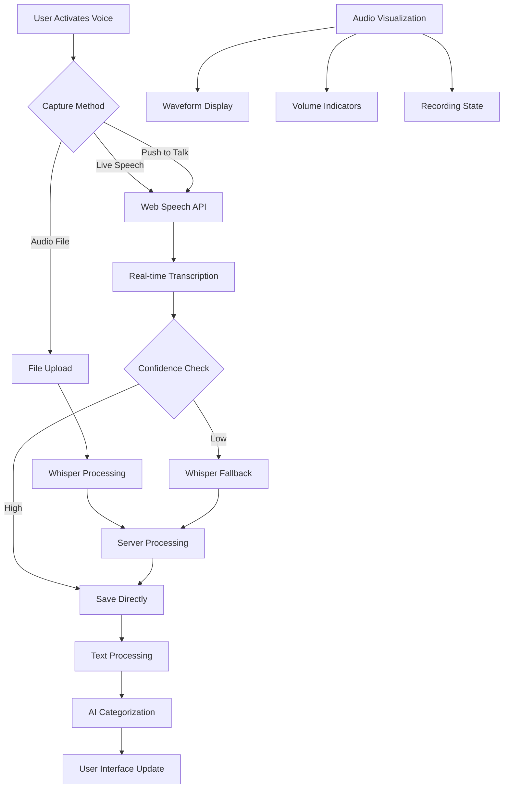

# Voice Capture System

Cathcr's voice capture system provides a seamless, real-time voice-to-text experience using the Web Speech API with Whisper fallback, featuring beautiful visualizations and intelligent processing.

## Overview

The voice capture system combines multiple technologies to deliver optimal transcription:
- **Web Speech API**: Real-time browser-based speech recognition
- **Whisper API**: Server-side transcription for audio files and fallback
- **Audio Visualization**: Real-time waveform and volume indicators
- **Smart Processing**: Confidence scoring and error handling
- **Global Shortcuts**: System-wide capture accessibility

## Architecture

### Voice Capture Flow



### Component Structure

```typescript
// Voice capture system architecture
interface VoiceCaptureSystem {
  speech: {
    webAPI: WebSpeechRecognition;
    whisper: WhisperTranscription;
    processor: AudioProcessor;
  };
  visualization: {
    waveform: WaveformVisualizer;
    volume: VolumeIndicator;
    status: RecordingStatus;
  };
  capture: {
    modal: CaptureModal;
    shortcuts: GlobalShortcuts;
    recorder: AudioRecorder;
  };
}
```

## Web Speech API Integration

### Speech Recognition Service

```typescript
// client/src/services/speechRecognition.ts
export class SpeechRecognitionService {
  private recognition: SpeechRecognition | null = null;
  private isListening = false;
  private onTranscript?: (text: string, isFinal: boolean) => void;
  private onError?: (error: string) => void;
  private onStatusChange?: (status: 'idle' | 'listening' | 'processing') => void;

  constructor() {
    this.initializeRecognition();
  }

  private initializeRecognition(): void {
    if (!('webkitSpeechRecognition' in window) && !('SpeechRecognition' in window)) {
      console.warn('Speech recognition not supported');
      return;
    }

    const SpeechRecognition = window.SpeechRecognition || window.webkitSpeechRecognition;
    this.recognition = new SpeechRecognition();

    this.recognition.continuous = true;
    this.recognition.interimResults = true;
    this.recognition.lang = this.getLanguage();
    this.recognition.maxAlternatives = 3;

    this.setupEventListeners();
  }

  private setupEventListeners(): void {
    if (!this.recognition) return;

    this.recognition.onstart = () => {
      console.log('Speech recognition started');
      this.onStatusChange?.(&#39;listening&#39;);
    };

    this.recognition.onresult = (event) => {
      let interimTranscript = '';
      let finalTranscript = '';

      for (let i = event.resultIndex; i < event.results.length; i++) {
        const result = event.results[i];
        const transcript = result[0].transcript;

        if (result.isFinal) {
          finalTranscript += transcript + ' ';
        } else {
          interimTranscript += transcript;
        }
      }

      if (finalTranscript) {
        this.onTranscript?.(finalTranscript.trim(), true);
      } else if (interimTranscript) {
        this.onTranscript?.(interimTranscript, false);
      }
    };

    this.recognition.onerror = (event) => {
      console.error('Speech recognition error:', event.error);
      this.handleError(event.error);
    };

    this.recognition.onend = () => {
      console.log('Speech recognition ended');
      this.isListening = false;
      this.onStatusChange?.('idle');
    };
  }

  async startListening(
    onTranscript: (text: string, isFinal: boolean) => void,
    onError?: (error: string) => void,
    onStatusChange?: (status: 'idle' | 'listening' | 'processing') => void
  ): Promise<void> {
    if (!this.recognition) {
      throw new Error('Speech recognition not supported');
    }

    if (this.isListening) {
      this.stopListening();
    }

    this.onTranscript = onTranscript;
    this.onError = onError;
    this.onStatusChange = onStatusChange;

    try {
      // Request microphone permission
      await navigator.mediaDevices.getUserMedia({ audio: true });

      this.isListening = true;
      this.recognition.start();
    } catch (error) {
      const errorMessage = error instanceof Error ? error.message : 'Unknown error';
      this.onError?.(`Microphone access denied: ${errorMessage}`);
      throw error;
    }
  }

  stopListening(): void {
    if (this.recognition && this.isListening) {
      this.recognition.stop();
    }
  }

  private handleError(error: string): void {
    const errorMessages: Record<string, string> = {
      'no-speech': 'No speech detected. Please try speaking clearly.',
      'audio-capture': 'Microphone not available. Please check your audio settings.',
      'not-allowed': 'Microphone access denied. Please enable microphone permissions.',
      'network': 'Network error occurred. Please check your connection.',
      'service-not-allowed': 'Speech recognition service is not available.',
      'bad-grammar': 'Speech recognition grammar error.',
      'language-not-supported': 'Language not supported for speech recognition.'
    };

    const userFriendlyMessage = errorMessages[error] || `Speech recognition error: ${error}`;
    this.onError?.(userFriendlyMessage);
  }

  private getLanguage(): string {
    return navigator.language || 'en-US';
  }

  isSupported(): boolean {
    return !!(window.SpeechRecognition || window.webkitSpeechRecognition);
  }
}
```

### Voice Capture Hook

```typescript
// client/src/hooks/useVoiceCapture.ts
interface VoiceCaptureState {
  isListening: boolean;
  transcript: string;
  interimTranscript: string;
  confidence: number;
  error: string | null;
  status: 'idle' | 'listening' | 'processing';
}

export const useVoiceCapture = () => {
  const [state, setState] = useState<VoiceCaptureState>({
    isListening: false,
    transcript: '',
    interimTranscript: '',
    confidence: 0,
    error: null,
    status: 'idle'
  });

  const speechService = useRef(new SpeechRecognitionService());

  const startListening = useCallback(async () => {
    try {
      setState(prev => ({
        ...prev,
        error: null,
        status: 'listening'
      }));

      await speechService.current.startListening(
        (text, isFinal) => {
          setState(prev => ({
            ...prev,
            [isFinal ? 'transcript' : 'interimTranscript']: text,
            confidence: isFinal ? 0.9 : 0.5 // Estimate confidence
          }));
        },
        (error) => {
          setState(prev => ({
            ...prev,
            error,
            status: 'idle',
            isListening: false
          }));
        },
        (status) => {
          setState(prev => ({
            ...prev,
            status,
            isListening: status === 'listening'
          }));
        }
      );
    } catch (error) {
      setState(prev => ({
        ...prev,
        error: error instanceof Error ? error.message : 'Failed to start listening',
        status: 'idle',
        isListening: false
      }));
    }
  }, []);

  const stopListening = useCallback(() => {
    speechService.current.stopListening();
    setState(prev => ({
      ...prev,
      isListening: false,
      status: 'idle'
    }));
  }, []);

  const reset = useCallback(() => {
    setState({
      isListening: false,
      transcript: '',
      interimTranscript: '',
      confidence: 0,
      error: null,
      status: 'idle'
    });
  }, []);

  return {
    ...state,
    startListening,
    stopListening,
    reset,
    isSupported: speechService.current.isSupported()
  };
};
```

## Audio Recording and Processing

### Audio Recorder Service

```typescript
// client/src/services/audioRecorder.ts
export class AudioRecorderService {
  private mediaRecorder: MediaRecorder | null = null;
  private audioChunks: Blob[] = [];
  private stream: MediaStream | null = null;
  private onDataAvailable?: (audioBlob: Blob) => void;
  private onVolumeChange?: (volume: number) => void;
  private volumeAnalyzer?: VolumeAnalyzer;

  async startRecording(
    onDataAvailable: (audioBlob: Blob) => void,
    onVolumeChange?: (volume: number) => void
  ): Promise<void> {
    try {
      this.stream = await navigator.mediaDevices.getUserMedia({
        audio: {
          sampleRate: 44100,
          channelCount: 1,
          echoCancellation: true,
          noiseSuppression: true,
          autoGainControl: true
        }
      });

      this.onDataAvailable = onDataAvailable;
      this.onVolumeChange = onVolumeChange;

      // Setup volume analyzer
      if (onVolumeChange) {
        this.volumeAnalyzer = new VolumeAnalyzer(this.stream, onVolumeChange);
        this.volumeAnalyzer.start();
      }

      this.mediaRecorder = new MediaRecorder(this.stream, {
        mimeType: this.getSupportedMimeType()
      });

      this.audioChunks = [];

      this.mediaRecorder.ondataavailable = (event) => {
        if (event.data.size > 0) {
          this.audioChunks.push(event.data);
        }
      };

      this.mediaRecorder.onstop = () => {
        const audioBlob = new Blob(this.audioChunks, {
          type: this.mediaRecorder?.mimeType || 'audio/webm'
        });
        this.onDataAvailable?.(audioBlob);
      };

      this.mediaRecorder.start(100); // Collect data every 100ms
    } catch (error) {
      throw new Error(`Failed to start recording: ${error}`);
    }
  }

  stopRecording(): void {
    if (this.mediaRecorder && this.mediaRecorder.state !== 'inactive') {
      this.mediaRecorder.stop();
    }

    if (this.volumeAnalyzer) {
      this.volumeAnalyzer.stop();
    }

    if (this.stream) {
      this.stream.getTracks().forEach(track => track.stop());
      this.stream = null;
    }
  }

  isRecording(): boolean {
    return this.mediaRecorder?.state === 'recording';
  }

  private getSupportedMimeType(): string {
    const types = [
      'audio/webm;codecs=opus',
      'audio/webm',
      'audio/mp4',
      'audio/ogg;codecs=opus'
    ];

    for (const type of types) {
      if (MediaRecorder.isTypeSupported(type)) {
        return type;
      }
    }

    return 'audio/webm'; // Fallback
  }
}

// Volume analyzer for real-time audio visualization
class VolumeAnalyzer {
  private audioContext: AudioContext;
  private analyser: AnalyserNode;
  private dataArray: Uint8Array;
  private animationId: number | null = null;

  constructor(
    private stream: MediaStream,
    private onVolumeChange: (volume: number) => void
  ) {
    this.audioContext = new AudioContext();
    this.analyser = this.audioContext.createAnalyser();
    this.analyser.fftSize = 256;

    const source = this.audioContext.createMediaStreamSource(stream);
    source.connect(this.analyser);

    this.dataArray = new Uint8Array(this.analyser.frequencyBinCount);
  }

  start(): void {
    const analyze = () => {
      this.analyser.getByteFrequencyData(this.dataArray);

      // Calculate volume (RMS)
      let sum = 0;
      for (let i = 0; i < this.dataArray.length; i++) {
        sum += this.dataArray[i] * this.dataArray[i];
      }

      const volume = Math.sqrt(sum / this.dataArray.length) / 255;
      this.onVolumeChange(volume);

      this.animationId = requestAnimationFrame(analyze);
    };

    analyze();
  }

  stop(): void {
    if (this.animationId) {
      cancelAnimationFrame(this.animationId);
    }
    this.audioContext.close();
  }
}
```

## Audio Visualization

### Waveform Visualizer

```typescript
// client/src/components/WaveformVisualizer.tsx
interface WaveformVisualizerProps {
  isActive: boolean;
  volume: number;
  className?: string;
}

export const WaveformVisualizer: React.FC<WaveformVisualizerProps> = ({
  isActive,
  volume,
  className = ''
}) => {
  const canvasRef = useRef<HTMLCanvasElement>(null);
  const animationRef = useRef<number>();

  useEffect(() => {
    const canvas = canvasRef.current;
    if (!canvas) return;

    const ctx = canvas.getContext('2d');
    if (!ctx) return;

    const draw = () => {
      const { width, height } = canvas;
      ctx.clearRect(0, 0, width, height);

      if (!isActive) {
        // Draw static bars when inactive
        drawStaticBars(ctx, width, height);
      } else {
        // Draw animated waveform when active
        drawAnimatedWaveform(ctx, width, height, volume);
      }

      animationRef.current = requestAnimationFrame(draw);
    };

    draw();

    return () => {
      if (animationRef.current) {
        cancelAnimationFrame(animationRef.current);
      }
    };
  }, [isActive, volume]);

  const drawStaticBars = (ctx: CanvasRenderingContext2D, width: number, height: number) => {
    const barCount = 20;
    const barWidth = width / barCount * 0.7;
    const barSpacing = width / barCount * 0.3;

    ctx.fillStyle = 'rgba(59, 130, 246, 0.3)'; // Blue with opacity

    for (let i = 0; i < barCount; i++) {
      const x = i * (barWidth + barSpacing);
      const barHeight = height * 0.2; // Static height
      const y = (height - barHeight) / 2;

      ctx.fillRect(x, y, barWidth, barHeight);
    }
  };

  const drawAnimatedWaveform = (
    ctx: CanvasRenderingContext2D,
    width: number,
    height: number,
    volume: number
  ) => {
    const barCount = 20;
    const barWidth = width / barCount * 0.7;
    const barSpacing = width / barCount * 0.3;

    // Create gradient
    const gradient = ctx.createLinearGradient(0, 0, 0, height);
    gradient.addColorStop(0, 'rgba(139, 92, 246, 0.8)'); // Purple
    gradient.addColorStop(1, 'rgba(59, 130, 246, 0.8)'); // Blue

    ctx.fillStyle = gradient;

    for (let i = 0; i < barCount; i++) {
      const x = i * (barWidth + barSpacing);

      // Simulate frequency response with some randomness
      const baseHeight = volume * height * 0.8;
      const variation = (Math.sin(Date.now() * 0.01 + i * 0.5) + 1) * 0.5;
      const barHeight = baseHeight * (0.3 + variation * 0.7);

      const y = (height - barHeight) / 2;

      // Add glow effect for active bars
      if (barHeight > height * 0.1) {
        ctx.shadowColor = 'rgba(59, 130, 246, 0.6)';
        ctx.shadowBlur = 10;
      } else {
        ctx.shadowBlur = 0;
      }

      ctx.fillRect(x, y, barWidth, barHeight);
    }

    ctx.shadowBlur = 0; // Reset shadow
  };

  return (
    <canvas
      ref={canvasRef}
      width={300}
      height={80}
      className={cn('rounded-lg', className)}
    />
  );
};
```

### Volume Indicator

```typescript
// client/src/components/VolumeIndicator.tsx
interface VolumeIndicatorProps {
  volume: number;
  isActive: boolean;
  size?: 'sm' | 'md' | 'lg';
}

export const VolumeIndicator: React.FC<VolumeIndicatorProps> = ({
  volume,
  isActive,
  size = 'md'
}) => {
  const sizeClasses = {
    sm: 'w-16 h-2',
    md: 'w-24 h-3',
    lg: 'w-32 h-4'
  };

  const volumePercentage = Math.min(volume * 100, 100);

  return (
    <div className={cn(
      'relative rounded-full overflow-hidden',
      'bg-white/10 backdrop-blur-sm',
      sizeClasses[size]
    )}>
      <motion.div
        className={cn(
          'h-full rounded-full',
          isActive
            ? 'bg-gradient-to-r from-blue-500 to-purple-500'
            : 'bg-gray-400'
        )}
        initial={{ width: '0%' }}
        animate={{ width: `${volumePercentage}%` }}
        transition={{ duration: 0.1 }}
      />

      {isActive && (
        <motion.div
          className="absolute inset-0 bg-white/20 rounded-full"
          animate={{ opacity: [0.3, 0.6, 0.3] }}
          transition={{ duration: 0.8, repeat: Infinity }}
        />
      )}
    </div>
  );
};
```

## Capture Modal Component

### Main Capture Interface

```typescript
// client/src/components/CaptureModal.tsx
export const CaptureModal: React.FC = () => {
  const [isOpen, setIsOpen] = useState(false);
  const [content, setContent] = useState('');
  const [volume, setVolume] = useState(0);

  const {
    isListening,
    transcript,
    interimTranscript,
    confidence,
    error,
    startListening,
    stopListening,
    reset,
    isSupported
  } = useVoiceCapture();

  const createThought = useCreateThought();

  // Global shortcut handling
  useHotkeys('ctrl+shift+c', () => {
    setIsOpen(true);
  }, {
    enableOnContentEditable: true,
    enableOnFormTags: true
  });

  useEffect(() => {
    if (transcript) {
      setContent(prev => prev + (prev ? ' ' : '') + transcript);
    }
  }, [transcript]);

  const handleVoiceToggle = async () => {
    if (isListening) {
      stopListening();
    } else {
      try {
        await startListening();
      } catch (error) {
        console.error('Failed to start voice capture:', error);
      }
    }
  };

  const handleSave = async () => {
    if (!content.trim()) return;

    try {
      await createThought.mutateAsync({
        content: content.trim(),
        source: isListening ? 'voice' : 'text',
        confidence: confidence
      });

      setContent('');
      reset();
      setIsOpen(false);
    } catch (error) {
      console.error('Failed to save thought:', error);
    }
  };

  const handleClose = () => {
    stopListening();
    reset();
    setContent('');
    setIsOpen(false);
  };

  return (
    <AnimatePresence>
      {isOpen && (
        <motion.div
          className="fixed inset-0 z-50 flex items-center justify-center p-4"
          initial={{ opacity: 0 }}
          animate={{ opacity: 1 }}
          exit={{ opacity: 0 }}
        >
          {/* Backdrop */}
          <motion.div
            className="absolute inset-0 bg-black/50 backdrop-blur-sm"
            onClick={handleClose}
            initial={{ opacity: 0 }}
            animate={{ opacity: 1 }}
            exit={{ opacity: 0 }}
          />

          {/* Modal */}
          <motion.div
            className={cn(
              'relative w-full max-w-2xl',
              'bg-black/80 backdrop-blur-xl',
              'border border-white/20 rounded-2xl',
              'p-6 shadow-2xl'
            )}
            initial={{ scale: 0.95, opacity: 0 }}
            animate={{ scale: 1, opacity: 1 }}
            exit={{ scale: 0.95, opacity: 0 }}
            transition={{ type: 'spring', damping: 20, stiffness: 300 }}
          >
            {/* Header */}
            <div className="flex items-center justify-between mb-6">
              <h2 className="text-xl font-semibold text-white">
                Capture Thought
              </h2>
              <button
                onClick={handleClose}
                className="text-gray-400 hover:text-white transition-colors"
              >
                <X className="w-5 h-5" />
              </button>
            </div>

            {/* Content Input */}
            <div className="space-y-4">
              <textarea
                value={content + (interimTranscript ? ` ${interimTranscript}` : '')}
                onChange={(e) => setContent(e.target.value)}
                placeholder="What's on your mind?"
                className={cn(
                  'w-full h-32 p-4 rounded-xl resize-none',
                  'bg-white/10 border border-white/20',
                  'text-white placeholder-gray-400',
                  'focus:outline-none focus:border-blue-500',
                  'transition-colors'
                )}
                autoFocus
              />

              {/* Voice Controls */}
              {isSupported && (
                <div className="flex items-center justify-between">
                  <div className="flex items-center space-x-4">
                    <motion.button
                      onClick={handleVoiceToggle}
                      className={cn(
                        'flex items-center justify-center w-12 h-12',
                        'rounded-full border-2 transition-all',
                        isListening
                          ? 'bg-red-500 border-red-500 text-white'
                          : 'bg-white/10 border-white/20 text-gray-300 hover:text-white'
                      )}
                      whilePress={{ scale: 0.95 }}
                      whileTap={{ scale: 0.9 }}
                    >
                      {isListening ? (
                        <Square className="w-5 h-5" />
                      ) : (
                        <Mic className="w-5 h-5" />
                      )}
                    </motion.button>

                    <VolumeIndicator
                      volume={volume}
                      isActive={isListening}
                      size="md"
                    />
                  </div>

                  {/* Waveform Visualizer */}
                  <WaveformVisualizer
                    isActive={isListening}
                    volume={volume}
                    className="flex-1 mx-4"
                  />
                </div>
              )}

              {/* Status Messages */}
              {error && (
                <div className="text-red-400 text-sm">
                  {error}
                </div>
              )}

              {confidence > 0 && (
                <div className="text-green-400 text-sm">
                  Confidence: {Math.round(confidence * 100)}%
                </div>
              )}
            </div>

            {/* Actions */}
            <div className="flex items-center justify-between mt-6">
              <div className="text-sm text-gray-400">
                Ctrl+Shift+C to capture • Ctrl+Enter to save
              </div>

              <div className="flex space-x-3">
                <button
                  onClick={handleClose}
                  className="px-4 py-2 text-gray-400 hover:text-white transition-colors"
                >
                  Cancel
                </button>

                <motion.button
                  onClick={handleSave}
                  disabled={!content.trim() || createThought.isLoading}
                  className={cn(
                    'px-6 py-2 rounded-lg font-medium',
                    'bg-gradient-to-r from-blue-500 to-purple-500',
                    'text-white transition-all',
                    'disabled:opacity-50 disabled:cursor-not-allowed'
                  )}
                  whilePress={{ scale: 0.98 }}
                >
                  {createThought.isLoading ? 'Saving...' : 'Save Thought'}
                </motion.button>
              </div>
            </div>
          </motion.div>
        </motion.div>
      )}
    </AnimatePresence>
  );
};
```

## Whisper Fallback Processing

### Server-side Transcription

```typescript
// server/src/services/transcriptionService.ts
export class TranscriptionService {
  constructor(private aiService: AIService) {}

  async processAudioFile(
    audioBuffer: Buffer,
    mimeType: string,
    userId: string
  ): Promise<TranscriptionResult> {
    try {
      // Convert to supported format if needed
      const processedAudio = await this.preprocessAudio(audioBuffer, mimeType);

      // Transcribe with Whisper
      const transcription = await this.aiService.transcribeAudio(processedAudio);

      // Log transcription attempt
      await this.logTranscription(userId, transcription);

      return transcription;
    } catch (error) {
      console.error('Transcription failed:', error);
      throw new TranscriptionError('Failed to transcribe audio', error);
    }
  }

  private async preprocessAudio(buffer: Buffer, mimeType: string): Promise<Buffer> {
    // Convert audio format if necessary
    if (mimeType.includes('webm') || mimeType.includes('ogg')) {
      // Convert to a more compatible format like MP3 or WAV
      return this.convertAudioFormat(buffer, mimeType);
    }

    return buffer;
  }

  private async convertAudioFormat(buffer: Buffer, fromType: string): Promise<Buffer> {
    // Audio conversion logic (could use ffmpeg-wasm or similar)
    // For now, return as-is since Whisper supports webm
    return buffer;
  }

  private async logTranscription(
    userId: string,
    result: TranscriptionResult
  ): Promise<void> {
    await supabase.from('transcription_logs').insert({
      user_id: userId,
      confidence: result.confidence,
      duration: result.duration,
      language: result.language,
      success: !!result.text,
      created_at: new Date().toISOString()
    });
  }
}
```

## Global Shortcuts

### System-wide Capture

```typescript
// client/src/hooks/useGlobalShortcuts.ts
export const useGlobalShortcuts = () => {
  const { openCaptureModal } = useCaptureModal();

  useEffect(() => {
    const handleKeyDown = (event: KeyboardEvent) => {
      // Ctrl+Shift+C for global capture
      if (event.ctrlKey && event.shiftKey && event.code === 'KeyC') {
        event.preventDefault();
        openCaptureModal();
      }

      // Escape to close any open modals
      if (event.code === 'Escape') {
        // Handle escape logic
      }
    };

    document.addEventListener('keydown', handleKeyDown);

    return () => {
      document.removeEventListener('keydown', handleKeyDown);
    };
  }, [openCaptureModal]);

  // Register global shortcuts with the system (if supported)
  useEffect(() => {
    if ('serviceWorker' in navigator) {
      // Register service worker for background shortcuts
      navigator.serviceWorker.register('/sw.js').then((registration) => {
        console.log('Service worker registered for global shortcuts');
      });
    }
  }, []);
};
```

This comprehensive voice capture system provides a seamless, intelligent voice-to-text experience while maintaining the premium glassmorphism aesthetic and robust error handling throughout the Cathcr platform.